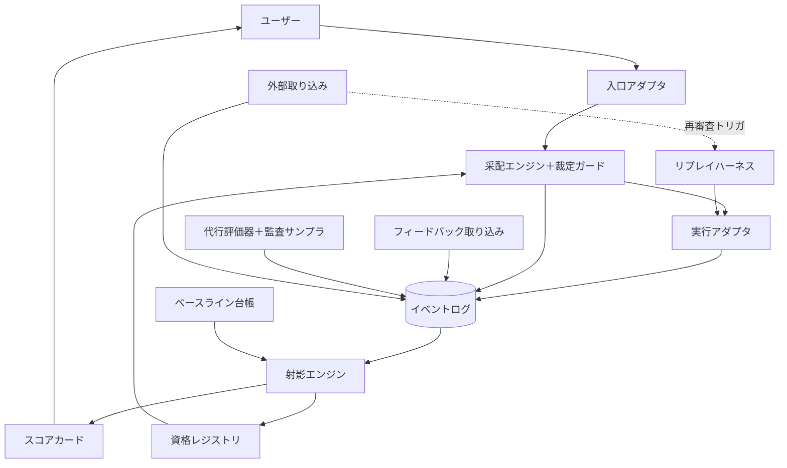

# DESIGN

この文書は [VISION.md](./VISION.md) の理念・概念モデルを、実装可能な構成に降ろすための設計文書である。

**この文書は決定しない。** 各設計点は「Decision Register」に、問い・制約・選択肢・調査・評価基準・有力候補（非拘束）・決定時期の形で保持される。決定は実装の各フェーズ入口で ADR（Architecture Decision Record）として確定し、この文書の該当項目は ADR への参照に置き換わる。

文書の層は次の通り: **VISION**（憲法。設計判断の制約）→ **DESIGN**（構成と選択肢。本書）→ **ADR**（決定と理由）→ 実装。

## 全体像

VISION の概念とコンポーネントの対応:

| VISION の概念 | コンポーネント |
|---|---|
| 入口（コマンド／エージェントスキル） | 入口アダプタ |
| 采配・裁定・エスカレーション | 采配エンジン＋裁定ガード |
| 実行プロファイル・実測 | 実行アダプタ |
| 評価イベント・来歴・データ最小化 | イベントログ |
| 射影（値＋不確実性＋適用範囲＋鮮度） | 射影エンジン |
| 監査できる（根拠の開示） | スコアカード（監査ビュー） |
| 役割と資格・任免・失効 | 資格レジストリ |
| 教師信号（ユーザーの価値判断） | フィードバック取り込み |
| 評価の代行・常時監査 | 代行評価器＋監査サンプラ |
| リプレイ・初期審査・定点観測 | リプレイハーネス |
| 外部 prior・外部シグナル・価格 | 外部取り込み |
| 成功基準の事前登録・自己計測 | ベースライン台帳 |

データの流れは VISION の循環そのままである: 指示は入口から采配エンジンに渡り、裁定ガード（序列）を通って実行アダプタが実行プロファイルを起動する。実行・決定・フィードバックはすべてイベントログに追記され、射影エンジンがスコア（値・不確実性・適用範囲・鮮度）を導き、資格レジストリの任免を更新し、次の采配を変える。

## コンポーネント

各コンポーネントの責務と、関わる決定点（D-xx）。

### 入口アダプタ

ホスト環境（現状は Claude Code）のコマンド／エージェントスキルとして実装される薄い層。指示を受け取り、采配エンジンに渡し、結果とスコアカードをユーザーに返す。**入口は直接エージェントを起動しない** — 委譲は常に采配エンジン経由（D-09 の執行原則）。

### 采配エンジン＋裁定ガード

指示を受け、裁定の序列（安全・秘密・不可逆 → ユーザー基準 → 証拠の十分性 → 経済性 → 探索価値）をゲートとして通し、資格レジストリとスコアカードを参照して実行プロファイルを選ぶ。確信が持てなければエスカレーション（選択肢＋推奨つきの差し戻し）。活用だけでなく探索（予算内）とリプレイ起動も担う。采配の判断自体が決定イベントとして記録される。段階論: 助言モード（提案のみ）→ 確認付き → 資格範囲での自動委任。関連: D-05, D-11。

### 実行アダプタ

選ばれた実行プロファイル（モデル・プロバイダ/バージョン・役割プロンプト・ツール・権限）でエージェントを起動し、実測（所要時間・実支出・帰結の参照）を正規化してイベントログに渡す。CLI ごとの出力形式差を吸収する正規化層を含む。関連: D-01。

### イベントログ

追記のみの一次データ。全イベントが実行プロファイル・タグ・来歴を持つ。データ最小化: 成果物やプロンプトの本文は保存せず、参照（パス・コミット等）とハッシュを記録する。削除はユーザー起点のみで、非機微な処置来歴を残す。関連: D-02。

### 射影エンジン＋スコアカード

イベント集合から射影を計算する。射影は値だけでなく不確実性・適用範囲・鮮度を伴う。一次の評価イベントと明示的な prior 入力は区別して合成する（証拠階級の分離）。スコアカードは人間向けの監査ビューで、すべての値に根拠（元イベントへの参照）を添える。関連: D-03, D-10。

### 資格レジストリ

（役割 × 実行プロファイル）ごとの資格記録。任用・保留・失効の状態と、その根拠射影を保持する。構成変更・鮮度切れ・ドリフト検知は再審査状態に遷移させる。関連: D-04, D-09, D-10。

### フィードバック取り込み

ユーザーの価値判断（受け入れ・選好・リスク許容）をイベント化する。明示的フィードバックは1アクション以内、受動シグナル（コミットの生存、手戻りの検知など）を優先して手間を抑える。関連: D-06。

### 代行評価器＋監査サンプラ

ユーザー判断との一致率で資格を得た評価代行が、探索・リプレイの成果を評価する。監査サンプラが代行評価の一部を必ずユーザーの二重評価に回し、一致の証拠を絶やさない。代行評価はユーザー判断と別種のイベント。関連: D-12。

### リプレイハーネス

受け入れ済み成果が確定している過去タスクを分離環境で再演する。用途は初期審査・較正・定点観測（ドリフト検知）。コストは探索予算の枠内。関連: D-07。

### 外部取り込み

価格表（実コスト計算の入力・即時反映）、外部ベンチマーク（「外部主張があった」来歴イベント・prior 入力）、外部シグナル（再審査トリガのみ、スコアに入らない）の3系統を区別して取り込む。関連: D-08。

### ベースライン台帳

成功基準の比較条件（基準・タスク群・期間・手間上限）を**結果を見る前に**登録し、射影エンジンが保留/将来の帰結に対して比較レポートを出す。不利な結果も開示する。関連: D-02, D-03。

## Decision Register

各項目の「有力候補」は現時点の傾きであり、決定ではない。決定は「決定時期」に示すフェーズの入口で ADR 化する。

### D-01 実行基盤（実行アダプタの実装方式）

**問い**: エージェントを何として起動し、実測をどう取るか。

**制約（VISION）**: ベンダー固定しない。制御面はローカル。実測（時間・実支出・帰結）が取れること。資格執行の介入点があること。

**環境の実態（2026-07 調査）**: この環境には claude (Claude Code 2.1.214) / codex-cli 0.144.4 / gemini-cli 0.47.0 が導入済み。

**選択肢**:

- **A. 既存エージェントCLIの headless 束ね**: 各CLIを非対話モードで起動し、構造化出力から実測を正規化する。
  - Claude Code: `claude -p --output-format json` が結果 JSON に usage・総コスト・所要時間・ターン数を含む。`--model`・`--allowedTools`・`--permission-mode` で実行プロファイルを構成でき、hooks で介入点も持てる。
  - codex CLI: `codex exec` の非対話実行と JSON イベント出力。トークン使用量はイベントから集計。サンドボックスモードあり。
  - gemini CLI: headless 実行と JSON 出力に対応。
  - 良: クロスベンダーの実運用が最速。各社のエージェント能力（ツール使用・ファイル編集）をそのまま利用。悪: 計測粒度と出力形式が CLI ごとに不均一（正規化層が必要）、CLI のバージョン追随コスト、ツール単位の細かい裁定介入は各CLI の許可機構に依存。
- **B. 単一ホスト完結（Claude Code のサブエージェント＋他社モデルはプロキシ注入）**: 構築は最軽量だが、他社モデルのエージェント能力がプロキシ越しに制限され、ベンダー横断比較という前提が弱まる。
- **C. 自前ハーネス**: Claude 側は Claude Agent SDK（Claude Code のハーネスのライブラリ版。ツール・ループ込み）、他社は各社 SDK か互換層（LiteLLM / OpenRouter 等）。計測は最精密で、裁定ガードを実行ループ内に埋め込める。構築・維持コストが最大。

**評価基準**: 実測の忠実度 / エージェント能力の多様性 / 資格執行・裁定介入のしやすさ / 構築・維持コスト。

**有力候補（非拘束）**: A を主軸に開始し、リプレイの精密化・裁定介入の強化が必要になった箇所へ C を部分導入するハイブリッド。B は「入口のホスト」としては使うが、実行基盤としては採らない。

**決定時期**: Phase 1 入口。

### D-02 イベント記録・ストレージ

**問い**: 評価イベントを何にどう記録するか。

**制約（VISION）**: 追記のみ・来歴保持・実行プロファイルとタグを持つ・データ最小化（本文は参照＋ハッシュ）・削除はユーザー起点で非機微来歴を残す・ローカル。

**選択肢**:

- **A. SQLite 単一DB**: 追記テーブル＋トリガで UPDATE/DELETE を禁止し不変性を機械的に担保。射影はビュー/派生テーブル。トランザクションと単一ファイルの手軽さ。導入済み。
- **B. JSONL 追記＋派生インデックス**: 1行1イベントの追記ファイルを真実とし、SQLite/DuckDB のインデックスを派生させる二層。可読・git 親和・修復容易。派生の再構築が常に可能。
- **C. DuckDB 主体**: 分析クエリに強いが未導入で、追記型の運用は SQLite より工夫が要る。

**評価基準**: 追記不変の担保しやすさ / 射影の書きやすさ / 可読性・修復性 / 運用の軽さ。

**有力候補（非拘束）**: A か B（真実の層はどちらでも成立する。射影クエリの複雑さが見えてから決める）。C は射影計算エンジンとしての後段導入余地を残す。

**決定時期**: Phase 0（最初に必要な決定）。

### D-03 射影とタスク分類

**問い**: タスク種別のタグ体系と、射影の実装形をどうするか。

**制約（VISION）**: 第二軸を固定しない（タグは射影の一つ）。射影は値＋不確実性＋適用範囲＋鮮度。prior と一次証拠を区別して合成。

**選択肢と調査**:

- タグ体系: 手動シードの粗い種別（例: 設計 / 実装 / 大量編集 / 調査 / レビュー / 運用）から始め、自由タグを併記して運用で育てる。分類の自動付与は後段（採配時に付与し、フィードバックで訂正可能）。
- 射影の実装: SQL ビュー群 / 小さな集計スクリプト / 宣言的定義（dbt 風）。イベントが真実なので、射影は常に再計算可能＝実装は交換可能。
- 不確実性の表現候補: 有効標本数、ベータ分布による区間、ブートストラップ（方式の決定はしない。射影が「値と確からしさと適用範囲」を返すことだけが要件）。

**有力候補（非拘束）**: SQL ビュー＋小スクリプト。タグは粗く始める。

**決定時期**: Phase 2 入口。

### D-04 役割と適性要件

**問い**: 役割の初期ラインナップと、適性要件の表現形式。

**制約（VISION)**: 役割は水平・資格は実行プロファイルに付く・コストも適性・要件は射影への要求条件。

**選択肢と調査**:

- 初期役割の候補: 采配役 / 設計役 / 実装役 / 大量実装役 / 検証役 / 評価代行役。ラインナップ自体も運用で増減する前提。
- 適性要件の表現: リポジトリ内の宣言的設定（YAML 等・バージョン管理）が有力。要件は「参照する射影＋満たすべき条件」の組。
- 実行プロファイルの同定: どの構成差を「別プロファイル」と見なすかの等価性の粒度は、証拠の可搬性の再審査（VISION）と表裏。運用データが集まるまで粗く保つ。

**決定時期**: Phase 3〜4。

### D-05 采配方式

**問い**: 采配エンジンの判断機構をどう実装するか。

**制約（VISION）**: 裁定の序列がゲート。判断は決定イベントとして記録。助言→確認付き→資格範囲の自動、と段階的に委任を広げる（始動）。

**選択肢**:

- **A. ルール＋スコアカード参照**: 資格チェック → 序列ゲート → 射影の比較で候補選定。決定的で監査しやすい。
- **B. LLM 采配**: 采配役の資格を持つプロファイルが、スコアカードを道具として参照しながら判断する。柔軟だが、判断品質自体が評価対象（采配種別の決定イベント）。
- **C. 文脈付きバンディット**: LinUCB / Thompson sampling 系で活用と探索を統合する（調査メモ: 探索予算と概念的に自然に接続する。導入は射影が安定してから）。

**有力候補（非拘束）**: A で安全側の骨格を作り、B を載せる併用。C は探索配分の機構として調査継続。

**決定時期**: Phase 4 入口。

### D-06 フィードバック UX

**問い**: 教師信号を、手間の上限内でどう集めるか。

**制約（VISION）**: 持続性の制約（手間が大きい評価体系は死ぬ）。監査サンプルは必ずユーザーが評価。

**選択肢と調査**:

- 明示的: タスク完了時のワンタップ/一文字応答、`/rate` 相当のコマンド。1アクション以内を上限とする。
- 受動的: コミットの生存（後日 revert されない）/ 直後の再指示・手戻りの検知 / 成果物の採用。受動シグナルは弱い証拠として扱う。
- ホスト機構: Claude Code の hooks（Stop 時のプロンプト）を利用可能。
- 監査サンプルのみ明示必須、他は受動優先。

**決定時期**: Phase 1。

### D-07 リプレイ方式

**問い**: 過去タスクの再演をどう分離・実行・採点するか。

**制約（VISION）**: 実タスクの証拠に劣後する第二階級。定点観測（同一プロファイルの過去比較）に使う。コストは予算枠内。

**選択肢と調査**:

- 分離: git worktree / 一時ディレクトリへの複製 / コンテナ。生成物比較のしやすさと構築コストのトレードオフ。
- 非決定性: LLM 出力は再現しないため、1回の再演を断定に使わない（n 回サンプル、または差分の大きさで判定）。
- 採点: 受け入れ済み成果との差分＋代行評価（監査付き）。
- 題材: 受け入れ済みタスクから小さな題材集合を選定（全履歴の再演はしない）。

**決定時期**: Phase 3 入口。

### D-08 外部取り込み（価格・prior・シグナル）

**問い**: 3系統の外部情報をどう取り込むか。

**制約（VISION）**: 価格は入力（即時反映）。ベンチは来歴イベント＋prior 入力（一次証拠ではない）。シグナルは再審査トリガのみ。

**選択肢と調査**:

- 価格: LiteLLM のモデル価格 DB（コミュニティ管理の JSON）を定期取り込み / 各社料金ページの手動更新。
- ベンチ prior: 手動キュレーションから開始（出典 URL・日付を来歴に含める）。自動収集は後段。
- シグナル: 手動貼り付け（「評判が変わった」との報をユーザーが投げ込む）から開始。RSS / changelog 監視は後段。

**有力候補（非拘束）**: 3系統とも手動優先で開始（持続性と純度を優先）、価格のみ半自動化を早める。

**決定時期**: Phase 3。

### D-09 資格執行

**問い**: 「資格のないプロファイルに仕事が行かない」ことを何が保証するか。

**制約（VISION）**: 権限は資格に束ねる。ユーザーは常に上書き可能（明示の許可）。

**選択肢**:

- **A. 起動経路の一本化**: すべての委譲は采配エンジン経由とし、エンジンが起動前に資格を検査する。入口コマンド/スキルは直接エージェントを起動しない。構造的で漏れにくい。
- **B. ホスト機構の併用**: Claude Code の hooks（PreToolUse で未資格の起動を拒否）や、資格を持つプロファイルだけを列挙した設定の生成。A の防御を深くする補助。

**有力候補（非拘束）**: A を原則に、B を補助として重ねる。

**決定時期**: Phase 5 入口（助言モードの間は執行不要）。

### D-10 鮮度・再審査

**問い**: 鮮度の減衰と再審査の起動をどう実装するか。

**制約（VISION）**: 古い証拠は重みを失う。資格は終身でない。再審査トリガ＝鮮度切れ・ドリフト検知・外部シグナル。

**調査メモ（方式は決めない）**:

- 減衰: 指数減衰 / 移動窓 / 有効標本数への換算。
- ドリフト検知: 定点観測（リプレイ）結果の差分閾値 / Page-Hinkley 等の変化検知。
- 再審査の起動: 経過時間 × イベント量 × 外部シグナルの組合せ。コスト上限内に収める。

**決定時期**: Phase 5（定点観測の定常運転前）。

### D-11 探索予算・リスク判定

**問い**: 探索予算の管理単位と、「低リスク」の機械的判定。

**制約（VISION）**: 探索は明示された予算の内のみ。リスク＝帰結の大きさ・可逆性・判定コスト。第1層（不可逆）は自律判断で越えない。

**選択肢と調査**:

- 予算: 月次定額 / 全支出比率。上限はユーザー設定・ドックは消化状況を開示。
- リスク判定: チェックリストルールから開始 — VCS 管理下か / ユーザー定義の送信境界外への作用を含むか / 成否の判定コストが低いか。判定結果は采配の決定イベントに残す。

**決定時期**: Phase 4〜5。

### D-12 評価代行の監査

**問い**: 監査比率・一致率の測り方・独立性の担保をどう実装するか。

**制約（VISION）**: 常時監査（一致の証拠を絶やさない）。代行評価は別種イベントで下位。審判と被評価者の独立性。

**調査メモ（方式は決めない）**:

- 監査比率: 初期は高率、一致率の確信が上がるにつれ逓減するサンプリング。ゼロにはしない（常時監査）。
- 一致率: 単純一致率＋区間 / κ 係数。
- 独立性: 被評価プロファイルと別系統（別ベンダー・別モデル系列）の審判を優先する規則。

**決定時期**: Phase 3 入口（代行を導入するフェーズ）。

## 横断課題

- **秘密と送信境界**: 裁定第1層のデータ面。イベントログは本文を持たない（参照＋ハッシュ）ことが第一の防御。送信境界の執行は、実行アダプタでの環境変数分離と、送信前の秘密パターン検査（gitleaks / trufflehog のルール流用が候補）を調査する。
- **スキーマ進化**: イベントに schema_version を持たせる。イベントが真実で射影は導出物なので、射影の変更は自由（再計算）。イベント形式の変更は互換読み込みで対応。
- **監査 UX**: スコアカードのすべての値は根拠（元イベント参照）に一段でたどれること。采配の提案には理由（参照した射影と序列の判定）を必ず添えること。この2つは実装形式を問わず不変条件とする。

## この文書の更新規則

- 決定が ADR 化されたら、該当する Decision Register 項目は結論と ADR への参照に短縮する。
- 新しい設計点が見つかったら D-xx として追記する。
- VISION と矛盾する変更はできない（矛盾が必要なら先に VISION を改定する。裁定者はユーザー）。
