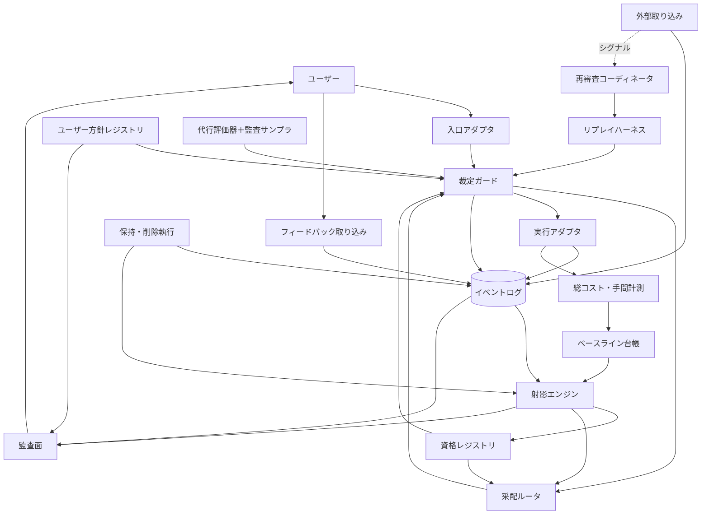

# DESIGN

この文書は [VISION.md](./VISION.md) の理念・概念モデルを、実装可能な構成に降ろすための設計文書である。

**この文書は技術選定をしない。** 固定するのは VISION から導かれる論理契約（設計不変条件）だけであり、実装方式は Decision Register に選択肢として開いたまま、各フェーズ入口の ADR（Architecture Decision Record）で確定する。

文書の層: **VISION**（憲法）→ **DESIGN**（構成と選択肢。本書）→ **ADR**（決定と理由）→ 実装。

## 読み方（記述の拘束力）

本書の記述は3種類に分かれる。

| 種別 | 拘束力 | 例 |
|---|---|---|
| **設計不変条件** | VISION から導かれる論理契約。実装がどうであれ満たす。変更には VISION 改定が先に必要 | すべてのエージェント実行がガードを通る／イベントは追記のみ |
| **ADR で決める設計点** | 未決。Decision Register に選択肢として保持 | ストレージ・封筒の具体フィールド・ホスト・UX |
| **非拘束候補** | 現時点の傾き。ADR で覆してよい | 各決定点の「有力候補」 |

決定は ADR でのみ生まれる。本文中の具体名（Claude Code 等）は現状の事実の記述であって選定ではない。

## 全体像

**図の各ボックスは論理責務であり、別プロセス・別ストアを意味しない。** 物理的な分割は ADR の領分である。

| VISION の概念 | 論理責務 |
|---|---|
| 入口（コマンド／エージェントスキル） | 入口アダプタ |
| 采配（候補の選定） | 采配ルータ |
| 裁定の序列・エスカレーション | 裁定ガード |
| 実行プロファイル・実測 | 実行アダプタ |
| 評価イベント・来歴・最小記録 | イベントログ |
| 射影（値＋不確実性＋適用範囲＋鮮度） | 射影エンジン |
| 監査できる | 監査面 |
| 役割と資格・任免・失効 | 資格レジストリ |
| 教師信号（ユーザーの価値判断） | フィードバック取り込み |
| 評価の代行・常時監査 | 代行評価器＋監査サンプラ |
| リプレイ・初期審査・定点観測 | リプレイハーネス |
| 外部 prior・外部シグナル・価格 | 外部取り込み（3系統） |
| 成功基準の事前登録・自己計測 | ベースライン台帳（成功評価プロトコル） |
| ユーザーの受入基準・リスク上限・境界 | ユーザー方針レジストリ |
| 鮮度切れ・ドリフト・再審査の起動 | 再審査コーディネータ |
| 保持境界・ユーザー起点の削除 | 保持・削除執行 |
| 総コスト（手間込み）の計測 | 総コスト・手間計測 |

**設計不変条件（実行経路）**: すべてのエージェント実行 — 通常遂行・探索・リプレイの再演・代行評価の審判実行 — は、同一の裁定ガード（権限・送信境界・秘密・予算）を通ってから実行アダプタに到達する。ルータの推薦も、ユーザーの直接指名も、内部責務の実行要求も例外ではない。

## 実行の4経路

自律性の段階を経路として分離する。**Phase 5 より前に自律権限は存在しない。**

| 経路 | 選ぶ主体 | ルータ | ガード | 利用可能になる時期 |
|---|---|---|---|---|
| **manual**（ユーザー指名） | ユーザー | 不要（または pass-through。未決のルータを必須経由にしない） | 通る（境界の執行と記録のため） | Phase 1 |
| **shadow** | ユーザー（推薦は計算されるが提示されない） | 計測のみ | 通る | Phase 4a |
| **advisory** | ユーザー（推薦＋根拠＋abstain を毎回明示承認） | 提示 | 通る | Phase 4b |
| **delegated** | ドック（資格・リスク・権限の独立ゲートを通過した範囲のみ） | 選定 | 通る | Phase 5 |

ユーザーの**明示単発委譲**（無資格プロファイルへの指名を含む）は manual の一種であり、ガードを通って scope と有効期限が記録される。**単発委譲も探索の許可も、資格を生まない**（D-22）。

## 情報モデル（正典性と証拠階級は別軸）

### 正典性（記録の軸）

イベントログは「**何が起き、何が主張されたか**」の正典記録である。実測も、ユーザー判断も、外部ベンチの取り込み（＝主張があったという事実）も、記録としては等しく正典である。**正典であることと、内容を信じることは別の軸である。**

### 証拠階級（命題の軸）

命題（例:「このプロファイルはこの種別に強い」）への寄与は証拠の種類で異なる。すべての証拠は provenance（出所・時刻・記録時の方針/プロトコル版）を持つ。

| 証拠 | 階級規則 |
|---|---|
| ユーザーの価値判断 | 受入・選好・リスク許容の ground truth |
| 実タスクの実測 | **関連性・比較可能性・十分性がある場合に**他の源泉に優越（無条件の優越ではない） |
| リプレイ | 第二階級（較正・審査・定点観測用） |
| 代行評価 | ユーザー判断に常に劣後する別種のイベント |
| 外部 prior | 仮説。射影で一次証拠と区別して合成 |
| 外部シグナル | **階級外**（証拠にならない。再審査のトリガのみ） |
| 価格 | **階級外**（運用入力。総コスト計算に即時反映） |

### 規範（ユーザー方針）

受入基準・リスク上限・送信/保持境界・探索予算・手間上限は証拠でも導出でもなく**規範**である。ユーザーのみが変更でき、恒久変更と単発許可は別種のイベントとして記録される（D-15）。

## VISION トレーサビリティ

| VISION 不変条件 | 責務 | 決定点 | 検証の場 |
|---|---|---|---|
| すべての仕事がイベントとして記録される | イベントログ・実行アダプタ | D-02, D-14, D-18, D-24 | Phase 0–1 |
| イベントは不変・来歴保持・訂正は追記 | イベントログ | D-02, D-19 | Phase 0–1 |
| 最小記録・秘密/全文を既定で保存しない | イベントログ・保持/削除執行 | D-02, D-15, D-21 | Phase 0 |
| 成績は実行プロファイルに帰属、モデルは射影 | 射影エンジン | D-13, D-03 | Phase 2 |
| 射影は不確実性・適用範囲・鮮度を伴う | 射影エンジン | D-17, D-10 | Phase 2 |
| prior と一次証拠の区別合成 | 外部取り込み・射影エンジン | D-08, D-17 | Phase 3 |
| 資格の任免・失効・「許可は資格を生まない」 | 資格レジストリ | D-04, D-13, D-22 | Phase 3, 5 |
| 裁定の序列・エスカレーション・単発上書き | 裁定ガード・ユーザー方針 | D-09, D-11, D-15 | Phase 0, 4–5 |
| 境界の外への送信を自律で行わない | 裁定ガード（最小 fail-closed ガード） | D-21, D-15 | Phase 0 から常時 |
| 探索は低リスク・予算内・資格を生まない | 裁定ガード・采配ルータ | D-11, D-22 | Phase 4–5 |
| ユーザー判断が価値判断の ground truth | フィードバック取り込み | D-06, D-15 | Phase 1 |
| 評価の代行は常時監査・別種イベント | 代行評価器＋監査サンプラ | D-12 | Phase 3, 5b |
| 比較条件の事前登録・保留/将来評価・不利開示 | ベースライン台帳 | D-16 | Phase 0, 2, 4 |
| 手間（attention）が上限内 | 総コスト・手間計測 | D-16 | 全フェーズ出口 |
| 監査できる（根拠・理由・方針・上書きの閲覧） | 監査面 | D-23 | 全フェーズ |

## コンポーネント（論理責務）

### 入口アダプタ
ホスト環境のコマンド／スキルとして実装される薄い層（現状のホストは Claude Code だが、ホストの選定・配置は D-01/D-20 の領分）。指示の受領と結果・スコアカードの提示のみ。**直接エージェントを起動しない**（設計不変条件: すべて裁定ガード経由）。

### 采配ルータ
資格レジストリと射影を参照し、**eligible な候補の列挙・順位付け・abstain** を行う。候補生成の責務であり、許可の責務ではない。manual 経路では不要（または pass-through）。判断は決定イベントとして記録される。関連: D-05。

### 裁定ガード
**非迂回のハードゲート（設計不変条件）。** すべてのエージェント実行が通る。序列（安全・秘密・不可逆 → ユーザー基準 → 証拠の十分性 → 経済性 → 探索価値）とユーザー方針を適用し、通らない要求はエスカレーションに変える。**最小 fail-closed ガード**（D-21）は最初の非 dummy 実行より前に存在しなければならない。資格・リスク・権限は独立のゲートとして判定する。関連: D-09, D-11, D-15, D-21。

### 実行アダプタ
実行プロファイルでエージェントを起動し、実測を正規化してイベント化する。**capability 申告**（何を測れ、何を止められ、何が観測不能か）と**実行レシート**（実際に使われた構成の報告）を返す。遂行中の技術判断が観測できるホストでは decision-event として取り込み、できない場合は欠測を capability で明示する。cancel・retry・部分失敗・in-doubt の扱いは契約（D-18）と完全性契約（D-24）に従う。関連: D-01, D-18, D-24。

### イベントログ
発生・主張の**正典記録**（追記のみ）。封筒は型付き: 共通必須項目は最小に保ち（候補: id・時刻・種別・source/actor・因果参照・schema_version）、実行プロファイル参照は実行関連のイベント型でのみ必須。具体フィールドは D-02 の ADR 対象。本文の扱いは「最小記録・全文の既定保存をしない」が制約で、参照方式は選択肢。関連: D-02, D-14, D-19。

### 射影エンジン
イベントと prior から射影（値・不確実性・適用範囲・鮮度）を導出する。証拠階級・provenance・選択バイアスを考慮し、較正される。比較レポート（ベースライン台帳）もここが計算する。関連: D-03, D-17, D-10。

### 監査面
監査可能性の対象はスコアだけではない: イベント来歴・采配の理由（候補集合と棄却理由）・適用された方針の版・上書き記録まで、ユーザーが一段でたどれる。**監査再構成契約**（D-23）がこの責務の受入条件を定める。異議申立ては訂正イベントとして受け付ける。

### 資格レジストリ
（役割 × 実行プロファイル）の資格状態と根拠射影への参照。**資格は自律委任の必要条件であって、権限の十分条件ではない。** ライフサイクル（candidate / appointed / on-hold / revoked、任免主体、矛盾・欠測時の hold、期限、「許可は資格を生まない」）は D-22 の契約に従う。Phase 3 までは candidate のみで権限を伴わない。関連: D-04, D-13, D-22。

### フィードバック取り込み
価値判断のイベント化。明示・受動の設計は D-06 の領分（「明示は1アクション以内」は有力候補であって不変条件ではない）。訂正・削除要求の受け口もここ。関連: D-06。

### 代行評価器＋監査サンプラ
一致率で資格を得る評価代行と、その常時監査。審判モデルの実行も裁定ガード経由。**采配の委任とは別軸の自律性**であり、解放は Phase 5b。関連: D-12。

### リプレイハーネス
分離環境での再演（初期審査・較正・定点観測）。再演の実行要求も裁定ガード経由で、本番と同じ送信・秘密境界に服する。再構成に必要な **replay manifest** の保存は Phase 0–1 から始める（PLAN 参照）。関連: D-07。

### 外部取り込み（3系統）
**価格**（運用入力→総コスト計算に即時反映）／**ベンチ prior**（仮説→来歴イベント＋射影の仮説入力）／**外部シグナル**（トリガ→再審査の起動のみ）。取り込み口を共有しても、型と消費者を混ぜない。関連: D-08。

### ベースライン台帳（成功評価プロトコル）
比較条件の**事前登録**（版と window を持つ）、holdout/将来データでの評価、不利な結果の開示。関連: D-16。

### ユーザー方針レジストリ（named）
規範の保管と参照。恒久変更と単発許可を別種のイベントとして記録。権威の所在（エージェントも編集できるファイルでどう user-only 変更を保証するか）・優先順位・失効は D-15 の未決事項。関連: D-15。

### 再審査コーディネータ（named）
鮮度切れ・ドリフト検知・外部シグナル・構成変更の4トリガから再審査を起動し、追跡する。関連: D-10。

### 保持・削除執行（named）
保持境界の適用と、ユーザーが認めた消去・秘匿の実行。**方針によっては参照・ハッシュ・tombstone 自体も消去対象になる。** 派生射影の無効化と、削除後の rebuild が削除を尊重すること（rebuild conformance）まで含む。関連: D-15, D-19, D-21。

### 総コスト・手間計測（named）
API 実費とユーザーの手間（attention）の計測。attention は単一指標にしない（D-16）。成功基準の入力。関連: D-16。

### 障害時イベント完全性（named）
**exactly-once は約束しない**（外部 CLI の副作用と記録の原子的コミットは保証できない）。責務は planned/started/completed/failed/unknown の状態表現・attempt の冪等性・重複検出と突き合わせ・duplicate event と duplicate execution の区別・クラッシュ回復であり、契約は D-24 が定める。

## クリティカルフロー

1. **通常遂行（manual / delegated）**: 入口 → 裁定ガード（方針・序列・[delegated なら]資格）→ [必要なら]采配ルータ → 裁定ガード最終ゲート → 実行アダプタ（起動・レシート）→ イベントログ → 射影更新。manual ではルータを経由しない。
2. **遅延フィードバック・訂正・削除**: 後日のフィードバック → 因果参照（D-14）で元の run に接続 → 訂正は新イベント＋優先関係。削除要求 → 保持・削除執行 → 認められた範囲の消去（参照・ハッシュ含みうる）＋非機微来歴＋導出ビューの無効化・再計算・rebuild conformance。
3. **探索**: ルータが証拠の薄い候補を予算内で提案 → ガードがリスク（低リスク・可逆のみ）と予算残を検査 → 実行。探索タグつきでイベント化。**探索の許可は資格を生まない。**
4. **リプレイ・再審査**: 再審査コーディネータがトリガ受領 → リプレイハーネスが manifest から再構成 → **裁定ガード（本番と同一ゲート）** → 分離環境で実行（外部副作用なし）→ リプレイ階級のイベント → 射影更新 → 資格状態遷移（D-22）。
5. **外部シグナル**: 取り込み（手動投入から）→ トリガとして来歴記録（スコアに入らない）→ 再審査コーディネータへ。
6. **エスカレーションと単発上書き**: ガードが不確実・境界超えを検知 → 選択肢＋推薦つきでユーザーへ → 裁定をイベント化（ユーザー領分の欠落なら教師信号、実証不足なら単発許可）。単発許可は scope・有効期限つきで記録され、恒久変更と別種、**資格を生まない**。
7. **共同作業の帰属**: 複数プロファイルの関与は run 単位で記録し、根拠なく個体配賦しない（帰属規則は D-14。未決の間は「共同」のまま保持）。
8. **失敗・リトライ・in-doubt**: 実行アダプタが planned/started/completed/failed/unknown を区別してイベント化（失敗も証拠）。リトライは新 attempt として因果参照で接続。unknown（実行されたか不明）は in-doubt として表現し、突き合わせで解決する（D-24）。

## Decision Register

各項目のフィールド: **状態** / **問い** / **VISION制約**（確定）/ **選択肢と調査**（既存 OSS・標準の候補を含む。存在しなければ明示）/ **証拠計画** / **依存** / **決定境界**（not before / no later than）/ **ADRトリガ** / **可逆性** / **有力候補（非拘束）**。

**意味契約グループ（Phase 0 で ADR 必須）**: D-02（封筒）・D-13（identity）・D-14・D-15・D-16・D-19（互換原則）・D-21（最小境界執行）。これらは最初のデータ収集・最初の非 dummy 実行より前に決めないと後から直せない。逆に、射影の数式・減衰値・監査サンプリング率・采配アルゴリズムは**証拠が揃うまで決めない**。

**採用か自作かは開いた選択肢**: 各決定点には既存 OSS・既存ツールの採用と自作の両方を含め、どちらも既定としない。選定は ADR の場で、契約への適合と維持コストに基づいて判断する。

### D-01 実行基盤（制御面のトポロジ）

- 状態: open
- 問い: エージェントを何として起動するか。
- VISION制約: ベンダー固定しない。制御面はローカル。実測が取れること。
- 選択肢と調査: 環境の実態（2026-07）: claude (Claude Code 2.1.214) / codex-cli 0.144.4 / gemini-cli 0.47.0 導入済み。**A. 既存エージェントCLIの headless 束ね**（Claude Code: `claude -p --output-format json` が usage・総コスト・所要時間等を返し hooks・許可機構を持つ / codex: `codex exec`＋JSON イベント / gemini: headless＋JSON）。**B. 単一ホスト完結**（他社能力が制限され前提が弱まる）。**C. 自前ハーネス**（Claude Agent SDK・各社 SDK・LiteLLM 等。計測最精密・構築最重）。
- 証拠計画: D-18 の **core conformance matrix**（ガード介入・cancel・レシート・unknown 表現・保守性・ベンダー中立性）で候補を比較。Phase 0–1 の縦切りで1本を実測。
- 依存: D-18。
- 決定境界: not before: D-18 の契約定義 / no later than: Phase 1 入口。
- ADRトリガ: D-18 確定と Phase 1 開始。
- 可逆性: 高（契約の背後で差し替え可能）。
- 有力候補（非拘束）: A 主軸＋必要箇所に C。

### D-02 イベント記録（型付き封筒とストレージ）

- 状態: open（封筒は Phase 0 で ADR 必須）
- 問い: 型付き封筒・本文の参照方式・ストレージ。
- VISION制約: 追記のみ・来歴・最小記録（秘密・全文を既定で保存しない）・削除はユーザー起点・ローカル。
- 選択肢と調査: **封筒**（具体フィールドは ADR 対象。候補: 共通=id・時刻・種別・source/actor・因果参照・schema_version、実行関連型のみプロファイル参照必須）。参考標準: CloudEvents（封筒属性）・OpenTelemetry trace/span・W3C Trace Context（因果参照）。**本文参照**: content-addressed（参照＋ハッシュ）/ パス参照 / ユーザー明示時のみ本文保持。**ストレージ**: SQLite（導入済・トリガで更新禁止）/ JSONL 追記＋派生インデックス / DuckDB（未導入）。配送・完全性は D-24 と接続。
- 証拠計画: Phase 0 縦切りで封筒 v0 を実データ（run 非依存イベント含む）に当てる。
- 依存: D-14 と同時。D-24・D-19 と整合。
- 決定境界: 封筒: no later than Phase 0 / ストレージ: Phase 0 では**可逆な v0 store** の ADR にとどめ、最終形は意図的未決。
- ADRトリガ: Phase 0 開始（意味契約群の一括 ADR）。
- 可逆性: 封筒は低。ストレージ・参照方式は高。
- 有力候補（非拘束）: 封筒6項目＋型別拡張、本文は参照＋ハッシュ、v0 store は SQLite か JSONL。

### D-03 タスク分類（taxonomy）

- 状態: open
- 問い: タスク種別タグの初期体系と育て方。
- VISION制約: 第二軸を固定しない。
- 選択肢と調査: 手動シードの粗い種別（設計/実装/大量編集/調査/レビュー/運用）＋自由タグ。付与は采配時＋訂正可能。**既存標準は見当たらない**（汎用作業分類は個人のエージェント作業に適合しない。この判断も ADR で再確認）。
- 証拠計画: Phase 1 の実データで **unknown 率・複数ラベルの被覆・タグの安定性・routing 改善への寄与**を見る。
- 依存: なし。
- 決定境界: not before: Phase 1 データ / no later than: Phase 2 入口。
- ADRトリガ: Phase 2 開始。
- 可逆性: 高。
- 有力候補（非拘束）: 粗い6種別＋自由タグ。

### D-04 役割と適性要件

- 状態: open
- 問い: 役割の初期ラインナップと適性要件の表現形式（ライフサイクルは D-22）。
- VISION制約: 役割は水平・資格は実行プロファイルに付く・コストも適性。
- 選択肢と調査: 初期役割候補: 采配役/設計役/実装役/大量実装役/検証役/評価代行役。要件表現: 宣言的設定ファイル（YAML＋JSON Schema 検証）/ 汎用ポリシーエンジン（OPA/Rego・Cedar — 過剰の懸念つき）/ コード内定義。
- 証拠計画: Phase 2–3 の射影の安定。
- 依存: D-13, D-17, D-22。
- 決定境界: no later than: Phase 3（**candidate/shadow 用の暫定役割 ADR**）・Phase 5（**執行用の最終 ADR**）。
- ADRトリガ: Phase 3 開始（暫定）、Phase 5 開始（最終）。
- 可逆性: 中。
- 有力候補（非拘束）: 宣言的設定ファイル。

### D-05 采配方式（rank / abstain）

- 状態: open
- 問い: eligible 集合内の順位付けと abstain の機構（許可は D-09/D-11/D-21）。
- VISION制約: 判断は決定イベント。助言→確認→自動の段階。
- 選択肢と調査: A. ルール＋スコアカード参照。B. LLM 采配（判断自体が評価対象）。C. 文脈付きバンディット — 既存 OSS: MABWiser・Vowpal Wabbit。
- 証拠計画: Phase 4a（shadow）で推薦と実選択の一致・帰結差・abstain 動作を計測。
- 依存: D-17, D-11。
- 決定境界: 4a 入口は**実験用の暫定方針 ADR** / 4a 出口・4b 入口で **routing choice ADR**。
- ADRトリガ: Phase 4a 開始（暫定）、4b 開始（選定）。
- 可逆性: 高（決定イベントの形だけ固定）。
- 有力候補（非拘束）: A の骨格に B を載せる。C は探索配分で調査継続。

### D-06 フィードバック UX

- 状態: open
- 問い: 教師信号を手間の上限内で集める方法。
- VISION制約: 持続性の制約。監査サンプルは必ずユーザー評価。
- 選択肢と調査: 明示: 完了時ワンタップ/一文字・`/rate` 相当。受動: コミット生存・手戻り検知・成果物採用（弱い証拠として区別）。既存: Claude Code hooks・TUI 部品（gum 等）。訂正・削除の受け口も同経路。
- 証拠計画: Phase 1 で**受動シグナルの precision・明示の応答率と attention・訂正/削除の成功率**を実測。
- 依存: D-15（手間上限）。
- 決定境界: no later than: Phase 1 入口。
- ADRトリガ: Phase 1 開始。
- 可逆性: 高。
- 有力候補（非拘束）: 受動優先＋明示は監査対象に絞る。「明示は1アクション以内」も候補であり計測で見直す。

### D-07 リプレイ方式

- 状態: open
- 問い: 再演の分離・実行・採点と VCS アダプタ。
- VISION制約: リプレイは第二階級。定点観測に使う。予算内。裁定ガード経由・外部副作用なし。
- 選択肢と調査: **このリポジトリは jj（colocated git）管理**である事実に合わせ、VCS アダプタとして比較: jj workspace / git worktree / 隔離コピー / コンテナ（Docker・Podman）。比較ツール: git diff / difftastic。非決定性: n 回サンプル・差分幅で判定。題材: 受け入れ済みタスクの小集合＋replay manifest（PLAN 参照）。
- 証拠計画: Phase 3 で再演コスト・判定の安定性・**外部副作用の隔離**を検証（隔離破りは即停止事由）。
- 依存: D-01/D-18, D-13。
- 決定境界: no later than: Phase 3 入口。
- ADRトリガ: Phase 3 開始。
- 可逆性: 高。
- 有力候補（非拘束）: なし（jj workspace と隔離コピーを実測比較してから）。

### D-08 外部取り込み（3つのサブ決定）

- 状態: open
- 問い: 価格（運用入力）・prior（仮説）・シグナル（トリガ）の取り込み方。
- VISION制約: 価格=総コスト計算へ即時反映／prior=来歴＋仮説入力／シグナル=トリガのみ。
- 選択肢と調査: **価格**: LiteLLM 価格 DB の定期取り込み / 手動更新。**prior**: 手動キュレーション（出典・日付つき）。参考情報源: HELM・公開リーダーボード・モデルカード。**シグナル**: 手動貼り付け→RSS リーダ（miniflux 等）・changelog 監視（後段）。
- 証拠計画: Phase 3 で手動運用の手間を実測。
- 依存: 価格は D-16 の入力。シグナルは D-10 が受け皿。
- 決定境界: **価格 contract v0 は最初の real run 前（Phase 1 入口）**（実支出を記録するため）。prior・シグナル: no later than Phase 3。
- ADRトリガ: Phase 1 開始（価格）、Phase 3 開始（prior・シグナル）。
- 可逆性: 高。
- 有力候補（非拘束）: 手動優先開始、価格のみ半自動を早める。

### D-09 資格ゲート（自律委任の必要条件）

- 状態: open
- 問い: 自律委任（delegated 経路）には資格を要することの保証機構。資格は権限の十分条件ではなく、無資格でも (a) 明示単発委譲 (b) 予算内・低リスク探索が別ゲート経由の正規経路として存在し、**これらの許可は資格を生まない**（D-22）。
- VISION制約: 自律の委任は資格に基づく。ユーザーは明示の単発許可で上書きできる。
- 選択肢と調査: A. 起動経路の一本化（全実行がガード経由・起動前検査）。B. ホスト機構の併用（permissions/hooks・資格保有プロファイルのみの設定生成）。OS サンドボックス（firejail 等）は過剰の懸念つき候補。
- 証拠計画: Phase 3–4 の例外経路（単発委譲・探索）の記録から、経路の区別が実データで機能するか確認。
- 依存: D-11, D-21, D-22, D-04。
- 決定境界: not before: 資格候補の運用（Phase 3）/ no later than: Phase 5 入口。
- ADRトリガ: Phase 5 開始。
- 可逆性: 中。
- 有力候補（非拘束）: A 原則＋B 補助。

### D-10 鮮度・再審査（2つのサブ決定）

- 状態: open
- 問い: 鮮度の重み付け（射影側）と再審査スケジューラ（コーディネータ側）。
- VISION制約: 古い証拠は重みを失う。資格は終身でない。トリガ=鮮度切れ・ドリフト・外部シグナル・構成変更。
- 選択肢と調査: 重み付け: 指数減衰 / 移動窓 / 有効標本数換算。ドリフト検知: 定点観測差分の閾値 / 既存 OSS: river（ADWIN・Page-Hinkley）・evidently。スケジューラ: 経過時間×イベント量×トリガ。
- 証拠計画: Phase 2 の射影データと Phase 3 の定点観測試行。
- 依存: D-07, D-17。
- 決定境界: **freshness v0: Phase 2 入口 / scheduler v0: Phase 3 入口 / 較正・定常化: Phase 5**。
- ADRトリガ: 各段階の開始。
- 可逆性: 高。
- 有力候補（非拘束）: なし（データを見てから）。

### D-11 リスク分類と探索予算

- 状態: open（最小境界執行は D-21 に分離済み）
- 問い: 完全なリスク分類（序列第1〜2層の機械化）と探索予算の管理。
- VISION制約: 第1層は自律で越えない。探索は低リスク・可逆・予算内。リスク=帰結の大きさ・可逆性・判定コスト。
- 選択肢と調査: リスク分類: チェックリストルール（VCS 管理下か/境界外作用か/判定コスト）から。方針評価の既存物: OPA/Rego・Cedar（軽量自作と比較）。予算: 月次定額 / 支出比率、ユーザー設定・消化開示。
- 証拠計画: Phase 4 でリスクルールの誤判定率（過剰エスカレーション率）を実測。
- 依存: D-15, D-21。
- 決定境界: リスク分類: no later than Phase 4 / **探索予算: 探索の開始前**（Phase 4–5）。
- ADRトリガ: Phase 4 開始（分類）、探索開始（予算）。
- 可逆性: ルールの中身は高。
- 有力候補（非拘束）: チェックリスト＋定額予算。

### D-12 代行監査（独立性・サンプリング・不一致処理）

- 状態: open
- 問い: 代行評価の監査に固有の機構（資格の一般機構は D-04/D-22 を再利用）。
- VISION制約: 常時監査・別種イベント・領域限定・独立性・ずれ時の停止/剥奪。
- 選択肢と調査: サンプリング: 初期高率→逓減（ゼロにしない）。一致統計の既存 OSS: statsmodels / scikit-learn（κ係数）・krippendorff。独立性: 別系統審判の優先規則。不一致: 閾値超過で該当領域を自動停止しユーザー裁定へ。
- 証拠計画: Phase 3 の shadow 一致データ（領域別の一致率と分散）。
- 依存: D-04, D-22, D-06。
- 決定境界: **Phase 3 入口: 初期高率の暫定サンプリング ADR / shadow 証拠の蓄積後・Phase 5b 前: 最終 ADR**。
- ADRトリガ: Phase 3 開始（暫定）、Phase 5b 開始（最終）。
- 可逆性: 高。
- 有力候補（非拘束）: 逓減サンプリング＋別系統審判。

### D-13 実行プロファイルの同一性（意味契約）

- 状態: open（identity は Phase 0 で ADR 必須）
- 問い: identity・バージョン・等価性・証拠の可搬性。
- VISION制約: 成績はプロファイルに帰属。構成変更は再審査事由。モデル名だけで資格を主張できない。
- 選択肢と調査: identity: 構成要素の正規化ハッシュ＋可読名（参考: OCI イメージ設定・ロックファイル慣行）。等価性: 全一致 / 要素別規則。
- 証拠計画: 可搬性規則は運用データで較正（初期は保守的に不可搬寄り）。
- 依存: D-02/D-14。
- 決定境界: **identity: Phase 0 / equivalence・portability: Phase 3（暫定）**。
- ADRトリガ: Phase 0 開始、Phase 3 開始。
- 可逆性: identity は低・等価性は中。
- 有力候補（非拘束）: 正規化ハッシュ＋可読名。

### D-14 作業とイベントの紐付け（意味契約）

- 状態: open（Phase 0 で ADR 必須）
- 問い: task / run / attempt / event の identity・因果参照・遅延帰結の接続・共同成果の帰属。
- VISION制約: 遅延イベントも同じ基盤に載る。共同成果を根拠なく個体配賦しない。
- 選択肢と調査: 構造: 厳密な木（task>run>attempt>event）は **fan-out/fan-in・共有成果物・遅延 outcome を表せない**ため、DAG / many-to-many 参照も選択肢。参考標準: OpenTelemetry trace/span・W3C Trace Context・CloudEvents。遅延接続: 成果物参照経由 / 明示 task 参照。帰属: 規則確定まで「共同」のまま保持。
- 証拠計画: Phase 1 で遅延フィードバック・並行 run の実例に当て、誤接続・共同帰属・曖昧リンクを検証。
- 依存: D-02 と同時。
- 決定境界: no later than Phase 0。
- ADRトリガ: Phase 0 開始。
- 可逆性: 低。
- 有力候補（非拘束）: DAG 許容の階層＋OTel 風因果参照。

### D-15 ユーザー権限・方針の表現（意味契約）

- 状態: open（Phase 0 で ADR 必須）
- 問い: 規範の表現・保管・優先順位と、恒久変更/単発許可の区別。**権威の所在**も未決: リポジトリ内のファイルはエージェントも編集できるため、user-only 変更の保証手段（scope・precedence・deny-by-default・失効/取り消し・run 開始時の方針スナップショット）を含めて決める。
- VISION制約: 価値判断の ground truth はユーザー。境界の外への送信は自律で行わない。削除はユーザー起点。単発許可はエスカレーションで与えられ、資格を生まない。
- 選択肢と調査: 表現: 宣言的設定ファイル（YAML・バージョン管理・変更もイベント化） / 汎用ポリシー言語（OPA/Rego・Cedar）。単発許可: 対象 run に紐づく一回性イベント（scope・有効期限つき）。上限値の設定はユーザーの領分（ドックが推奨を添えるかは非拘束の選択肢 — VISION のエスカレーションは推奨を伴う）。
- 証拠計画: Phase 0 縦切りで、最小ガード（D-21）が方針スナップショットを読んで fail-closed に動くことを確認。
- 依存: なし（他が依存する側）。
- 決定境界: 送信/保持境界・単発許可の形・方針スナップショット: no later than Phase 0。
- ADRトリガ: Phase 0 開始。
- 可逆性: 表現形式は中・記録済み許可は不変。
- 有力候補（非拘束）: 宣言的設定ファイル＋run 開始時スナップショット。

### D-16 評価契約（意味契約）

- 状態: open（Phase 0 で ADR 必須）
- 問い: **2つの baseline**（routing: ドックなしの采配 / evaluation: external-prior-only）・cohort と期間・非劣性 margin・総コストと attention の単位・欠測/遅延 outcome の扱い・最小標本・判定不能の表現・事前登録の版管理・不利開示。
- VISION制約: 比較条件は結果を見る前に定める。スコア形成に使っていないデータで評価。不利も開示。判定はユーザー。
- 選択肢と調査: holdout: gate 別の frozen cohort / future window（アクセス統制・opened=spent・変更は新登録として扱う）。attention: 複数の代理指標（エスカレーション回数・明示フィードバック回数・確認待ち時間など。**単一指標にしない**）。統計: statsmodels（非劣性の区間推定）。事前登録は preregistration 慣行を参考に軽量自作で足りる見込み。
- 証拠計画: Phase 2 で最初の比較レポートを出し、登録条件で判定可能かを確認。
- 依存: D-14。
- 決定境界: no later than Phase 0（登録が先、データが後）。
- ADRトリガ: Phase 0 開始。
- 可逆性: 低（変更は新しい登録として追加）。
- 有力候補（非拘束）: baseline 2種併記＋frozen cohort/future window 併用＋代理指標3種。

### D-17 射影の較正と選択バイアス

- 状態: open
- 問い: 不確実性・適用範囲の表現、較正、選択バイアスの扱い。
- VISION制約: 射影は値＋不確実性＋適用範囲＋鮮度。証拠不足は保留。
- 選択肢と調査: 不確実性: 有効標本数 / ベータ区間 / ブートストラップ。較正の既存 OSS: scikit-learn（calibration）・MAPIE（conformal prediction）。バイアス: 探索データの重み付け・適用範囲の明示。**propensity（推薦がどう選好を歪めたか）が取れない場合は適用範囲を狭め、因果主張を禁止する。**
- 証拠計画: Phase 1–2 のデータ量と偏り。Phase 4 の保留データでの較正誤差。
- 依存: D-03。
- 決定境界: 最小形: no later than Phase 2 / **較正 ADR: Phase 4 入口**。
- ADRトリガ: Phase 2 開始（最小形）、Phase 4 開始（較正）。
- 可逆性: 高。
- 有力候補（非拘束）: 最小形は有効標本数＋区間表示。

### D-18 アダプタ契約

- 状態: open
- 問い: 実行アダプタの共通契約 — capability 申告・実行レシート・cancel/retry・部分失敗・in-doubt・タイムアウト・**decision-event channel**（遂行中の技術判断が観測できるホストでの取り込みと、観測不能時の欠測明示）。
- VISION制約: 実測の忠実性。失敗も証拠。遂行中の技術判断も決定イベント（VISION）— 観測できない場合は欠測を明示する。
- 選択肢と調査: 契約項目: 実測フィールドの必須/任意、レシート、kill 可能性、in-doubt 表現、decision-event の有無。記述形式: JSON Schema。参考: OTel semantic conventions・CloudEvents 属性。**core conformance matrix**（ガード介入・cancel・レシート・unknown・保守性・ベンダー中立）で D-01 候補を比較する。
- 証拠計画: Phase 0–1 で導入済み 3 CLI の出力を契約に当てて充足度を実測。
- 依存: D-24（完全性契約と整合）。
- 決定境界: **Phase 0 で real アダプタを使うなら minimal contract/conformance は最初の real run 前。用意できなければ Phase 0 は dummy のみ**。full contract: no later than Phase 1 入口。
- ADRトリガ: 最初の real run（minimal）、Phase 1 開始（full）。
- 可逆性: 中（拡張は可、破壊は不可）。
- 有力候補（非拘束）: JSON Schema 契約・必須は最小集合。

### D-19 スキーマ・射影の進化

- 状態: open（互換原則は Phase 0 で明文化）
- 問い: schema_version の運用・互換読み込み・射影の版管理と再構築・**削除後の rebuild conformance**。
- VISION制約: イベントは正典・射影は導出物。削除の反映は導出にも及ぶ。
- 選択肢と調査: 射影に「入力の識別＋射影版」を記録して再現可能に — ただし**入力の識別（ハッシュ等）自体も消去対象になりうる**前提で設計する。スキーマ検証: JSON Schema。移行ツール: dbmate・sqlite 系（ストレージ選定に従属）。参考: CloudEvents のバージョニング指針。
- 証拠計画: Phase 2 で rebuild と「削除→無効化→再計算が削除を尊重すること」を実演。
- 依存: D-02, D-15（保持境界）。
- 決定境界: **互換性・移行の原則: 最初のイベントの前（Phase 0）/ 機構: Phase 2**。
- ADRトリガ: Phase 0 開始（原則）、Phase 2 開始（機構）。
- 可逆性: 高。
- 有力候補（非拘束）: 入力識別＋版の記録を最小形に（消去可能性を織り込む）。

### D-20 リポジトリ境界（dotfiles との責務分担）

- 状態: open
- 問い: 入口コマンド・スキル・エージェント関連設定を、このリポジトリと megumish/dotfiles のどちらで管理するか。
- VISION制約: ドックが所有するのは評価イベント・射影・資格・采配と接続境界。
- 選択肢と調査: **事実（evidence）**: dotfiles は既にグローバルなエージェント指示・スキル・許可設定・パッケージ管理を所有している。選択肢: A. AI 関連を本リポジトリに集約 / B. dotfiles に残し本リポジトリは参照 / C. 分割 — **ドック固有の契約・アダプタ・入口・非秘密の既定値は本リポジトリ、マシンのブートストラップ・汎用設定・秘密は dotfiles**。C では単一 source-of-truth の維持・依存方向（dotfiles→本リポジトリの一方向か）・版の握手（version handshake）を定める。
- 証拠計画: Phase 1 で置き場所ごとの更新頻度・同期の手間を実測。
- 依存: D-01。
- 決定境界: no later than: Phase 1 入口。
- ADRトリガ: Phase 1 開始。
- 可逆性: 高。
- 有力候補（非拘束）: C。

### D-21 秘密・送信・保持境界の執行契約（意味契約）

- 状態: open（Phase 0 で ADR 必須）
- 問い: D-15 の境界を**執行**する最小 fail-closed ガードの契約。
- VISION制約: 境界の外への送信・秘密の開示・不可逆な帰結は自律で行わない（裁定第1層）。
- 選択肢と調査: 契約項目: 実行前の capability/サンドボックス確認・**run 開始時の方針スナップショット**・deny-by-default（fail-closed）・**bypass の negative test**（ガードを迂回できないことの検証）。許可リスト方式が fail-closed の素直な形。秘密パターン検査（gitleaks / trufflehog ルール流用）は**補助防御**であり単独で境界執行にしない。
- 証拠計画: Phase 0 縦切りで fail-closed 動作と bypass negative test。
- 依存: D-15。
- 決定境界: **最初の非 dummy 実行の前（no later than Phase 0）**。
- ADRトリガ: Phase 0 開始。
- 可逆性: 「fail-closed であること」は不変。方式は高。
- 有力候補（非拘束）: 許可リスト＋方針スナップショット。

### D-22 資格ライフサイクル（意味契約に準ずる）

- 状態: open
- 問い: 資格状態機械（candidate / appointed / on-hold / revoked）・任免の主体・証拠の矛盾/欠測時は hold・期限（expiry）・**ユーザーの単発許可や探索の許可が資格を生成しないこと**の保証。
- VISION制約: 資格は役割ごとに独立に任免・失効。証拠不足は保留。許可は資格を生まない。
- 選択肢と調査: 状態機械の表現: 宣言的定義＋遷移イベント（資格変更もイベントとして正典記録）。任免主体: Phase 5 までユーザー承認必須 / 以後も降格は自動・昇格は承認など。
- 証拠計画: Phase 3 の候補運用で状態遷移の実例を集める。
- 依存: D-04, D-13。
- 決定境界: candidate 運用の形: no later than Phase 3 / 執行を伴う完全形: Phase 5。
- ADRトリガ: Phase 3 開始、Phase 5 開始。
- 可逆性: 中。
- 有力候補（非拘束）: 遷移イベント方式＋昇格のみ承認必須。

### D-23 監査再構成契約

- 状態: open
- 問い: 任意の采配・評価について、**candidate 集合・棄却理由・適用された方針/上書きの版・その時点の証拠スナップショット・現在の判定と provenance** を再構成できることの受入基準。
- VISION制約: 監査できる（根拠・理由・方針・上書きの閲覧）。異議申立ては訂正イベント。
- 選択肢と調査: 再構成の実現: 決定イベントに参照を埋める（軽量） / 定期スナップショット（重い）。受入テスト: 過去の任意の決定を選び、監査面だけで上記5点を答えられるか。
- 証拠計画: Phase 2 の監査面 v0 で受入テストを実施。
- 依存: D-02, D-14, D-15。
- 決定境界: no later than: Phase 2（監査面の受入条件として）。
- ADRトリガ: Phase 2 開始。
- 可逆性: 中。
- 有力候補（非拘束）: 決定イベントに参照埋め込み。

### D-24 障害・イベント完全性契約

- 状態: open
- 問い: planned / started / completed / failed / unknown の状態機械・attempt の冪等性・重複検出と突き合わせ（reconciliation）・**duplicate event と duplicate execution の区別**・クラッシュ回復。
- VISION制約: 失敗も証拠。イベントは追記のみ（exactly-once は約束しない）。
- 選択肢と調査: 配送意味論: at-least-once＋重複検出 / ベストエフォート＋定期突き合わせ。in-doubt の解決: レシート（D-18）との突き合わせ・ユーザー確認へのエスカレーション。
- 証拠計画: Phase 1 で意図的なクラッシュ・二重実行の試験（fault injection の前哨）。
- 依存: D-02, D-18。
- 決定境界: 状態機械と in-doubt の表現: no later than Phase 1 / 完全な回復手順: Phase 5 の fault injection まで。
- ADRトリガ: Phase 1 開始、Phase 5 開始。
- 可逆性: 中。
- 有力候補（非拘束）: at-least-once＋レシート突き合わせ。

## 横断課題

- **テレメトリの切り分け**: 采配の委任（routing）と評価の代行（teacher signal）は自律性の別軸。イベントにどちらの軸の自動化が関与したかを記録し、異常時に原因を切り分けられるようにする（PLAN のインシデントレーンと対）。
- **wrapper の観測影響**: 入口・アダプタによるラップ自体が実行の timing・context・プロファイルへ与える影響を計測対象にする（観測が挙動を変えていないことの確認。PLAN Phase 1）。

## この文書の更新規則

- 決定が ADR 化されたら、該当 Decision Register 項目は結論と ADR 参照に短縮する。
- 新しい設計点は D-xx として追記する。既存 ID は付け替えない。
- VISION と矛盾する変更はできない（必要なら先に VISION を改定する。裁定者はユーザー）。
