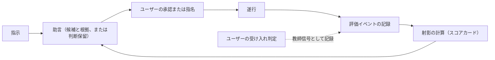

# Agent Dock の設計

この文書は、[VISION.md](./VISION.md) の「評価と采配の循環」を最初の実装から成り立たせるための設計文書である。
VISION を正とし、この文書を VISION と矛盾させることはできない。
矛盾する変更が必要な場合は、ユーザーの裁定によって先に VISION を改定する。

## 版数と進め方

製品版には Semantic Versioning 2.0.0 を使い、版表記に `v` を付けない。
最小のループを備えた最初の実用版を **0.1.0** としてリリースし、以後の拡張を 0.2.0、0.3.0 と重ねる。

- `0.1.0-alpha.N` は、0.1.0 を組み立てて検証する開発確認版とする。
- この文書は 0.1.0 の目標と設計上の制約を扱い、各 alpha の実装範囲と成立時点の挙動はリリース文書に記録する。
- 0.1.0 は、循環の全要素が実用開始時から存在する最小のループとする。
- 拡張の順序は事前に固定しない。
  「0.1.0 で実現しない VISION の要求」から、運用で痛みまたは証拠が出たものを選んで着手する。
- alpha の期間は ADR（Architecture Decision Record）を作らず、実装しながら技術を探索する。
  ADR は 0.2.0 以降の拡張から使う。
- alpha の設定は製品版から独立した `api_version` で識別し、版をまたぐ互換性と移行を保証しない。
  非対応の設定は、ユーザーが既定値 No の確認で許可した場合だけ退避して作り直す。
- alpha の JSONL イベントは一時的な保存形式であり、製品版から独立した `format_version` で識別する。
  版をまたぐ互換性と移行は保証せず、非対応のイベントは、ユーザーが既定値 No の確認で許可した場合だけログ全体を退避して空にする。

## 0.1.0 の輪郭

0.1.0 では、ドックが記録、射影、助言だけを担う。
資格、探索、リプレイ、評価の代行、再審査は実装せず、ユーザーが兼任する。
これは VISION の「資格のない初期状態」、すなわちユーザーが全役割を兼任する状態を、そのまま運用形にしたものである。

0.1.0 の采配はすべて**助言**（advisory）で行う。
助言では、ドックがスコアカードを根拠に候補の実行プロファイルを提示し、ユーザーが承認してから実行する。
証拠が足りないあいだは候補を選ばず**判断保留**（abstain）を返し、ユーザーが委任先を指名する。
したがって運用の初期は実質「記録と表示」であり、証拠が貯まるにつれて助言が効き始める。

ループの各辺は初日から存在する。
間引いたのは自動化の範囲であって、循環の構造ではない。

## 0.1.0 の乗組員

0.1.0 は、四つのエージェント CLI（Claude Code、Codex CLI、Gemini CLI、Antigravity CLI）のヘッドレス実行を共通の実行アダプタで包む。
これに加え、ユーザーが直接起動した Claude Code と Codex CLI の対話セッションを観測する。
モデルの違いを含めて数個の実行プロファイルを登録し、助言が選び分けられる選択肢を確保する。
三社の CLI を最初から扱うことで、特定ベンダーに固定しないという VISION の非目標も初日から満たす。

ヘッドレス実行と対話セッション経由の違いは、実行プロファイルを構成する実行基盤の違いとして扱う。
同じ CLI とモデルを使っても、ヘッドレス実行と対話セッションは別の実行プロファイルである。
対話セッションはドックから起動せず、ユーザーが直接起動したセッションを外側から観測する。

この入口を**直接実行の観測**（direct execution observation）と呼ぶ。
直接実行の観測は、CLI 横断の共通境界を持つ。
Gemini CLI と Antigravity CLI の対話セッションは、0.1.0 では共通境界の接続先に含めない。

## 直接実行の観測

直接実行の観測では、セッションと評価対象のタスクを別の単位として記録する。
セッションは CLI の会話が存在する範囲であり、タスクはユーザーが評価したい仕事の範囲である。
一つのセッションには複数のタスクを順番に記録できるが、同時に進行中として扱うタスクは一つだけとする。

タスクの開始、完了、中断は、ユーザーがドックのコマンドまたはそのコマンドを呼ぶスキルから付ける明示マークを正本とする。
ターンの終了、一定時間の無操作、セッション終了をタスク境界に読み替えない。
進行中のタスクがある状態では、別のタスクを開始できない。
次のタスクを開始するには、現在のタスクを完了または中断として明示的に閉じる。

### 観測イベント

イベントは、取得した事実の**来歴**（provenance）と、仕事の**実行元**（execution origin）を区別する。
来歴は手動マーク、CLI の hook、OpenTelemetry、通知など、事実を取得した経路を表す。
実行元は、ドックが仲介した実行か、直接実行を観測した仕事かを表す。
同じ事実を複数の経路から取得しても、来歴を実行元として扱わない。

共通のイベントモデルは、次の事実を表現する。

- **セッションの観測**：ドックが発行するローカルのセッション識別子、CLI、開始または再開、終了の通知、作業ディレクトリを記録する。
  CLI が発行した識別子は相関に必要な範囲でだけ保持し、ドックの識別子を正本とする。
- **タスクの開始**：タスク識別子、セッション識別子、実行元、開始時刻、自由タグを記録する。
  プロンプトは既存の明示許可がある場合だけ記録する。
- **タスクの終了**：完了または中断、終了時刻を記録する。
  受け入れ判定はタスクの終了へ埋め込まず、後から訂正できる別のイベントとして記録する。
- **構成の観測**：CLI、モデル、実行基盤、ツール、権限など、取得できた構成と欠測した構成を記録する。
- **プロファイルへの帰属**：観測した構成と登録済みの実行プロファイルを対応付けた結果を記録する。
  対応付けは観測事実と分け、訂正時には新しい帰属イベントを追記する。
- **実測**：明示マーク間の所要時間と、公式な機械可読経路から取得できた実支出を記録する。
  トークン量や公開単価から実支出を推定しない。
- **観測異常**：対応する開始がない終了マーク、取得できなかった終了通知、相関できない補助事実を、セッション単位の診断として記録する。

受け入れ判定はタスク識別子を対象とし、同じタスクへのユーザー判定が複数ある場合はイベントログへ後から追記された判定を現在値とする。
発生時刻ではなく追記順を使うことで、時計のずれに左右されず、既存の訂正規則を維持する。

対話セッション用の実行プロファイルは、CLI、実行基盤、モデルと、ツール、権限、CLI 設定のうち同一性に含める値を正規化した構成指紋を持つ。
観測アダプタはタスクの開始時と終了時に同じ項目を取得し、秘密そのものを含まない構成指紋を作る。
プロファイルへの帰属は、正規化した項目がすべて揃い、開始時と終了時で変わらず、登録済みプロファイルの正規形と一件だけ完全一致する場合に限る。
モデルの切り替えや構成変更を検知した場合は、単一の実行プロファイルへ帰属させない。

セッションの終了通知は、進行中のタスクを自動的に完了または中断にしない。
終了通知を取得できない場合も、開いたセッションとタスクを推定で閉じない。
進行中のタスクがない状態で終了マークを受け取った場合は、そのマークを拒否し、原因を推定せずセッション単位の孤立終了マークとして記録する。
開始と終了のどちらのマークもない仕事はタスクとして識別できないため、評価イベントを作らない。
終了マークがないタスク、時刻が不正なタスク、構成を実行プロファイルへ一意に帰属できないタスクは、理由を区別して欠測として残す。

OpenTelemetry の補助事実は、CLI のセッション識別子をドックのセッション識別子へ対応付け、発生区間が一つの明示マーク区間に完全に含まれる場合だけ、そのタスクへ関連付ける。
要求やターンがタスク境界をまたぐ場合、時刻またはセッションの対応が欠ける場合、複数のタスク区間に該当する場合は、タスクの補助実測に使わない。
遅れて届いた補助事実は発生時刻で区間へ対応付け、受信順によって別のタスクへ移さない。

セッション自体はタスクの外側にあるため、イベントの共通部分にタスク識別子を必須としない。
この変更では JSONL イベントの `format_version` を上げる。
対話セッションを実行基盤としてプロファイルの同一性へ加えるため、設定の `api_version` とプロファイル識別子の世代も上げる。
版をまたぐ互換性と移行は、「版数と進め方」に定めた alpha の規則に従って保証しない。

CLI が出力する OpenTelemetry を補助事実として取り込むことと、ドック自身の評価イベントを OpenTelemetry Traces として保存することは別の設計判断である。
後者は [Issue #16](https://github.com/megumish/agent-dock/issues/16) の将来検討とし、0.1.0 の評価イベントは引き続き版付き JSONL に保存する。

### CLI ごとの観測経路

CLI 固有の情報は共通イベントへ正規化し、CLI の通知形式やセッションログを評価イベントの保存形式にしない。
タスク境界と受け入れ判定には、どちらの CLI でもドックの明示マークを使う。
セッションの開始と終了には hook を使い、OpenTelemetry はタスク境界を決めない補助入力に限る。

- **Claude Code**：公式の [hooks](https://code.claude.com/docs/en/hooks) が提供する `SessionStart`、`SessionEnd`、`CwdChanged`、`StopFailure` を、セッションと構成の観測に使う。
  公式の [OpenTelemetry](https://code.claude.com/docs/en/monitoring-usage) が提供するセッション識別子、モデル、トークン量、API 要求単位の推定コストは補助事実として取り込める。
  推定コストは実支出として扱わず、取得できない実支出は欠測にする。
- **Codex CLI**：公式の [hooks](https://learn.chatgpt.com/docs/hooks) が提供する `SessionStart`、`SessionEnd`、`Stop` を、セッションと構成の観測に使う。
  公式の [OpenTelemetry](https://learn.chatgpt.com/docs/config-file/config-advanced#observability-and-telemetry) が提供する会話識別子、モデル、トークン量、ターンや API 要求の所要時間は補助事実として取り込める。
  `notify` はターン完了しか表さず会話本文を含むため、0.1.0 の既定の観測経路にしない。

どちらの CLI でも、hook から受け取る会話記録のパス、ユーザー入力、エージェントの応答、ツールの引数と出力を既定では保存しない。
OpenTelemetry は CLI が提供する本文の秘匿設定を有効にし、ローカルの受信口で許可した属性だけを評価イベントへ変換する。
Codex CLI のようにツール出力の断片を含みうる経路は、受信した属性を保存前に破棄できることを確認し、ユーザーが有効化した場合だけ使う。
CLI のセッションログは形式が安定した接続境界ではなく会話全文を含むため、通常の観測経路には使わない。

CLI の更新により観測できる属性や終了通知の条件は変わりうる。
接続層は CLI ごとの入力を検証して未知の形式を欠測として扱い、共通イベントの意味を推測で補わない。

## 0.1.0 の責務

- **入口**：指示を受け取り、助言とスコアカードを提示し、承認または指名を受け付ける。
  成果への受け入れ判定と自由タグの入力も同じ入口で受け付ける。
- **実行アダプタ**：承認された実行プロファイルで CLI をヘッドレス起動し、所要時間や実支出などの実測を正規化してイベントにする。
  実際に使った構成も記録する。
- **観測アダプタ**：ユーザーが直接起動した Claude Code と Codex CLI から、セッション、構成、補助実測を受け取り、共通イベントへ正規化する。
  タスク境界と受け入れ判定は、ユーザーの明示マークからだけ記録する。
- **記録**：評価イベントをローカルに追記で保持する。
- **射影**：記録からスコアカードを計算する。
- **助言**：スコアカードを根拠に候補を提示し、証拠が足りなければ判断保留を返す。

## 0.1.0 の不変条件

実装の規模を絞っても、次の条件は満たす。
いずれも VISION から導かれる。

- **承認の必須**：ドックが起動する実行は、すべてユーザーの明示承認または指名を経る。
  0.1.0 ではこの承認が裁定の役割を果たし、これより強い境界執行機構は置かない。
  実行中の送信制御は、各 CLI 自身の権限機構に委ねる。
  ユーザーが直接起動したセッションの受動的な観測は、実行を起動または承認しないため、この条件の対象外である。
- **最小記録**：秘密、成果物の全文、プロンプトの全文を既定で記録しない。
- **追記と削除**：通常運転ではイベントを追記し、書き換えない。
  訂正は新しいイベントとして追記する。
  削除はユーザーだけが指示できる。
- **ユーザー判断の優先**：受け入れや選好といった価値判断は、ユーザーの判定だけを教師信号とする。
  受動的な観測や外部の評判を教師信号にしない。
- **プロファイルへの帰属**：成績は実行プロファイルに帰属させる。
  構成を変えた場合は別の実行プロファイルとして登録し、証拠を引き継がない。
  実行基盤が異なる場合も別の実行プロファイルとする。
  必要な構成が欠測している場合や、登録済みプロファイルへ一意に対応しない場合は帰属させない。
- **明示的なタスク境界**：直接実行の観測では、一つのセッションで進行中のタスクを一つに限る。
  セッションやターンの状態から、タスクの開始、完了、中断を推定しない。
- **総合順位の禁止**：射影を単一の普遍スコアや総合順位へ集約しない。
- **成功の非主張**：0.1.0 はドックの成功を主張しない。
  成功を主張するには、VISION の成功基準に従う事前登録が先に必要である。

## スコアカード

複数の実行プロファイルについて射影を並べて表示するビューを**スコアカード**（scorecard）と呼ぶ。
0.1.0 のスコアカードは次の三軸を持つ。

- **受入率**：ユーザーの受け入れ判定が付いた実行を母数とし、受け入れられた割合。
  判定のない実行は母数に含めず、判定済みの件数を別に示す。
- **所要時間**：乗組員の実行開始から終了までの実測時間。
- **実支出**：CLI の機械可読出力から取得できる範囲の金銭的支出。
  取得できない場合は欠測として明示する。

直接実行を観測したタスクは、完了し、登録済みの実行プロファイルへ一意に帰属できる場合だけ、仲介実行と同じスコアカードへ含める。
観測した実行であることは実行元として保持し、仲介実行と区別して監査できるようにする。
進行中、中断、帰属不能、時刻不正のタスクはスコアカードの母数へ入れず、除外理由ごとの件数を示す。
受け入れ判定のない完了タスクは、仲介実行と同じく受入率の母数へ入れない。
所要時間には、受け入れ済みの完了タスクについて開始マークから終了マークまでの実測時間を使う。
実支出が欠測していても、条件を満たす受入率と所要時間の証拠まで除外しない。

各軸には件数と直近の実行日時を添え、証拠の量と古さを読めるようにする。
鮮度の重み付けと不確実性の定量化は行わず、この件数と直近性の表示で代替する。

タスクには自由タグを付けられ、付けない場合は未分類として明示する。
スコアカードはタグで絞り込める。

## 助言の規則

- 候補には、参照したスコアカードの値を根拠として添える。
- 指示と同じタグの実行実績が無い場合、または件数が少ない場合は判断保留を返す。
  件数の閾値は実装で調整する。
- 提案、承認または拒否、指名、実行、受け入れ判定は、それぞれ別のイベントとして記録する。
- 助言に従わない指名も通常の運用であり、記録の上で区別する。

## 0.1.0 で実現しない VISION の要求

0.1.0 は、VISION の次の要求を実現しない。
各項目には、対応する VISION の節と、0.1.0 での扱いを添える。

- **遂行中の技術判断の記録**（評価イベント）：0.1.0 が決定として記録するのは采配上の判断だけであり、遂行中の技術判断は取り込まない。
- **モデル単位の参考集計**（評価イベント）：スコアカードは実行プロファイル単位だけを表示し、モデルを横断する参考射影は作らない。
- **射影の鮮度、不確実性、適用範囲**（射影としてのスコア）：鮮度の重み付けと確からしさの定量化は行わず、件数、直近性、タグ絞り込みの表示で代替し、読み取りはユーザーが担う。
- **評価の代行**（教師信号と観測事実）：観測状態、常時監査、領域の限定、独立性を含む一式を実装せず、評価はすべてユーザーが行う。
- **リプレイと再審査**（証拠と外部事前情報の優先関係）：自前リプレイによる初期審査、定点観測、再審査を行わず、実タスクの実測だけを証拠にする。
- **外部事前情報と外部シグナル**（証拠と外部事前情報の優先関係）：外部ベンチマークの合成と再審査のトリガーを取り込まず、新しい乗組員の見立てはユーザーが行う。
- **役割、資格、自動委任**（役割ごとの資格）：役割の分化、適性要件、資格の付与から失効までを実装せず、すべての実行はユーザーの承認または指名を経る。
- **探索**（評価と采配の循環）：探索予算による割り当てを実装せず、証拠の薄い乗組員を試すかどうかはユーザーの指名に任せる。
- **エスカレーション**（自律判断の優先順位）：0.1.0 には自律判断がないため、判断を止めてユーザーへ求める手続き自体が生じない。
- **手間の上限の計測**（設計と運転の原則）：手間の代理指標と上限の運用を実装せず、続けられるかの判断はユーザーの体感に任せる。
- **成功基準の判定**（成功基準）：事前登録とベースライン比較を実装しない。
  不変条件の「成功の非主張」で整合させる。

自動委任へ進むときは、境界の機械的な執行と、記録の欠落を検知する仕組みを先に実現する。
この順序だけは事前に定める。
VISION の自律判断の優先順位が第 1 層に置く、境界外への送信と不可逆な帰結の回避は、事後の評価では取り返せないためである。

## この文書の更新規則

- alpha の間は、実装の探索に合わせてこの文書を随時改定する。
- 0.2.0 以降の設計決定は ADR として `docs/adr/` に記録し、採択にはユーザーの承認を必要とする。
- 実現しない要求へ着手するときは、ADR を起草してから実装する。
- 要求を実現したら、「0.1.0 で実現しない VISION の要求」の列挙から外す。
- プロジェクト固有の用語の英語表記は、VISION と本文書の初出併記を正本とする。
  実装で用いる識別子は、0.2.0 以降の ADR で確定する。
