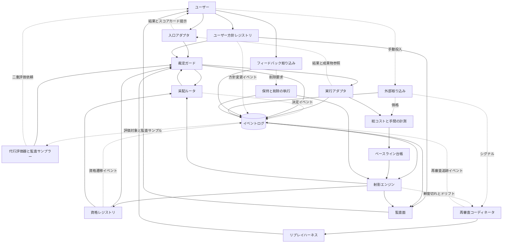

# Agent Dock の設計

この文書は、[VISION.md](./VISION.md) の理念と概念モデルを実装可能な構成へ落とし込む設計文書である。

この文書は技術を選定しない。
この文書が固定するのは、VISION から導かれる設計不変条件と、現時点の論理責務およびフローである。
実装方式は設計判断一覧に未決事項として残し、各フェーズの入口または設計判断一覧に明記した時点の ADR（Architecture Decision Record）で確定する。
決定は ADR でのみ生まれる。

文書体系は次のとおりである。

- **VISION**：理念と設計不変条件を定める。
- **DESIGN**：論理責務、フロー、未決の設計点を定める。
- **ADR**：採用する案と理由を記録する。
- **実装**：ADR の決定を具体化する。

## 記述の効力

本文には効力の異なる三種類の記述がある。
種類は大文字の英語マーカーで示す。
マーカーは、それを含む一つの段落、表の一行、または箇条書きの一項目にだけ適用する。
複数の文へ適用する場合は、文を同じ段落または同じ項目にまとめる。
マーカーのない記述は `FIXED` として読む。

- **設計不変条件**（`INVARIANT`）：VISION から導かれる論理契約である。
  実装方式にかかわらず満たす必要がある。
  変更するには、先に VISION を改定する必要がある。
- **論理構成**（`FIXED`）：この文書が固定する論理責務とフローである。
  VISION と矛盾しない範囲で、この文書の改定によって変更できる。
- **未決の設計点**（`OPEN`）：ADR で決める問いと選択肢である。
  設計判断一覧に保持し、ADR が確定するまで特定の案を採用しない。

本文中の具体名は、明示的に `OPEN` の選択肢として書かれていない限り、現状を説明するための名称である。
具体名の記載だけでは選定にならない。
非規範の調査資料は「非規範の調査ノート」で扱う。

## 全体像

図の各ボックスは論理責務を表す。
各ボックスが別プロセスまたは別ストアであることは意味しない。
物理的な分割は `OPEN` であり、ADR で決める。
この文書では、外部から取り込む仮説入力を**外部事前情報**（prior）と呼ぶ。

| VISION の概念 | 論理責務 |
| --- | --- |
| コマンドまたはエージェントスキルによる入口 | 入口アダプタ |
| 候補の選定 | 采配ルータ |
| 自律判断の優先順位とエスカレーション | 裁定ガード |
| 実行プロファイルと実測 | 実行アダプタ |
| 評価イベント、来歴、最小記録 | イベントログ |
| 値、不確実性、適用範囲、鮮度からなる射影 | 射影エンジン |
| 判断過程の監査 | 監査面 |
| 役割、資格の付与、保留、取り消し、失効 | 資格レジストリ |
| ユーザーの価値判断から得る教師信号 | フィードバック取り込み |
| 評価の代行と常時監査 | 代行評価器と監査サンプラー |
| 再演、初期審査、定点観測 | リプレイハーネス |
| 外部事前情報、外部シグナル、価格 | 外部取り込み |
| 成功基準の事前登録と自己計測 | ベースライン台帳 |
| ユーザーの受け入れ基準、リスク上限、境界 | ユーザー方針レジストリ |
| 鮮度切れ、ドリフト、再審査の起動 | 再審査コーディネータ |
| 保持境界とユーザー起点の削除 | 保持と削除の執行 |
| 実支出、ローカル計算資源、ユーザーの手間 | 総コストと手間の計測 |
| 障害時のイベント完全性 | 実行アダプタとイベントログ |

複数の射影について、値、不確実性、適用範囲、鮮度を並べて表示するビューを**スコアカード**と呼ぶ。
スコアカードは、新しいスコアや単一の総合順位を作らない。

`INVARIANT`：ドックが起動または仲介するすべての実行は、D-21 で定める同じ境界執行契約に従う裁定ガードを通ってから実行アダプタへ到達する。
対象には、通常遂行、探索、リプレイの再演、代行評価の審判実行を含む。
ルータの推薦、ユーザーの直接指名、内部責務からの実行要求にも同じ契約を適用する。
ここでいう「同じ」は、物理的に単一のプロセスまたはインスタンスであることを意味しない。

ユーザーがドックを介さずにエージェントを直接使う場合、その実行はこの契約の適用対象外である。
この適用範囲は、VISION が定める実行系の非所有と整合する。

## 四つの運用モード

実行の決定主体と推薦の扱いを四つの運用モードに分ける。

`INVARIANT`：`Phase 5` より前に、ドックが実行を決定する自律権限は存在しない。

| 運用モード | 推薦 | 対象作業の実行 | 決定主体 |
| --- | --- | --- | --- |
| **手動**（`manual`） | 必須ではない | ユーザーの指名後に実行する | ユーザー |
| **シャドー**（`shadow`） | 計算して記録するが提示しない | 推薦による実行は行わない | ユーザー |
| **助言**（`advisory`） | 根拠と判断保留を提示する | 毎回の明示承認後に実行する | ユーザー |
| **委任**（`delegated`） | 適格な候補から選定する | 独立した資格、リスク、権限のゲート通過後に実行する | ドック |

四つの運用モードは采配の自動化状態だけを表し、評価代行の自動化状態には使わない。
資格前の候補による評価出力を記録するが、その出力自体を現在の判定、射影、資格判定の入力に使わない状態を**評価代行の観測状態**と呼ぶ。
同じ対象へのユーザー判断と観測出力を比較して得た一致実績は、資格審査の証拠にできる。
評価代行の観測状態は較正のための出力状態であり、評価を代行する権限ではない。
運用モードと評価代行の観測状態は独立しており、同じ状態変数として扱わない。

対象作業を実行する場合は、運用モードにかかわらず裁定ガードを通る。
`shadow` で推薦計算のために内部実行が必要な場合も、実行経路の不変条件を適用する。
各運用モードを利用できる時期は [PLAN.md](./PLAN.md) のフェーズ定義に従う。

ユーザーが無資格の実行プロファイルを一回だけ指名する場合も、`manual` として扱う。
裁定ガードは適用範囲と有効期限を記録する。
単発委任と探索許可が資格へ与える影響は D-22 に従う。

## 記録、証拠、規範の区分

### 正典記録

**正典記録**とは、何が起き、誰が何を主張したかを確定する記録である。
イベントログは正典記録を保持する。
実測、ユーザー判断、外部ベンチの取り込みは、発生または主張の記録として等しく正典である。
正典であることは、記録された内容を証拠として信頼できることを意味しない。

`INVARIANT`：通常の自律運転ではイベントを追記し、書き換えまたは削除を行わない。
この追記規則の唯一の優先例外は、ユーザーが要求し、認可された削除または秘匿である。
VISION が定める保持境界は、イベントの不変性に優先する。
許可記録と完全性記録にも同じ例外を適用する。
削除時の非機微な処置来歴は、安全であり、かつユーザー方針が許す場合にだけ残す。
追記と削除の優先規則はこの段落を正本とし、他の箇所ではこの段落を参照する。

### 証拠階級

**証拠階級**は、命題への寄与を証拠の種類ごとに定める序列である。
たとえば「この実行プロファイルはこの種別に強い」という命題への寄与は、証拠の種類によって異なる。
すべての証拠は、出所、時刻、記録時の方針版、プロトコル版からなる来歴を持つ。
次の階級規則は VISION の証拠の序列から導かれる。

| 証拠 | 階級規則 |
| --- | --- |
| ユーザーの価値判断 | 受け入れ、選好、リスク許容の最終基準 |
| 実タスクの実測 | 関連性、比較可能性、十分性がある場合に他の源泉へ優越する |
| リプレイ | 較正、審査、定点観測に使う第二階級 |
| 代行評価 | ユーザー判断に常に劣後する別種のイベント |
| 外部事前情報 | 仮説として一次証拠と区別して射影へ合成する |
| 外部シグナル | 証拠には使わず、再審査の起動だけに使う |
| 価格 | 証拠には使わず、総コスト計算へ即時に反映する |

### ユーザー規範

**ユーザー規範**は、証拠から導出せず、ユーザーが定める運用上の基準である。
受け入れ基準、リスク上限、送信境界、保持境界、探索予算、手間上限が該当する。

`INVARIANT`：ユーザー規範を変更できるのはユーザーだけである。
恒久変更と単発許可は別種のイベントとして記録する。

表現、保管、認証によって変更権限を保証する機構は D-15 で決める。

## VISION との対応

| VISION の不変条件 | 責務 | 決定点 | 検証の場 |
| --- | --- | --- | --- |
| ドックを介する仕事をすべて記録する | イベントログと実行アダプタ | D-02、D-14、D-18、D-24 | `Phase 0–1` |
| イベントの来歴を保持し、訂正を追記する | イベントログ | D-02、D-19 | `Phase 0–1` |
| 最小記録とし、秘密または全文を既定で保存しない | イベントログと保持と削除の執行 | D-02、D-15、D-21 | `Phase 0` |
| 成績を実行プロファイルに帰属させ、モデルを射影として扱う | 射影エンジン | D-13、D-03 | `Phase 2` |
| 射影に不確実性、適用範囲、鮮度を持たせる | 射影エンジン | D-17、D-10 | `Phase 2` |
| 外部事前情報と一次証拠を区別して合成する | 外部取り込みと射影エンジン | D-08、D-17 | `Phase 3` |
| 資格の付与、保留、取り消し、失効を役割ごとに扱う | 資格レジストリ | D-04、D-13、D-22 | `Phase 3` と `Phase 5` |
| 自律判断と単発許可を実現する | 裁定ガードと方針レジストリ | D-09、D-11、D-15 | `Phase 0`、`Phase 4–5` |
| 境界外への送信を自律で行わない | 裁定ガード | D-21、D-15 | `Phase 0` 以降 |
| 探索を低リスクかつ予算内に制限する | 裁定ガードと采配ルータ | D-11、D-22 | `Phase 4–5` |
| ユーザー判断を価値判断の最終基準とする | フィードバック取り込み | D-06、D-15 | `Phase 1` |
| 評価の代行を常時監査し、別種のイベントとして記録する | 代行評価器と監査サンプラー | D-12 | `Phase 3` と `Phase 5b` |
| 比較条件を事前登録し、不利な結果も開示する | ベースライン台帳 | D-16 | `Phase 0` と `Phase 2` と `Phase 4` |
| ユーザーの手間を上限内に保つ | 総コストと手間の計測 | D-16 | 全フェーズ出口 |
| 根拠、理由、方針、上書きを監査できる | 監査面 | D-23 | 全フェーズ |

## 論理コンポーネント

### 入口アダプタ

入口アダプタは、ホスト環境のコマンドまたはスキルとして実装する薄い層である。
入口アダプタは指示を受け取り、結果とスコアカードを提示する。

`INVARIANT`：入口アダプタはエージェントを直接起動せず、実行要求を裁定ガードへ渡す。

ホストの選定と配置は D-01 と D-20 で決める。

### 采配ルータ

采配ルータは、資格レジストリと射影を参照し、適格な候補を列挙して順位付けする。
証拠が足りない場合は、候補を選ばず判断を保留する。
采配ルータは候補を生成するが、実行を許可しない。
`manual` では采配ルータを使う必要がない。
采配ルータの判断は決定イベントとして記録する。
順位付けと判断保留の機構は D-05 で決める。

### 裁定ガード

裁定ガードは、実行経路の不変条件を執行する非迂回のゲートである。
裁定ガードは自律判断の優先順位とユーザー方針を適用する。
ドックが自律では許可できず、ユーザーの単発許可で許可できる要求については、選択肢と推奨案を添えてエスカレーションする。
境界を保証できない操作は、ユーザーへのエスカレーションでは代替せず、安全側で拒否する。
裁定ガードは、資格、リスク、権限を独立したゲートとして判定する。
境界執行は起動前だけでなく、実行中も継続する。
未決の機構は D-09、D-11、D-15、D-21 で決める。

### 実行アダプタ

実行アダプタは、実行プロファイルでエージェントを起動し、実測を正規化してイベントにする。
**能力申告**は、測定できる項目、停止できる操作、観測できない項目を示す。
**実行レシート**は、実際に使った構成と、取得できる範囲の実サーバー情報およびバージョン情報を示す。
ホストが遂行中の技術判断を観測できる場合は、その判断を決定イベントとして取り込む。
観測できない場合は、能力申告で欠測を明示する。
中止、再試行、部分失敗、結果不明の扱いは D-18 と D-24 に従う。
実行基盤と契約の未決事項は D-01、D-18、D-24 で決める。

### イベントログ

イベントログは、発生と主張の正典記録を保持する。
追記と削除には「正典記録」で定めた優先規則を適用する。
イベントは型付きの封筒に収める。
共通必須項目の候補は、`id`、時刻、種別、`source`、`actor`、因果参照、`schema_version` である。
実行プロファイル参照は、実行関連のイベント型でだけ必須とする。
本文は最小記録とし、全文を既定で保存しない。
封筒、因果参照、版管理の未決事項は D-02、D-14、D-19 で決める。

### 射影エンジン

射影エンジンは、イベントと外部事前情報から、値、不確実性、適用範囲、鮮度を導出する。
計算対象の軸は D-17 の射影カタログで決める。
計算では証拠階級、来歴、選択バイアスを考慮する。
比較レポートも射影エンジンが計算する。
未決の分類、射影、鮮度は D-03、D-17、D-10 で決める。

### 監査面

監査面は、イベントの来歴、采配の理由、候補集合、棄却理由、適用した方針の版、上書き記録をユーザーへ示す。
監査面だけを使って判断過程を再構成できることを受け入れ条件とする。
具体的な受け入れ条件は D-23 で決める。
異議申立ては訂正イベントとして受け付ける。

### 資格レジストリ

資格レジストリは、役割と実行プロファイルの組ごとに資格状態を保持する。
各資格状態は根拠となる射影を参照する。

`INVARIANT`：資格は自律委任の必要条件だが、権限の十分条件ではない。
`Phase 5` より前は候補状態だけを使い、実行権限を与えない。

資格のライフサイクルは D-22 に従う。
役割、同一性、ライフサイクルの未決事項は D-04、D-13、D-22 で決める。

### フィードバック取り込み

フィードバック取り込みは、ユーザーの価値判断をイベントにする。
ユーザーが明示した評価は教師信号として記録する。
成果の残存、手戻り、採用などから得る**受動シグナル**は、ユーザーの価値判断を推測する観測または代理信号として記録する。
受動シグナルは教師信号として扱わず、現在のユーザー判定を上書きしない。
明示的な入力と受動的な入力の設計は D-06 で決める。
入力操作数の上限は候補であり、設計不変条件ではない。
訂正要求と削除要求もこの責務が受け付ける。

### 代行評価器と監査サンプラー

代行評価器は、資格前の候補を評価代行の観測状態で実行できる。
観測出力は現在の判定を変更せず、同じ対象へのユーザー判断と比較して得た一致実績だけを資格審査の証拠にする。
現在の判定に使う評価は、ユーザー判断との一致率に基づく資格を持つ範囲でだけ代行する。
監査サンプラーは、代行評価の一部をユーザーの二重評価へ送る。
審判モデルの実行も裁定ガードを通る。
評価の代行は采配の委任とは別の自律性である。
評価の代行は `Phase 5b` で解放する。
独立性、サンプリング、不一致処理は D-12 で決める。

### リプレイハーネス

リプレイハーネスは、分離環境で初期審査、較正、定点観測のための再演を行う。
再演の実行要求にも、本番と同じ境界執行契約を適用する。

`INVARIANT`：分離環境では、作業対象または外界に対する作業領域の副作用を禁止する。
許可された外部モデル API への通信と、計測された支出は、禁止する副作用に含めない。
これらの通信と支出には、本番と同じガード、予算、記録を適用する。
外部 API のモデルを組み込んだ実行プロファイルも乗組員になり得るためである。
審判側の実行にも同じ境界を適用する。
分離の定義はこの段落を正本とし、他の箇所ではこの段落を参照する。

採点は D-07 で定める判定基準に従う。
受け入れ済み成果との差分は診断材料にだけ使う。
再構成に必要な再演マニフェストは `Phase 0–1` から保存する。
再演方式の未決事項は D-07 で決める。

### 外部取り込み

外部取り込みは、価格、外部事前情報、外部シグナルを受け付ける。
価格は総コスト計算へ即時に反映する。
外部事前情報は仮説として来歴を記録し、射影の仮説入力にする。
外部シグナルは再審査の起動だけに使う。
取り込み口を共有する場合も、型と利用先を分ける。
取り込み方式は D-08 で決める。

### ベースライン台帳

ベースライン台帳は、成功評価プロトコルと比較条件の版を事前登録する。
保留データまたは将来データによる評価結果を保持する。
不利な結果も開示する。
初回改善後も効果が維持されるかを継続して監視する。
評価対象群の凍結規則を含む評価契約は D-16 で定める。

### ユーザー方針レジストリ

ユーザー方針レジストリは、ユーザー規範を保管し、他の責務から参照できるようにする。
恒久変更と単発許可は別種のイベントとして記録する。
エージェントが変更できないことを保管と認証で保証する機構は D-15 で決める。

### 再審査コーディネータ

再審査コーディネータは、鮮度切れ、ドリフト検知、外部シグナルを受けて再審査を起動する。
起動した再審査の進行を追跡する。
鮮度とスケジュールの機構は D-10 で決める。

### 保持と削除の執行

保持と削除の執行は、保持境界を適用する。
ユーザーが要求し、認可された削除または秘匿を実行する。
ユーザー方針によっては、参照、ハッシュ、削除済みを示す印も消去対象になる。
削除後は派生射影を無効化し、削除を尊重して再計算する。
再構築が削除を尊重することも検証する。

未決の機構は D-15、D-19、D-21 で決める。

### 総コストと手間の計測

総コストと手間の計測は、API の従量料金、定額契約の配賦額、ローカル計算資源の費用などの実支出と、ユーザーの手間を測る。
金額へ換算できないローカル計算資源の使用量は、元の単位で保持して別に開示する。
ユーザーの手間は単一指標に集約しない。
計測結果は成功評価プロトコルの入力にする。
指標と上限は D-16 で決める。

### 障害時のイベント完全性

障害時のイベント完全性は、実行アダプタとイベントログにまたがる責務である。
実行状態、試行の冪等性、重複検出、突き合わせ、クラッシュ回復を扱う。
重複イベントと重複実行は区別する。
`INVARIANT`：記録の取りこぼしを検知した場合は、新しい受付と実行を安全停止する。
この停止によって、記録できない仕事が増えることを防ぐ。
完全性の不変条件と契約は D-24 で定める。

## クリティカルフロー

1. **手動実行**
   入口アダプタはユーザーの指名を裁定ガードへ渡す。
   裁定ガードはユーザー方針と自律判断の優先順位を検査する。
   許可された要求は実行アダプタへ渡り、実行レシートと結果がイベントログへ記録される。
   射影エンジンは記録後に射影を更新する。
   `manual` では采配ルータを経由しない。
2. **助言と委任による実行**
   `advisory` では、采配ルータが推薦と根拠を提示し、ユーザーの明示承認後に裁定ガードの最終判定を受ける。
   `delegated` では、采配ルータの選定後に資格、リスク、権限の独立ゲートを判定する。
   どちらの運用モードでも、判断を決定イベントとして記録してから実行する。
3. **シャドー計測**
   `shadow` では、采配ルータが推薦を計算して決定イベントとして記録する。
   推薦はユーザーへ提示せず、推薦に基づく対象作業も実行しない。
4. **遅延フィードバックと訂正**
   後日のフィードバックは、D-14 の因果参照で元の実行へ接続する。
   訂正は新しいイベントとして追記し、元のイベントとの優先関係を記録する。
5. **削除**
   ユーザーの削除要求は保持と削除の執行へ渡す。
   認可された範囲を消去し、派生ビューを無効化して再計算する。
   非機微な処置来歴は、安全であり、かつ方針が許す場合だけ残す。
   再構築が削除を尊重することを検証する。
6. **探索**
   采配ルータは証拠の薄い候補を予算内で提案する。
   裁定ガードは低リスクで可逆であることと、予算残を検査する。
   許可された探索を実行し、探索タグを付けてイベントにする。
   探索許可と資格の関係は D-22 の不変条件に従う。
7. **リプレイと再審査**
   再審査コーディネータは、鮮度切れ、ドリフト、外部シグナルを受け取る。
   リプレイハーネスは再演マニフェストから環境を再構成する。
   再演は本番と同じ境界執行契約を通り、分離環境で実行する。
   D-07 の判定基準で採点し、リプレイ階級のイベントとして記録する。
   射影更新後の資格状態遷移は D-22 に従う。
8. **外部取り込み**
   外部シグナルは来歴を記録し、再審査コーディネータへ渡す。
   外部シグナルはスコアへ加えない。
   価格は総コスト計算へ即時に反映する。
   価格を更新できない場合は比較結果を不明として扱う。
   外部事前情報は来歴イベントと射影の仮説入力にする。
9. **エスカレーションと単発上書き**
   裁定ガードは、不確実性または許可可能な境界超過を検知すると、選択肢と推薦をユーザーへ提示する。
   ユーザー領分の基準が欠けていた場合は、裁定を教師信号として記録する。
   適性の実証が足りない場合は、裁定を適用範囲と有効期限を持つ単発許可として記録する。
   恒久変更と単発許可は別種のイベントにする。
10. **共同作業の帰属**
    複数の実行プロファイルの関与は実行単位で記録する。
    D-14 で帰属規則を決めるまでは、根拠なく個体へ配賦せず「共同」のまま保持する。
11. **失敗と再試行**
    実行アダプタは、`planned`、`started`、`completed`、`failed`、`unknown` の実行状態を区別して記録する。
    再試行は新しい `attempt` とし、因果参照で元の試行へ接続する。
    `unknown` は結果不明として表現し、突き合わせで解決する。
    詳細は D-24 で決める。
12. **代行評価の常時監査**
    代行評価器は、探索またはリプレイの成果について審判実行を要求する。
    審判実行も裁定ガードを通る。
    代行判断はユーザー判断に劣後する別種のイベントとして記録する。
    監査サンプラーは一部をユーザーの二重評価へ送る。
    不一致が閾値を超えた場合は該当領域の代行を自動停止する。
    停止後の資格状態遷移は D-22 に従う。

## 設計判断一覧

設計判断一覧の各項目には、異なる効力のフィールドが含まれる。
VISION 制約は `INVARIANT` に準ずる。
問いと選択肢は `OPEN` である。
状態と可逆性は現在の設計点を説明する `FIXED` のメタデータである。
証拠計画、依存、決定境界、ADR トリガは、この文書が定める `FIXED` の運用上の約束である。
これらの約束は、この文書を改定しない限り ADR を拘束する。

各項目は次のフィールドを持つ。

- **状態**：設計点の現在の状態を示す。
- **問い**：ADR が答える問いを示す。
- **VISION 制約**：選択肢が満たす設計不変条件を示す。
- **選択肢と調査**：比較する方式、必要な能力、論点を示す。
- **証拠計画**：選択肢の比較または採択した契約の検証に使う証拠と、その取得時期を示す。
- **依存**：先に定義または決定する設計点と、同時に整合させる設計点を示す。
- **決定境界**：決定可能時点と決定期限を示す。
- **ADR トリガ**：ADR を起草または再検討する条件を示す。
- **可逆性**：決定後の変更しやすさを示す。

個別製品、版、現時点の評価は調査ノートに置く。
選択肢の列挙は網羅ではなく、ADR は列挙外の案も採用できる。
既存の OSS を採用する案と自作する案のどちらも既定としない。
選定では契約への適合性と維持コストを比較する。
小さく可逆性の高い決定は、問い、決定境界、可逆性だけの簡約形にできる。

`Phase 0` で ADR を必要とする意味契約は、D-02 の封筒、D-13 の同一性、D-14、D-15、D-16、D-19 の互換原則、D-21 である。
D-02、D-13、D-14、D-19 は、記録開始後に変更すると移行と再解釈が必要になり、証拠の比較可能性を失うおそれがある。
D-15 と D-21 は、最初の実行より前に決めなければ境界を保証できない。
D-16 は、結果を見る前に登録しなければ事前登録として成立しない。
一方で、射影の数式、減衰値、監査サンプリング率、采配アルゴリズムは、必要な証拠が集まるまで決めない。

### D-01 実行基盤

- **状態**：未決。
- **問い**：エージェントをどの実行基盤で起動するか。
- **VISION 制約**：
  - 特定のベンダーに固定しない。
  - 制御面をローカルに置く。
  - 実測を取得できる。
- **選択肢と調査**：
  - `A`：既存エージェント CLI の非対話実行を束ねる。
  - `B`：単一ホストで完結させる。
    この案では他社の能力を利用しにくくなり、ベンダー中立性が弱まる。
  - `C`：実行基盤を自作する。
    この案は計測点を細かく制御できるが、構築と保守の負担が大きい。
  - 導入済み CLI と版の一覧は調査ノートに置き、ADR の起草時に取り直す。
- **証拠計画**：D-18 と D-24 の共同最小契約に対する適合性マトリクスで候補を比較する。
  `Phase 1` では一つの候補を実測する。
- **依存**：D-18 と D-24 の共同最小契約。
- **決定境界**：
  - 決定可能時点は、D-18 と D-24 の共同最小契約の確定後とする。
  - 決定期限は `Phase 1` の入口とする。
- **ADR トリガ**：共同最小契約の確定後、`Phase 1` の開始前に起草する。
- **可逆性**：高い。
  共通契約の背後で実行基盤を差し替えられる。

### D-02 イベント封筒と保存先

- **状態**：未決。
  封筒は `Phase 0` で ADR を必要とする。
- **問い**：型付き封筒、本文の参照方式、保存先をどのように設計するか。
- **VISION 制約**：
  - 追記と削除には「正典記録」で定めた優先規則を適用する。
  - 来歴を保持する。
  - 秘密または全文を既定で保存しない。
  - 正典記録をローカルに置く。
- **選択肢と調査**：
  - 封筒の具体的なフィールドは ADR で決める。
  - 共通フィールドの候補は、`id`、時刻、種別、`source`、`actor`、因果参照、`schema_version` である。
  - 実行プロファイル参照は、実行関連のイベント型でだけ必須とする。
  - 本文は、内容ハッシュによる参照、パス参照、ユーザーが明示した場合だけの保持を比較する。
  - 保存先は、埋め込みデータベースと、追記ログおよび派生インデックスの組合せを比較する。
  - 完全性の機構は D-24 と接続する。
- **証拠計画**：`Phase 0` の縦切り実装で、封筒 `v0` を実行に依存しないイベントを含む実データへ適用する。
- **依存**：D-14 と同時に決める。
  D-24 と D-19 に整合させる。
- **決定境界**：
  - 封筒の決定可能時点は制限しない。
  - 封筒の決定期限は `Phase 0` とする。
  - 暫定保存先 `v0` の決定可能時点は制限しない。
  - 暫定保存先 `v0` の決定期限は `Phase 0` とする。
  - 保存先の再選定は、`Phase 2` で射影クエリの実態が分かった後に行える。
  - 保存先の再選定には固定の決定期限を置かない。
- **ADR トリガ**：`Phase 0` の開始時に封筒と暫定保存先を決める。
  `Phase 2` で暫定保存先の限界が判明した場合は再検討する。
  限界が判明しない場合も、`Phase 3` の入口までに一度再評価する。
- **可逆性**：封筒は低い。
  保存先と本文の参照方式は高い。

### D-03 タスク分類

- **状態**：未決。
- **問い**：タスク種別タグの初期体系と更新方法をどう設計するか。
- **VISION 制約**：単一の普遍スコアや総合順位へ集約しない。
  射影ごとに対象範囲を定める。
- **選択肢と調査**：
  - `Phase 1` の暫定語彙は、明示的な `unclassified` と自由タグを最小形とする。
  - 手動で用意した粗い種別を暫定語彙へ加える案も比較する。
  - タグは采配時に付与し、後から訂正できるようにする。
  - 過去の評価対象群は、D-16 の凍結規則に従って書き換えない。
  - 初期種別と既存標準の評価は調査ノートに置き、ADR の起草時に確認する。
- **証拠計画**：`Phase 1` の実データで、未分類率、複数ラベルの被覆率、タグの安定性を測る。
  `Phase 4a` でタグ別の候補被覆率と判断保留率を測る。
  `Phase 4b` の前向き比較で、タグを使う采配と帰結差の関連を検証する。
- **依存**：なし。
- **決定境界**：
  - 暫定語彙の決定可能時点は制限しない。
  - 暫定語彙の決定期限は、`Phase 1` で最初の実環境での実行を始める前とする。
  - 正式な初期体系は、`Phase 1` のデータ取得後に決められる。
  - 正式な初期体系の決定期限は `Phase 2` の入口とする。
- **ADR トリガ**：`Phase 1` の開始前に暫定語彙を決める。
  `Phase 2` の開始前に正式な初期体系を決める。
- **可逆性**：高い。
  タグは追加または再付与できるが、登録済みの評価対象群は D-16 に従う。

### D-04 役割と適性要件

- **状態**：未決。
- **問い**：初期役割と、役割ごとの適性要件をどの形式で表現するか。
- **VISION 制約**：
  - 役割に上下関係を置かない。
  - 資格は実行プロファイルへ付与する。
  - コストも適性の一部として評価する。
- **選択肢と調査**：
  - 初期役割の候補は、采配役、設計役、実装役、大量実装役、検証役、評価代行役である。
  - 適性要件は、宣言的設定ファイル、汎用ポリシーエンジン、コード内定義を比較する。
  - 個別候補は調査ノートに置く。
- **証拠計画**：`Phase 2–3` で、役割が参照する射影軸の値と不確実性が、候補の比較に使える程度まで安定するかを確認する。
- **依存**：D-13、D-17。
- **決定境界**：
  - `candidate` と `shadow` で使う暫定役割は、`Phase 2` の出口通過後に決められる。
  - 暫定役割の決定期限は `Phase 3` とする。
  - 執行に使う役割は、`Phase 3–4` の候補運用データ取得後に決められる。
  - 執行に使う役割の決定期限は `Phase 5` とする。
- **ADR トリガ**：`Phase 3` の開始前に暫定役割を決める。
  `Phase 5` の開始前に執行用の役割を決める。
- **可逆性**：中程度である。

### D-05 順位付けと判断保留

- **状態**：未決。
- **問い**：適格な候補集合の順位付けと、`abstain` による判断保留をどのように行うか。
- **VISION 制約**：采配の判断を決定イベントとして記録する。
  自律性は助言、確認、自動委任の順に広げる。
- **選択肢と調査**：
  - `A`：ルールとスコアカードを参照する。
  - `B`：LLM に采配させ、その判断も評価対象にする。
  - `C`：文脈付きバンディットを使う。
  - 個別ライブラリは調査ノートに置く。
- **証拠計画**：検証を二段階に分ける。
  `Phase 4a` の `shadow` では、候補の被覆率、較正、判断保留の適切さ、現行判断へ影響しないことを検証する。
  `shadow` では反実仮想を識別できないため、帰結差を主張しない。
  `Phase 4b` の `advisory` では、事前登録した前向き設計で非劣性、コスト、手間を検証する。
  `Phase 4b` が基準を満たさない場合は、采配方式の ADR を再検討する。
- **依存**：D-17、D-11、D-04、D-22。
- **決定境界**：
  - 実験用の暫定方針は、`Phase 2` の出口通過後に決められる。
  - 暫定方針の決定期限は `Phase 4a` の入口とする。
  - 采配方式は、`Phase 4a` の `shadow` 証拠取得後に決められる。
  - 采配方式の決定期限は `Phase 4b` の入口とする。
- **ADR トリガ**：`Phase 4a` の開始前に暫定方針を決める。
  `Phase 4b` の開始前に采配方式を決める。
  `Phase 4b` が基準を満たさない場合は再検討する。
- **可逆性**：高い。
  決定イベントの形式だけを固定する。

### D-06 フィードバックの操作設計

- **状態**：未決。
- **問い**：ユーザーの手間を上限内に保ちながら、明示的な教師信号と受動的な観測または代理信号を集めるには、どの操作を用意するか。
- **VISION 制約**：継続して使える手間に抑える。
  監査サンプルは必ずユーザーが評価する。
  ユーザーの価値判断だけを教師信号として扱う。
  受動シグナルは現在のユーザー判定を上書きしない。
- **選択肢と調査**：
  - 明示的な入力は、完了時の一操作に相当する軽量な形式を候補とする。
  - 受動的な入力は、コミット後の成果の残存、手戻り、成果物の採用を、教師信号とは別の型で記録する。
  - 受動シグナルを射影へ使う場合は、適用先と重みを明示し、ユーザー判断の代理であることを開示する。
  - 訂正要求と削除要求も同じ入口で受け付ける。
  - ホスト機構と部品の候補は調査ノートに置く。
- **証拠計画**：`Phase 1` で、受動シグナルの適合率、明示入力の応答率、ユーザーの手間、訂正と削除の成功率を測る。
  計測前に各指標の分母、判定不能条件、操作設計を見直す条件を定める。
- **依存**：手間上限は D-16 に依存する。
  訂正と削除の境界は D-15 に依存する。
- **決定境界**：
  - 決定可能時点は制限しない。
  - 決定期限は `Phase 1` の入口とする。
- **ADR トリガ**：`Phase 1` の開始前に起草する。
- **可逆性**：高い。

### D-07 リプレイ方式

- **状態**：未決。
- **問い**：再演環境の分離、実行、判定基準（oracle）、VCS アダプタ、再演予算をどのように設計するか。
- **VISION 制約**：
  - リプレイを第二階級の証拠として扱う。
  - リプレイを定点観測に使う。
  - 予算内で実行する。
  - 実行要求を裁定ガードへ通す。
  - 「リプレイハーネス」で定めた分離の不変条件を満たす。
- **選択肢と調査**：
  - VCS アダプタは、ワークスペース分離、隔離コピー、コンテナを比較する。
  - 判定基準は、振る舞いのテスト、受け入れ条件としての不変条件、成果判定、ユーザーまたは資格を持つ独立した代行評価を比較する。
  - 判定基準を用意できない題材は保留し、審査に使わない。
  - 受け入れ済み成果との差分は診断材料にだけ使う。
  - 受け入れ済み成果を審判または被験プロファイルへ見せず、答えの漏洩を防ぐ。
  - 非決定的な実行は複数回サンプルする。
  - 再演予算には、実支出、ローカル計算資源の使用量、反復回数、ユーザーの手間の上限を持たせる。
- **証拠計画**：`Phase 3` で再演コスト、判定の安定性、副作用の隔離を検証する。
  隔離に失敗した場合は直ちに停止する。
- **依存**：D-01、D-18、D-13、D-16。
- **決定境界**：
  - 決定可能時点は、`Phase 1` で再演マニフェストを蓄積した後とする。
  - 決定期限は `Phase 3` の入口とする。
- **ADR トリガ**：`Phase 3` の開始前に起草する。
- **可逆性**：高い。

### D-08 外部入力

- **状態**：未決。
- **問い**：価格、外部事前情報、外部シグナルをどのように取り込むか。
- **VISION 制約**：
  - 価格は総コスト計算へ即時に反映する。
  - 外部事前情報は来歴を持つ仮説入力として扱う。
  - 外部シグナルは再審査の起動だけに使う。
- **選択肢と調査**：
  - 価格は、既存価格データの定期取り込みと手動更新を比較する。
  - 外部事前情報は、出典と日付を持つ手動キュレーションから始める。
  - 外部シグナルは手動投入から始め、自動監視を後段の候補とする。
  - 個別の情報源とツールは調査ノートに置く。
- **証拠計画**：`Phase 3` で、外部事前情報と外部シグナルの手動取り込みに必要な手間を別々に測る。
- **依存**：価格は D-16 の入力である。
  外部シグナルは D-10 が受け取る。
- **決定境界**：
  - 価格入力契約 `v0` の決定可能時点は制限しない。
  - 価格入力契約 `v0` の決定期限は、`Phase 1` で最初の実行を始める前とする。
  - 外部事前情報と外部シグナルの決定可能時点は制限しない。
  - 外部事前情報と外部シグナルの決定期限は `Phase 3` とする。
- **ADR トリガ**：`Phase 1` の開始前に価格入力契約を決める。
  `Phase 3` の開始前に外部事前情報と外部シグナルを決める。
- **可逆性**：高い。

### D-09 資格ゲート

- **状態**：未決。
- **問い**：`delegated` による委任で資格を必須にする機構をどう保証するか。
- **VISION 制約**：自律的な委任は資格に基づく。
  資格は権限の十分条件ではない。
  ユーザーは明示的な単発許可で上書きできる。
  単発許可と探索許可が資格へ与える影響は D-22 に従う。
- **選択肢と調査**：
  - `A`：起動経路を一本化し、すべての実行を裁定ガードへ通す。
  - `B`：資格を持つ実行プロファイルだけを許可するホスト設定を併用する。
  - OS の分離機構は、必要な隔離強度と運用負担を比較して採否を決める。
  - 個別機構は調査ノートに置く。
- **証拠計画**：単発委任と探索の記録を使い、例外経路を通常の委任と区別できるかを確認する。
  単発委任は `Phase 3–4` の記録を使う。
  探索は `Phase 4a` の `shadow` 記録と、`Phase 4b` の承認付き実行を使う。
- **依存**：D-11、D-21、D-22、D-04。
- **決定境界**：
  - 決定可能時点は、`Phase 3` で資格候補を運用した後とする。
  - 決定期限は `Phase 5` の入口とする。
- **ADR トリガ**：`Phase 5` の開始前に起草する。
- **可逆性**：中程度である。

### D-10 鮮度と再審査

- **状態**：未決。
- **問い**：射影における鮮度の重みと、再審査を起動するスケジュールをどう設計するか。
- **VISION 制約**：古い証拠は重みを失う。
  資格を終身にしない。
  鮮度切れ、ドリフト、外部シグナルを再審査の起動条件にする。
- **選択肢と調査**：
  - 鮮度の重みは、指数減衰、移動窓、有効標本数への換算を比較する。
  - ドリフト検知は、定点観測差分の閾値と既存の変化検知手法を比較する。
  - 再審査のスケジュールは、経過時間、イベント量、起動条件を組み合わせる。
  - 個別ライブラリは調査ノートに置く。
- **証拠計画**：`Phase 2` の射影データと、`Phase 3` の定点観測試行を使う。
- **依存**：鮮度 `v0` は D-17 の最小形に依存する。
  再審査スケジュール `v0` と定常形は D-07 と D-17 に依存する。
- **決定境界**：
  - 鮮度 `v0` の決定可能時点は `Phase 1` のデータ取得後とする。
  - 鮮度 `v0` の決定期限は `Phase 2` の入口とする。
  - 再審査スケジュール `v0` の決定可能時点は、`Phase 2` で射影を取得した後とする。
  - 再審査スケジュール `v0` の決定期限は `Phase 3` の入口とする。
  - 鮮度と再審査スケジュールの定常形は、`Phase 3` の定点観測後に決められる。
  - 定常形の決定期限は `Phase 5` とする。
- **ADR トリガ**：各段階の開始前に起草する。
- **可逆性**：高い。

### D-11 リスク分類と予算管理

証拠が少ない実行プロファイルへ低リスクの仕事を割り当てるための上限を**探索予算**と呼ぶ。
無作為化または期間切替比較のために追加で負う費用、リスク、ユーザーの手間の上限を**介入予算**と呼ぶ。

- **状態**：未決。
  境界執行の契約は D-21 で決める。
- **問い**：自律判断の第 1 層と第 2 層を判定するリスク分類と、探索予算および介入予算をどう管理するか。
- **VISION 制約**：自律判断の第 1 層を自律で越えない。
  探索を低リスクかつ可逆な範囲へ限定する。
  探索を予算内で実行する。
  リスクは帰結の大きさ、可逆性、判定コストから評価する。
- **選択肢と調査**：
  - リスク分類は、VCS 管理下か、境界外へ作用するか、判定コストはいくらかを確認するチェックリストから始める。
  - 方針評価は、既存のポリシーエンジンと軽量な自作を比較する。
  - 二つの予算は混合せず、それぞれについて定額と支出比率を比較する。
  - ユーザーが各予算を設定し、消化状況を別々に確認できるようにする。
  - 個別候補は調査ノートに置く。
- **証拠計画**：`Phase 4` で過剰エスカレーション率を測り、リスクルールの誤判定を評価する。
  計測前に両指標の定義、分母、判定不能条件、執行用の分類を見直す条件を定める。
  この証拠を取得してから執行用 ADR を決める。
- **依存**：D-15、D-21。
- **決定境界**：
  - リスク分類 `v0` の決定可能時点は `Phase 1` の実記録取得後とする。
  - リスク分類 `v0` の決定期限は `Phase 4` の入口とする。
  - 執行用のリスク分類は、`Phase 4` の誤判定証拠取得後に決められる。
  - 執行用のリスク分類の決定期限は `Phase 5` の入口とする。
  - 探索予算の決定可能時点は制限しない。
  - 探索予算は、各探索形態を始める前に決める。
  - `advisory` の探索予算は `Phase 4b` の入口までに決める。
  - `delegated` の探索予算は `Phase 5` の入口までに別の版として確定または再承認する。
  - `Phase 4b` で無作為化または切替比較を行う場合は、開始前に介入予算を決める。
- **ADR トリガ**：`Phase 4` の開始前にリスク分類 `v0` を決める。
  `Phase 5` の開始前に執行用のリスク分類を決める。
  各探索または介入の開始前に予算を決める。
- **可逆性**：ルールの内容は変更しやすい。

### D-12 代行評価の監査

- **状態**：未決。
- **問い**：代行評価に固有の独立性、サンプリング、不一致処理をどう設計するか。
- **VISION 制約**：
  - 代行評価を常時監査する。
  - 代行判断を別種のイベントとして記録する。
  - 資格を領域ごとに限定する。
  - 審判の独立性を保つ。
  - 判断のずれを検知した場合は停止または資格の取り消しを行う。
  - 評価代行の観測状態は、資格前の較正出力であって代行権限ではない。
  - 観測出力自体は資格判定に使わず、同じ対象へのユーザー判断と比較して得た一致実績だけを資格審査の証拠にする。
  - `INVARIANT`：各領域の監査サンプリング率をゼロにしない。
- **選択肢と調査**：
  - 初期は高い監査率を使い、証拠に応じて下げる。
  - 領域ごとに最低監査率を置く。
  - 一致率には既存の統計手法を使う。
  - 独立性は、提供者、モデル系列、実行プロファイル、プロンプトとツール、証拠へのアクセスという次元で定義する。
  - 停止閾値は信頼区間とともに定義する。
  - 監査欠落または不一致による停止後の再開条件も決める。
  - 継続監査は [PLAN.md](./PLAN.md) の評価代行の継続監査レーンへ接続する。
  - 個別ライブラリは調査ノートに置く。
- **証拠計画**：`Phase 3` の評価代行の観測状態で、観測出力と同じ対象へのユーザー判断を比較し、領域別の一致率と分散を測る。
- **依存**：D-04、D-22、D-06、D-13。
- **決定境界**：
  - 初期の高い監査率はいつでも決められる。
  - 初期監査率の決定期限は `Phase 3` の入口とする。
  - 最終的な監査率は、評価代行の観測状態で一致証拠を蓄積した後に決められる。
  - 最終的な監査率の決定期限は `Phase 5b` の入口とする。
- **ADR トリガ**：`Phase 3` の開始前に初期監査率を決める。
  `Phase 5b` の開始前に最終的な監査率を決める。
- **可逆性**：高い。

### D-13 実行プロファイルの同一性

- **状態**：未決。
  同一性は `Phase 0` で ADR を必要とする。
- **問い**：実行プロファイルの同一性、版、等価性、証拠の可搬性をどう定義するか。
- **VISION 制約**：成績を実行プロファイルへ帰属させる。
  構成を変更した場合は、新しい実行プロファイルとして扱う。
  新しい実行プロファイルは資格を持たない状態から初期審査する。
  変更前の実行プロファイルの証拠を、新しい実行プロファイルへ自動的に可搬とみなさない。
  モデル名だけでは資格または同一性を主張できない。
  識別子に秘密を含めない。
  保持方針に従って識別子も削除または再発行できるようにする。
- **選択肢と調査**：構成要素の正規化ハッシュと可読名を組み合わせる案を候補とする。
  構成を変更した場合は、新しい識別子を発行する。
  構成ハッシュだけでは、同じモデル名のままサービス側が変化したことを識別できない。
  D-18 の実行レシートには、取得できる範囲で実サーバー情報と版を記録する。
  取得できない項目は能力申告で不明と示す。
  D-10 の定点観測でドリフトを検知した場合は、証拠の可搬を停止して再審査する。
  参考方式と個別候補は調査ノートに置く。
- **証拠計画**：運用データで可搬性の規則を較正する。
  初期状態では証拠を可搬とみなさない側へ倒す。
- **依存**：D-02、D-14、D-15、D-19。
- **決定境界**：
  - 同一性の決定可能時点は制限しない。
  - 同一性の決定期限は `Phase 0` とする。
  - 証拠を可搬しない暫定規則は、変更前後の実例がなくても決められる。
  - 等価性を認め、証拠を可搬できるとする規則は、`Phase 1–2` で変更前後の実行プロファイルの実例を得た後にだけ決められる。
  - `Phase 3` の入口までに実例がなければ、証拠を可搬しない暫定規則を決める。
- **ADR トリガ**：`Phase 0` の開始時に同一性を決める。
  `Phase 3` の開始前に等価性と可搬性を決める。
- **可逆性**：同一性は低い。
  等価性は中程度である。

### D-14 作業とイベントの紐付け

- **状態**：未決。
  `Phase 0` で ADR を必要とする。
- **問い**：`task`、`run`、`attempt`、`event` の識別子、因果参照、遅延帰結の接続、共同成果の帰属をどう設計するか。
- **VISION 制約**：遅延イベントも同じイベント基盤へ載せる。
  共同成果を根拠なく個体へ配賦しない。
- **選択肢と調査**：厳密な木だけでは、分岐と合流、共有成果物、遅延帰結を表現できない。
  有向非巡回グラフまたは多対多の参照を候補にする。
  遅延帰結は、成果物参照を介する方式と、明示的な `task` 参照を比較する。
  帰属規則を決めるまでは「共同」のまま保持する。
  参考標準は調査ノートに置く。
- **証拠計画**：`Phase 1` で、遅延フィードバックと並行実行の実例を使い、誤接続、共同帰属、曖昧な参照を検証する。
- **依存**：D-02 と同時に決める。
- **決定境界**：
  - 決定可能時点は制限しない。
  - 決定期限は `Phase 0` とする。
- **ADR トリガ**：`Phase 0` の開始時に起草する。
- **可逆性**：低い。

### D-15 ユーザー方針の表現と変更権限

- **状態**：未決。
  `Phase 0` で ADR を必要とする。
- **問い**：ユーザー規範の表現、保管、認証、変更権限をどう設計するか。
  恒久変更と単発許可をどう区別するか。
  適用範囲、優先順位、既定拒否、失効、取消し、実行開始時の方針スナップショットをどう表現するか。
- **VISION 制約**：ユーザーの価値判断を最終基準とする。
  境界外への送信を自律で行わない。
  削除要求はユーザーだけが開始できる。
  単発許可はエスカレーションを通じて与える。
  単発許可と資格の関係は D-22 に従う。
- **選択肢と調査**：
  - 方針の表現は、宣言的設定ファイルと汎用ポリシー言語を比較する。
  - 保管と認証は、エージェントが書き込めない保存先、ホスト画面による別経路の確認、署名と一回限りの値を持つ単発許可、OS 権限による保護を比較する。
  - 上限値はユーザーが設定する。
  - ドックが推奨値を添えるかは未決とする。
  - 個別候補は調査ノートに置く。
- **証拠計画**：`Phase 0` の縦切り実装で、D-21 の境界執行が方針スナップショットを読み、安全側で拒否することを確認する。
  不正変更、適用範囲超過、有効期限超過、単発許可の再利用を拒否する試験を行う。
- **依存**：なし。
  他の設計点が D-15 に依存する。
- **決定境界**：
  - 決定可能時点は制限しない。
  - 決定期限は `Phase 0` とする。
- **ADR トリガ**：`Phase 0` の開始時に起草する。
- **可逆性**：表現形式は中程度である。
  記録済みの許可は追記と削除の優先規則に従う。

### D-16 評価契約

- **状態**：未決。
  `Phase 0` で ADR を必要とする。
- **問い**：
  - ドックを使わない采配を基準とする采配ベースラインをどう定義するか。
  - 外部事前情報だけを使う評価ベースラインをどう定義するか。
  - 評価対象群、評価期間、非劣性の許容差をどう定義するか。
  - 総コストと手間の単位をどう定義するか。
  - 欠測と遅延帰結をどう扱うか。
  - 最小標本数と判定不能の表現をどう定義するか。
  - 事前登録の版管理と不利な結果の開示をどう行うか。
- **VISION 制約**：
  - 比較条件を結果を見る前に定める。
  - スコア形成に使っていないデータで評価する。
  - 不利な結果も開示する。
  - 最終的な判定はユーザーが行う。
  - `INVARIANT`：評価対象群の定義と版は登録時に凍結する。
  - 後日のタスク分類の訂正では、過去の評価対象群または保留データの所属を書き換えない。
  - 変更後のタスク分類を使う比較は新しく事前登録する。
- **選択肢と調査**：
  - 保留データは、ゲート別に凍結した評価対象群と、将来期間のデータを比較する。
  - 一度開いた保留データは使用済みとし、再利用しない。
  - 保留データを変更する場合は新しく登録する。
  - 実支出は、API の従量料金、定額契約の配賦額、ローカル計算資源の費用などを分けて記録する。
  - ローカル計算資源は、金額への換算規則と換算できない使用量の扱いを定める。
  - 換算値には、規則の版と不確実性を付ける。
  - 手間は、エスカレーション回数、明示フィードバック回数、確認待ち時間など複数の代理指標で測る。
  - 手間を単一指標へ集約しない。
  - 統計手法と事前登録の実現候補は調査ノートに置く。
- **証拠計画**：`Phase 2` で最初の比較レポートを作り、登録した条件で判定できるかを確認する。
- **依存**：D-14。
- **決定境界**：
  - 決定可能時点は制限しない。
  - 決定期限は `Phase 0` とする。
  - 登録をデータ取得より先に行う。
- **ADR トリガ**：`Phase 0` の開始時に起草する。
- **可逆性**：低い。
  変更は既存の登録を書き換えず、新しい登録として追加する。

### D-17 射影カタログと較正

- **状態**：未決。
- **問い**：計算する射影軸、各軸の意味、入力イベント、版管理をどう定義するか。
  不確実性と適用範囲をどう表現するか。
  較正と選択バイアスをどう扱うか。
- **VISION 制約**：射影は値、不確実性、適用範囲、鮮度を持つ。
  証拠不足の場合は判断を保留する。
  単一の普遍スコアや総合順位へ集約せず、目的の異なる複数の射影を扱う。
  VISION が挙げる意思決定の確かさ、作業速度、成果あたりの実コストは、拘束的な式ではなく初期候補である。
- **選択肢と調査**：
  - 射影カタログ `v0` は、VISION の三つの初期候補から始める。
  - 各軸の意味、入力イベント、計算対象は `Phase 2` の入口の ADR で定義する。
  - 軸の追加と変更は D-19 に従って版管理する。
  - D-04 の適性要件は射影カタログの軸を参照する。
  - 不確実性は、有効標本数、ベータ分布の区間、ブートストラップを比較する。
  - 較正は、既存の較正手法、適合予測、自作を比較する。
  - 探索データは重みと適用範囲を明示する。
  - 選択確率を取得できない場合は適用範囲を狭め、因果関係を主張しない。
  - 個別ライブラリは調査ノートに置く。
- **証拠計画**：`Phase 1–2` のデータ量と偏りを確認する。
  `Phase 4` の保留データで較正誤差を測る。
- **依存**：D-03。
  射影カタログの版管理は D-19 と同時に整合させる。
- **決定境界**：
  - 射影カタログ `v0` を含む最小形は、`Phase 1` のデータ取得後に決められる。
  - 最小形の決定期限は `Phase 2` の入口とする。
  - 較正は、`Phase 2–3` の保留データ取得後に決められる。
  - 較正の決定期限は `Phase 4` の入口とする。
- **ADR トリガ**：`Phase 2` の開始前に最小形を決める。
  `Phase 4` の開始前に較正を決める。
- **可逆性**：高い。

### D-18 実行アダプタ契約

- **状態**：未決。
- **問い**：能力申告、実行レシート、中止、再試行、部分失敗、結果不明、タイムアウト、決定イベントの経路を共通契約としてどう定義するか。
- **VISION 制約**：実測を忠実に記録する。
  失敗も証拠として記録する。
  遂行中の技術判断も決定イベントとして記録する。
  観測できない判断は欠測として明示する。
- **選択肢と調査**：
  - 実測フィールドごとに必須または任意を定める。
  - 実行レシートには、実構成と取得できる範囲の実サーバー情報および版を含める。
  - 強制停止の可否、結果不明の表現、決定イベント経路の有無を能力申告に含める。
  - 契約は宣言的なスキーマで記述する案を候補とする。
  - 個別形式と参考標準は調査ノートに置く。
- **適合性マトリクス**：ガードの介入、中止、実行レシート、結果不明の表現、保守性、ベンダー中立性を比較する。
  D-01 はこのマトリクスを参照する。
- **最小契約**：最初の実環境での実行から VISION 制約を満たすために必要な意味項目を指す。
  - 実行前に意図を永続化し、各 `attempt` を識別可能にする。
  - 能力申告には、取得できる実測、停止できる操作、決定イベント経路の有無を含める。
  - 取得できない実測と観測できない判断は、欠測として明示する。
  - 実行レシートには、実構成と取得できる範囲の実サーバー情報および版を含める。
  - 完了、失敗、部分失敗、結果不明、タイムアウトを区別する。
  - 開始を記録できない場合は、安全側で実行を拒否する。
  - 実行の事実と結果を突き合わせ、結果不明を後から解決できるようにする。
  - 実現機構は D-24 で決める。
- **完全な契約**：最小契約を保ったまま、実行基盤ごとの項目対応、中止、再試行、部分失敗、タイムアウトの正規化規則を確定した契約を指す。
- **証拠計画**：`Phase 1` で、D-01 の調査対象とした導入済み CLI の出力を契約へ適用し、充足度を測る。
- **依存**：D-24 と同時に最小の完全性契約を定める。
- **決定境界**：
  - 最小契約の決定可能時点は制限しない。
  - 最小契約の決定期限は、`Phase 1` で最初の実行を始める前とする。
  - 完全な契約は、最小契約の運用実績取得後に決められる。
  - 完全な契約の決定期限は `Phase 1` の出口とする。
- **ADR トリガ**：`Phase 1` の開始前に最小契約を決める。
  `Phase 1` の出口で完全な契約を決める。
- **可逆性**：中程度である。
  後方互換な拡張はできるが、破壊的な変更は避ける。

### D-19 スキーマと射影の進化

- **状態**：未決。
  互換原則は `Phase 0` で明文化する。
- **問い**：`schema_version`、互換読み込み、射影の版管理、再構築、削除後の再構築適合性をどう設計するか。
- **VISION 制約**：イベントを正典記録とする。
  射影を導出物とする。
  削除を導出物にも反映する。
- **選択肢と調査**：射影には入力の識別情報と射影版を記録し、再現できるようにする。
  入力の識別情報であるハッシュなども消去対象になり得ることを前提にする。
  スキーマ検証と移行の機構は、D-02 の保存先に応じて選ぶ。
  個別候補と参考標準は調査ノートに置く。
- **証拠計画**：`Phase 2` で再構築を実演する。
  削除後の無効化と再計算が削除を尊重することも実演する。
- **依存**：D-02、D-15。
- **決定境界**：
  - 互換性と移行の原則はいつでも決められる。
  - 原則の決定期限は最初のイベントを記録する前とする。
  - 実現機構は、`Phase 1` でイベントを蓄積した後に決められる。
  - 実現機構の決定期限は `Phase 2` とする。
- **ADR トリガ**：`Phase 0` の開始時に原則を決める。
  `Phase 2` の開始前に実現機構を決める。
- **可逆性**：高い。

### D-20 リポジトリの責務分担

- **状態**：未決。
- **問い**：入口コマンド、スキル、エージェント設定を、このリポジトリと `megumish/dotfiles` のどちらで管理するか。
- **VISION 制約**：ドックは評価イベント、射影、資格、采配、接続境界を所有する。
- **選択肢と調査**：
  - `A`：エージェント関連の構成をこのリポジトリへ集約する。
  - `B`：構成を `dotfiles` に置き、このリポジトリから参照する。
  - `C`：ドック固有の契約、アダプタ、入口、非秘密の既定値をこのリポジトリへ置く。
    マシンの初期設定、汎用設定、秘密は `dotfiles` へ置く。
  - `C` では、情報の正本、依存方向、版の整合確認を定める。
  - 現在の責務目録と個別の管理機構は、ADR の起草前に調査ノートへ置く。
  - ADR には、`dotfiles` の所在、アクセス前提、責務目録、参照できない場合の代替手順を記載する。
  - ADR だけで判断できるようにし、文書外の会話知識を要求しない。
- **証拠計画**：`Phase 1` で、配置ごとの更新頻度と同期の手間を測る。
  同期不整合を検出した場合または手間が D-16 の上限を超えた場合は、責務分担を見直す。
- **依存**：D-01。
- **決定境界**：
  - 決定可能時点は制限しない。
  - 決定期限は `Phase 1` の入口とする。
- **ADR トリガ**：`Phase 1` の開始前に起草する。
- **可逆性**：高い。

### D-21 秘密、送信、保持境界の執行

- **状態**：未決。
  `Phase 0` で ADR を必要とする。
- **問い**：D-15 の境界を、起動前と実行中にどう執行するか。
  CLI 起動後のネットワーク送信、ツール実行、秘密参照、不可逆な作用をどう制御するか。
  既存の正典記録について、保持期限、削除対象の探索、参照と複製の消去、削除完了の判定をどう執行するか。
- **VISION 制約**：境界外への送信、秘密の開示、不可逆な帰結を自律で行わない。
  ドックが責任を持つのは、ドックが起動または仲介する実行に限る。
  境界を保証できない操作は安全側で拒否する。
  パターン検査のような補助防御だけでは境界執行とみなさない。
- **選択肢と調査**：
  - 実行時の分離環境を使う。
  - ツール呼出しの仲介点で操作を検査する。
  - ネットワーク層の許可リストで外向き通信を制限する。
  - 複数の方式を併用する。
  - 実行開始時にユーザー方針のスナップショットを取得する。
  - 保持と削除の最小契約には、対象範囲、期限の起点、期限切れ時の処置、削除の認可主体、消去範囲、完了条件を含める。
  - 正典記録、参照、複製、派生射影の所在を追跡し、削除対象を列挙できるようにする。
  - 参照、ハッシュ、削除済みを示す印を残せるかは、ユーザー方針に従って対象ごとに判定する。
  - 管理範囲内で追跡済みの正典記録、参照、複製から削除対象を再読込できないことを削除完了の条件にする。
  - 管理範囲外または未追跡の複製を検出した場合は、削除完了とせずインシデントとして扱う。
  - 派生射影の無効化と削除後の再構築は、D-19 の原則と整合させる。
  - 非冪等または不可逆な操作では、D-24 が定める実行前の重複防止も境界執行に含める。
  - 重複実行を防止できない場合は、安全側で拒否する。
  - 秘密パターン検査は補助防御としてだけ使う。
  - 個別機構は調査ノートに置く。
- **証拠計画**：`Phase 0` の模擬的な縦切り実装で、安全側の拒否を確認する。
  迂回、未許可の外向き通信、秘密の送信または記録、単発許可の適用範囲超過、有効期限超過、再利用を拒否する試験を行う。
  ダミー記録で保持期限を判定し、削除対象と参照および複製を列挙して、認可済み削除と完了判定を実演する。
  ユーザー方針が消去を求める場合は、参照、ハッシュ、削除済みを示す印も再読込できないことを確認する。
  派生射影の無効化と削除後の再構築適合性は、D-19 の証拠計画で追加検証する。
  非冪等または不可逆な操作の重複防止を保証できない場合に、安全側で拒否する試験も行う。
  最初の実行より前に、対象 CLI で実行中の境界を執行できることを確認する。
- **依存**：D-02、D-15。
  保持と削除の最小契約は、D-19 の互換性と移行の原則と同時に整合させる。
- **決定境界**：
  - 保持と削除の最小契約の決定可能時点は制限しない。
  - 最小契約の決定期限は、最初のイベントを記録する前とする。
  - 起動前と実行中の境界執行契約の決定可能時点は制限しない。
  - 境界執行契約の決定期限は、最初の実行を始める前とする。
- **ADR トリガ**：`Phase 0` の開始時に最小契約と境界執行契約を決める。
  `Phase 1` の開始前に実行への適用を再確認する。
- **可逆性**：安全側で拒否することは不変である。
  実現方式は変更しやすい。

### D-22 資格ライフサイクル

- **状態**：未決。
- **問い**：資格の状態機械、変更主体、保留条件、有効期限をどう設計するか。
  単発許可と探索許可を資格状態からどう分離するか。
- **VISION 制約**：
  - 資格の付与、保留、取り消し、失効を役割ごとに独立して扱う。
  - 証拠不足の場合は判断を保留する。
  - `INVARIANT`：ユーザーの単発許可と探索許可は資格を生成しない。
- **選択肢と調査**：
  - 状態の候補は `candidate`、`qualified`、`on-hold`、`revoked`、`expired` である。
  - 状態機械は宣言的に定義し、遷移を正典イベントとして記録する。
  - `Phase 5` までは資格の付与にユーザー承認を必要とする。
  - `Phase 5` 以後も、取り消し、失効、保留だけを自動化し、付与と再付与には承認を求める案を候補とする。
  - 鮮度切れと再審査による失効遷移は、D-10 の定常形と同時に整合させる。
  - 役割と資格に上下関係を置かないため、「昇格」と「降格」は状態名に使わない。
  - 実現ライブラリの候補は調査ノートに置く。
- **証拠計画**：`Phase 3` の候補運用で状態遷移の実例を集める。
- **依存**：D-04、D-10、D-13。
- **決定境界**：
  - `candidate` の運用形式は、`Phase 2` の出口通過後に決められる。
  - `candidate` の運用形式の決定期限は `Phase 3` とする。
  - 執行を伴う完全な形式は、`Phase 3` の遷移実例取得後に決められる。
  - 完全な形式の決定期限は `Phase 5` とする。
- **ADR トリガ**：`Phase 3` の開始前に候補運用を決める。
  `Phase 5` の開始前に完全な形式を決める。
- **可逆性**：中程度である。

### D-23 監査再構成契約

- **状態**：未決。
- **問い**：任意の采配または評価について、次の情報を監査面だけで再構成できるための受け入れ基準をどう定めるか。
  - 候補集合と棄却理由。
  - 適用した方針と上書きの版。
  - 判断時点の証拠スナップショット。
  - 現在の判定と来歴。
  - 入力イベント、外部事前情報、射影版、方針版、プロトコル版からなる射影の導出関係。
- **VISION 制約**：判断過程を監査できる。
  異議申立てを訂正イベントとして記録する。
  保持方針が許す範囲で再構成し、削除と両立させる。
  削除済みの部分は、理由を添えて利用不能と表示する。
  監査用スナップショットに削除対象を複製しない。
- **選択肢と調査**：
  - 決定イベントへ参照を埋め込む方式を候補とする。
  - 定期スナップショットを使う方式を候補とする。
  - スナップショット方式では、保存量と削除との両立を評価する。
  - 過去の決定を一つ選び、監査面だけで必要情報を答えられるかを受け入れテストにする。
  - 削除済みの情報が利用不能と表示されることも受け入れテストに含める。
  - 個別候補は調査ノートに置く。
- **証拠計画**：`Phase 2` の監査面 `v0` で、削除を含む受け入れテストを行う。
- **依存**：D-02、D-14、D-15、D-19。
- **決定境界**：
  - 決定可能時点は、`Phase 1` で決定イベントの実例を得た後とする。
  - 決定期限は `Phase 2` とする。
- **ADR トリガ**：`Phase 2` の開始前に起草する。
- **可逆性**：中程度である。

### D-24 障害時のイベント完全性

- **状態**：未決。
- **問い**：実行状態、`attempt` の冪等性、重複検出、突き合わせ、クラッシュ回復をどう設計するか。
  重複イベントと重複実行をどう区別するか。
- **VISION 制約**：
  - 失敗も証拠として記録する。
  - 完全性記録にも「正典記録」で定めた追記と削除の優先規則を適用する。
  - `INVARIANT`：実行指示とイベント配送を区別する。
  - `INVARIANT`：一回だけのイベント配送を前提とせず、検出できない欠落を許さない。
  - `INVARIANT`：非冪等または不可逆な操作は、実行前の重複防止を保証できなければ安全側で拒否する。
  - 欠落と重複を検出し、実行の事実と記録を突き合わせられるようにする。
- **選択肢と調査**：
  - 実行状態の候補は `planned`、`started`、`completed`、`failed`、`unknown` である。
  - イベント配送には、少なくとも一回の配送、重複検出、定期的な突き合わせを組み合わせる。
  - 実行指示には、冪等性キー、永続的な重複防止、実行レシートの突き合わせを組み合わせる。
  - 検出しないベストエフォートは採用しない。
  - 状態機械、配送方式、送信待ち領域、突き合わせ周期は ADR で選ぶ。
  - 結果不明は、実行レシートとの突き合わせまたはユーザー確認へのエスカレーションで解決する。
  - 分散システムの慣行と個別候補は調査ノートに置く。
- **証拠計画**：`Phase 1` で意図的なクラッシュ、イベントの重複配送、実行指示の重複を試験する。
  非冪等または不可逆な操作では、作用前に重複を拒否できることを確認する。
  `Phase 5` では、同時実行時の予算競合、重複配送、負荷中の強制停止を注入して試験する。
- **依存**：D-02、D-21。
  D-18 と同時に最小の完全性契約を定める。
- **決定境界**：
  - 最小の状態機械と結果不明の扱いはいつでも決められる。
  - 最小形の決定期限は、`Phase 1` で最初の実行を始める前とする。
  - 完全な回復手順は、`Phase 1` の障害試験後に決められる。
  - 完全な回復手順の決定期限は `Phase 5` とする。
- **ADR トリガ**：`Phase 1` の開始前に最小形を決める。
  `Phase 5` の開始前に完全な回復手順を決める。
- **可逆性**：中程度である。

## 自律性二軸のテレメトリ

采配の委任と評価の代行は、自律性の異なる軸である。
イベントには、どちらの軸の自動化が関与したかを記録する。
この記録により、異常時に原因となった自律性の軸を切り分ける。
この責務は [PLAN.md](./PLAN.md) のインシデント対応レーンへ接続する。

## ラッパーによる観測影響

入口アダプタと実行アダプタによるラップ自体が、実行時間、入力文脈、実行プロファイルへ影響する可能性がある。
この影響を `Phase 1` の計測対象にする。

## この文書の更新規則

- 決定が ADR になった場合は、対応する設計判断一覧の項目を結論と ADR 参照へ短縮する。
- ADR に調査を引き継いだ後は、調査ノートの対応する節を削除する。
- 新しい設計点は D-xx として追記する。
- 既存の ID は付け替えない。
- VISION と矛盾する変更は行わない。
- 矛盾する変更が必要な場合は、ユーザーの裁定によって先に VISION を改定する。

## 非規範の調査ノート

[docs/research-notes.md](./docs/research-notes.md) は、設計判断一覧の検討に使う調査結果と現時点の評価を置く日付付きのスナップショットである。
調査ノートは ADR を拘束しない。
ADR の起草時には情報を取り直す。
決定後は、根拠を ADR へ引き継いで対応する調査ノートの節を削除する。
