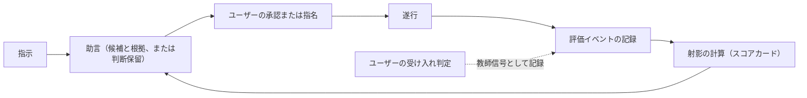

# Agent Dock の設計

この文書は、[VISION.md](./VISION.md) の「評価と采配の循環」を最初の実装から成り立たせるための設計文書である。
VISION を正とし、この文書を VISION と矛盾させることはできない。
矛盾する変更が必要な場合は、ユーザーの裁定によって先に VISION を改定する。

## 版数と進め方

製品版には Semantic Versioning 2.0.0 を使い、版表記に `v` を付けない。
最小のループを備えた最初の実用版を **0.1.0** としてリリースし、以後の拡張を 0.2.0、0.3.0 と重ねる。

- `0.1.0-alpha.N` は、0.1.0 を組み立てて検証する開発確認版とする。
- この文書は 0.1.0 の目標と設計上の制約を扱い、各 alpha の実装範囲と成立時点の挙動はリリース文書に記録する。
- 0.1.0 は、循環の全要素が実用開始時から存在する最小のループとする。
- 拡張の順序は事前に固定しない。
  「0.1.0 で実現しない VISION の要求」から、運用で痛みまたは証拠が出たものを選んで着手する。
- alpha の期間は ADR（Architecture Decision Record）を作らず、実装しながら技術を探索する。
  ADR は 0.2.0 以降の拡張から使う。
- alpha の設定は製品版から独立した `api_version` で識別し、版をまたぐ互換性と移行を保証しない。
  非対応の設定は、ユーザーが既定値 No の確認で許可した場合だけ退避して作り直す。
- alpha の JSONL イベントは一時的な保存形式であり、製品版から独立した `format_version` で識別する。
  版をまたぐ互換性と移行は保証せず、非対応のイベントは、ユーザーが既定値 No の確認で許可した場合だけログ全体を退避して空にする。

## 0.1.0 の輪郭

0.1.0 では、ドックが記録、射影、助言だけを担う。
資格、探索、リプレイ、評価の代行、再審査は実装せず、ユーザーが兼任する。
これは VISION の「資格のない初期状態」、すなわちユーザーが全役割を兼任する状態を、そのまま運用形にしたものである。

0.1.0 の采配はすべて**助言**（advisory）で行う。
助言では、ドックがスコアカードを根拠に候補の実行プロファイルを提示し、ユーザーが承認してから実行する。
証拠が足りないあいだは候補を選ばず**判断保留**（abstain）を返し、ユーザーが委任先を指名する。
したがって運用の初期は実質「記録と表示」であり、証拠が貯まるにつれて助言が効き始める。

ループの各辺は初日から存在する。
間引いたのは自動化の範囲であって、循環の構造ではない。

## 0.1.0 の乗組員

0.1.0 は、四つのエージェント CLI（Claude Code、Codex CLI、Gemini CLI、Antigravity CLI）のヘッドレス実行を共通の実行アダプタで包む。
モデルの違いを含めて数個の実行プロファイルを登録し、助言が選び分けられる選択肢を確保する。
三社の CLI を最初から扱うことで、特定ベンダーに固定しないという VISION の非目標も初日から満たす。

ヘッドレス実行と対話セッション経由の違いは、実行プロファイルを構成する実行基盤の違いとして扱う。
0.1.0 の実行基盤はヘッドレス実行に限る。
対話セッションを介した実行は、タスク境界と実測のタスク単位の帰属が煩雑になるため 0.1.0 では仲介せず、実行基盤の追加として後日扱う。

ドックを介さずにエージェント CLI を直接実行した仕事も、将来は観測対象にする。
これはドックによる実行の仲介とは別の入口であり、0.1.0 の後続リリースで扱う。
直接実行を観測する方式とイベント境界の詳細は、その実装へ着手するときに定める。

## 0.1.0 の責務

- **入口**：指示を受け取り、助言とスコアカードを提示し、承認または指名を受け付ける。
  成果への受け入れ判定と自由タグの入力も同じ入口で受け付ける。
- **実行アダプタ**：承認された実行プロファイルで CLI をヘッドレス起動し、所要時間や実支出などの実測を正規化してイベントにする。
  実際に使った構成も記録する。
- **記録**：評価イベントをローカルに追記で保持する。
- **射影**：記録からスコアカードを計算する。
- **助言**：スコアカードを根拠に候補を提示し、証拠が足りなければ判断保留を返す。

## 0.1.0 の不変条件

実装の規模を絞っても、次の条件は満たす。
いずれも VISION から導かれる。

- **承認の必須**：ドックが起動する実行は、すべてユーザーの明示承認または指名を経る。
  0.1.0 ではこの承認が裁定の役割を果たし、これより強い境界執行機構は置かない。
  実行中の送信制御は、各 CLI 自身の権限機構に委ねる。
- **最小記録**：秘密、成果物の全文、プロンプトの全文を既定で記録しない。
- **追記と削除**：通常運転ではイベントを追記し、書き換えない。
  訂正は新しいイベントとして追記する。
  削除はユーザーだけが指示できる。
- **ユーザー判断の優先**：受け入れや選好といった価値判断は、ユーザーの判定だけを教師信号とする。
  受動的な観測や外部の評判を教師信号にしない。
- **プロファイルへの帰属**：成績は実行プロファイルに帰属させる。
  構成を変えた場合は別の実行プロファイルとして登録し、証拠を引き継がない。
- **総合順位の禁止**：射影を単一の普遍スコアや総合順位へ集約しない。
- **成功の非主張**：0.1.0 はドックの成功を主張しない。
  成功を主張するには、VISION の成功基準に従う事前登録が先に必要である。

## スコアカード

複数の実行プロファイルについて射影を並べて表示するビューを**スコアカード**（scorecard）と呼ぶ。
0.1.0 のスコアカードは次の三軸を持つ。

- **受入率**：ユーザーの受け入れ判定が付いた実行を母数とし、受け入れられた割合。
  判定のない実行は母数に含めず、判定済みの件数を別に示す。
- **所要時間**：乗組員の実行開始から終了までの実測時間。
- **実支出**：CLI の機械可読出力から取得できる範囲の金銭的支出。
  取得できない場合は欠測として明示する。

各軸には件数と直近の実行日時を添え、証拠の量と古さを読めるようにする。
鮮度の重み付けと不確実性の定量化は行わず、この件数と直近性の表示で代替する。

タスクには自由タグを付けられ、付けない場合は未分類として明示する。
スコアカードはタグで絞り込める。

## 助言の規則

- 候補には、参照したスコアカードの値を根拠として添える。
- 指示と同じタグの実行実績が無い場合、または件数が少ない場合は判断保留を返す。
  件数の閾値は実装で調整する。
- 提案、承認または拒否、指名、実行、受け入れ判定は、それぞれ別のイベントとして記録する。
- 助言に従わない指名も通常の運用であり、記録の上で区別する。

## 0.1.0 で実現しない VISION の要求

0.1.0 は、VISION の次の要求を実現しない。
各項目には、対応する VISION の節と、0.1.0 での扱いを添える。

- **遂行中の技術判断の記録**（評価イベント）：0.1.0 が決定として記録するのは采配上の判断だけであり、遂行中の技術判断は取り込まない。
- **モデル単位の参考集計**（評価イベント）：スコアカードは実行プロファイル単位だけを表示し、モデルを横断する参考射影は作らない。
- **射影の鮮度、不確実性、適用範囲**（射影としてのスコア）：鮮度の重み付けと確からしさの定量化は行わず、件数、直近性、タグ絞り込みの表示で代替し、読み取りはユーザーが担う。
- **評価の代行**（教師信号と観測事実）：観測状態、常時監査、領域の限定、独立性を含む一式を実装せず、評価はすべてユーザーが行う。
- **リプレイと再審査**（証拠と外部事前情報の優先関係）：自前リプレイによる初期審査、定点観測、再審査を行わず、実タスクの実測だけを証拠にする。
- **外部事前情報と外部シグナル**（証拠と外部事前情報の優先関係）：外部ベンチマークの合成と再審査のトリガーを取り込まず、新しい乗組員の見立てはユーザーが行う。
- **役割、資格、自動委任**（役割ごとの資格）：役割の分化、適性要件、資格の付与から失効までを実装せず、すべての実行はユーザーの承認または指名を経る。
- **探索**（評価と采配の循環）：探索予算による割り当てを実装せず、証拠の薄い乗組員を試すかどうかはユーザーの指名に任せる。
- **エスカレーション**（自律判断の優先順位）：0.1.0 には自律判断がないため、判断を止めてユーザーへ求める手続き自体が生じない。
- **手間の上限の計測**（設計と運転の原則）：手間の代理指標と上限の運用を実装せず、続けられるかの判断はユーザーの体感に任せる。
- **成功基準の判定**（成功基準）：事前登録とベースライン比較を実装しない。
  不変条件の「成功の非主張」で整合させる。

自動委任へ進むときは、境界の機械的な執行と、記録の欠落を検知する仕組みを先に実現する。
この順序だけは事前に定める。
VISION の自律判断の優先順位が第 1 層に置く、境界外への送信と不可逆な帰結の回避は、事後の評価では取り返せないためである。

## この文書の更新規則

- alpha の間は、実装の探索に合わせてこの文書を随時改定する。
- 0.2.0 以降の設計決定は ADR として `docs/adr/` に記録し、採択にはユーザーの承認を必要とする。
- 実現しない要求へ着手するときは、ADR を起草してから実装する。
- 要求を実現したら、「0.1.0 で実現しない VISION の要求」の列挙から外す。
- プロジェクト固有の用語の英語表記は、VISION と本文書の初出併記を正本とする。
  実装で用いる識別子は、0.2.0 以降の ADR で確定する。
