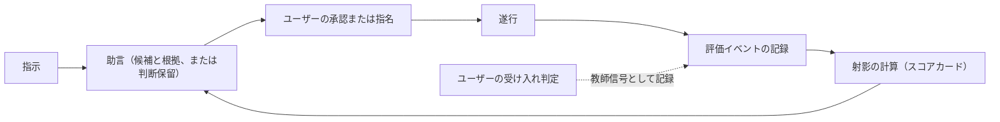

# Agent Dock の設計

この文書は、[VISION.md](./VISION.md) の「評価と采配の循環」を最初の実装から成り立たせるための設計文書である。
VISION を正とし、この文書を VISION と矛盾させることはできない。
矛盾する変更が必要な場合は、ユーザーの裁定によって先に VISION を改定する。

## 版数と進め方

マイルストーンはマイナーバージョンで表す。
最初の最小実装を **v0.0** と呼び、以後の拡張を v0.1、v0.2 と重ねる。

- v0.0 は、循環の全要素が初日から存在する最小のループを作る。
- 拡張の順序は事前に固定しない。
  「条件付きバックログ」の再導入条件に該当する痛みまたは証拠が出た要素から着手する。
- v0.0 の期間は ADR（Architecture Decision Record）を作らず、実装しながら技術を探索する。
  ADR は v0.1 以降の拡張から使う。
- v0.0 の記録は使い捨て前提とする。
  イベントに `schema_version` を付けるが、移行は保証せず、再解釈できない記録は捨てて貯め直す。

## v0.0 の輪郭

v0.0 では、ドックが記録、射影、助言だけを担う。
資格、探索、リプレイ、評価の代行、再審査は実装せず、ユーザーが兼任する。
これは VISION の「資格のない初期状態」、すなわちユーザーが全役割を兼任する状態を、そのまま運用形にしたものである。

v0.0 の采配はすべて**助言**（advisory）で行う。
助言では、ドックがスコアカードを根拠に候補の実行プロファイルを提示し、ユーザーが承認してから実行する。
証拠が足りないあいだは候補を選ばず**判断保留**（abstain）を返し、ユーザーが委任先を指名する。
したがって運用の初期は実質「記録と表示」であり、証拠が貯まるにつれて助言が効き始める。

ループの各辺は初日から存在する。
間引いたのは自動化の範囲であって、循環の構造ではない。

## v0.0 の乗組員

導入済みの三つのエージェント CLI（Claude Code、Codex CLI、Gemini CLI）のヘッドレス実行を、共通の実行アダプタで包む。
モデルの違いを含めて数個の実行プロファイルを登録し、助言が選び分けられる選択肢を確保する。
三社の CLI を最初から扱うことで、特定ベンダーに固定しないという VISION の非目標も初日から満たす。

## v0.0 の責務

- **入口**：指示を受け取り、助言とスコアカードを提示し、承認または指名を受け付ける。
  成果への受け入れ判定と自由タグの入力も同じ入口で受け付ける。
- **実行アダプタ**：承認された実行プロファイルで CLI をヘッドレス起動し、所要時間や実支出などの実測を正規化してイベントにする。
  実際に使った構成も記録する。
- **記録**：評価イベントをローカルに追記で保持する。
- **射影**：記録からスコアカードを計算する。
- **助言**：スコアカードを根拠に候補を提示し、証拠が足りなければ判断保留を返す。

## v0.0 の不変条件

実装の規模を絞っても、次の条件は満たす。
いずれも VISION から導かれる。

- **承認の必須**：ドックが起動する実行は、すべてユーザーの明示承認または指名を経る。
  v0.0 ではこの承認が裁定の役割を果たし、これより強い境界執行機構は置かない。
  実行中の送信制御は、各 CLI 自身の権限機構に委ねる。
- **最小記録**：秘密、成果物の全文、プロンプトの全文を既定で記録しない。
- **追記と削除**：通常運転ではイベントを追記し、書き換えない。
  訂正は新しいイベントとして追記する。
  削除はユーザーだけが指示できる。
- **ユーザー判断の優先**：受け入れや選好といった価値判断は、ユーザーの判定だけを教師信号とする。
  受動的な観測や外部の評判を教師信号にしない。
- **プロファイルへの帰属**：成績は実行プロファイルに帰属させる。
  構成を変えた場合は別の実行プロファイルとして登録し、証拠を引き継がない。
- **総合順位の禁止**：射影を単一の普遍スコアや総合順位へ集約しない。
- **成功の非主張**：v0.0 はドックの成功を主張しない。
  成功を主張するには、VISION の成功基準に従う事前登録が先に必要である（バックログの「事前登録と成功基準」）。

## スコアカード

複数の実行プロファイルについて射影を並べて表示するビューを**スコアカード**（scorecard）と呼ぶ。
v0.0 のスコアカードは次の三軸を持つ。

- **受入率**：ユーザーの受け入れ判定が付いた実行を母数とし、受け入れられた割合。
  判定のない実行は母数に含めず、判定済みの件数を別に示す。
- **所要時間**：指示から成果までの実測時間。
- **実支出**：CLI の機械可読出力から取得できる範囲の金銭的支出。
  取得できない場合は欠測として明示する。

各軸には件数と直近の実行日時を添え、証拠の量と古さを読めるようにする。
鮮度の重み付けと不確実性の定量化は行わず、この件数と直近性の表示で代替する（バックログの「鮮度と不確実性の定量化」）。

タスクには自由タグを付けられ、付けない場合は未分類として明示する。
スコアカードはタグで絞り込める。

## 助言の規則

- 候補には、参照したスコアカードの値を根拠として添える。
- 指示と同じタグの実行実績が無い場合、または件数が少ない場合は判断保留を返す。
  件数の閾値は実装で調整する。
- 提案、承認または拒否、指名、実行、受け入れ判定は、それぞれ別のイベントとして記録する。
- 助言に従わない指名も通常の運用であり、記録の上で区別する。

## 条件付きバックログ

v0.0 から間引いた要素を、再導入条件とともに列挙する。
順序は決めず、条件に該当する痛みまたは証拠が出た要素から、ADR を起草して着手する。

- **資格と限定委任**：適性要件を満たした実行プロファイルへ、承認なしの実行を委ねる。
  再導入条件：助言の採択率が安定して高く、毎回の承認が手間の主因になったとき。
  着手時には「境界執行の専用機構」と「障害時のイベント完全性」を先に満たす。
- **境界執行の専用機構**：承認に代わる、送信、秘密、不可逆操作の機械的な制御と、ユーザー方針の機械可読化。
  再導入条件：自動委任の導入前に必ず作る。
- **探索予算**：証拠の薄い実行プロファイルへ、低リスクの仕事を予算内で割り当てる采配。
  再導入条件：助言が特定の実行プロファイルへ偏り、他の評価が更新されなくなったとき。
- **リプレイと再審査**：受け入れ済みタスクの再演による初期審査、較正、定点観測と、その起動条件の管理。
  再導入条件：新しい実行プロファイルの初期証拠の不足が痛みになったとき、またはモデル更新による挙動変化を疑ったとき。
- **評価の代行**：ユーザー判断との一致実績に基づく、評価の限定的な委任。
  再導入条件：受け入れ判定の手間が持続しなくなったとき。
- **役割と適性要件**：采配役、実装役、検証役などの役割分化と、役割ごとの要求条件。
  再導入条件：「資格と限定委任」に着手するとき、同時に定義する。
- **意思決定の確かさ**：決定イベントと較正に基づく射影軸。
  再導入条件：受入率、所要時間、実支出だけでは助言の根拠が不足すると分かったとき。
- **鮮度と不確実性の定量化**：減衰による重み付けと、確からしさの区間表示。
  再導入条件：件数と直近性の表示では、古い証拠を信じすぎる痛みが出たとき。
- **イベント封筒の互換性**：スキーマの互換読み込みと移行の保証。
  再導入条件：記録を資格審査などの長期の証拠に使い始め、捨てられなくなったとき。
- **実行プロファイルの同一性の厳密化**：構成の正規化ハッシュ、等価性、証拠の可搬性。
  再導入条件：構成変更や同名モデルの挙動変化によって、成績の帰属が曖昧になったとき。
- **事前登録と成功基準**：比較条件の事前登録、保留データ、ドックを使わないベースラインとの比較。
  再導入条件：ドックの成功を主張したくなったとき。
  結果を見る前に登録する。
- **手間の計測と上限**：ユーザーの手間の代理指標と上限の運用。
  再導入条件：評価と運用の手間が続かないと感じたとき。
- **外部事前情報と外部シグナル**：外部ベンチマークの仮説としての合成と、再審査を起動する外部トリガー。
  再導入条件：初期証拠のない実行プロファイルの扱いに困ったとき、または外部の変化を再審査へつなぐ運用を始めたとき。
- **削除執行の厳密化**：参照と複製の追跡、派生射影の無効化、削除完了の判定。
  再導入条件：機微な内容が記録に入り得る運用を始めたとき。
- **監査再構成**：助言と判定の根拠を、後からすべて再構成できる契約。
  再導入条件：判断過程を後から追えず困ったとき。
- **障害時のイベント完全性**：冪等性、重複検出、突き合わせ、クラッシュ回復。
  再導入条件：記録の欠落または重複実行を観測したとき。
  自動委任の導入前には必ず満たす。

## この文書の更新規則

- v0.1 以降の設計決定は ADR として `docs/adr/` に記録し、採択にはユーザーの承認を必要とする。
- バックログの要素へ着手するときは、ADR を起草してから実装する。
- 新しい論点はバックログへ追記する。
- プロジェクト固有の用語の英語表記は、VISION と本文書の初出併記を正本とする。
  実装で用いる識別子は、v0.1 以降の ADR で確定する。

## 非規範の調査ノート

[docs/research-notes.md](./docs/research-notes.md) は、実装の検討に使う調査結果を置く日付付きのスナップショットであり、この文書を拘束しない。
