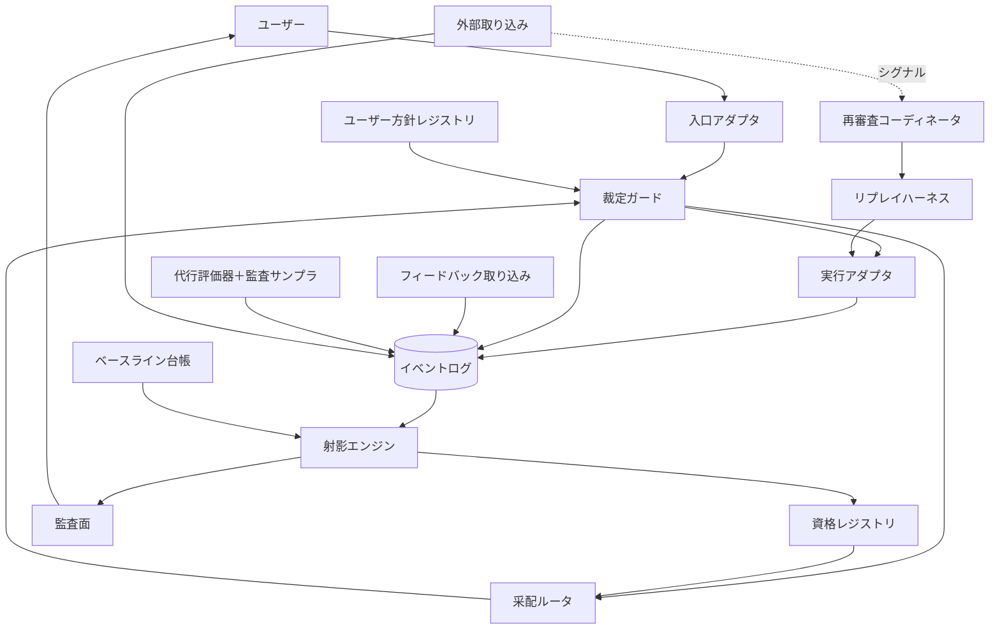

# DESIGN

この文書は [VISION.md](./VISION.md) の理念・概念モデルを、実装可能な構成に降ろすための設計文書である。

**この文書は決定しない。** 構成（責務の分割と情報の流れ）と、開いている決定（Decision Register）を定める。決定は各フェーズの入口で ADR（Architecture Decision Record）として確定し、この文書の該当項目は ADR への参照に置き換わる。

文書の層: **VISION**（憲法。設計判断の制約）→ **DESIGN**（構成と選択肢。本書）→ **ADR**（決定と理由）→ 実装。

## 読み方（記述の拘束力）

| 記述 | 拘束力 |
|---|---|
| **VISION制約** | 確定。変更には VISION の改定が先に必要（裁定者はユーザー） |
| 選択肢・調査 | 情報。拘束しない |
| **有力候補（非拘束）** | 現時点の傾き。決定ではなく、ADR で覆してよい |
| 決定 | ADR でのみ生まれる。本書には存在しない |

## 全体像

**図の各ボックスは論理責務であり、別プロセス・別ストアを意味しない。** 複数の責務が同一プロセス・単一ストアに同居してよい。物理的な分割は ADR の領分である。

| VISION の概念 | 論理責務 |
|---|---|
| 入口（コマンド／エージェントスキル） | 入口アダプタ |
| 采配（候補の選定） | 采配ルータ |
| 裁定の序列・エスカレーション | 裁定ガード |
| 実行プロファイル・実測 | 実行アダプタ |
| 評価イベント・来歴・データ最小化 | イベントログ |
| 射影（値＋不確実性＋適用範囲＋鮮度） | 射影エンジン |
| 監査できる | 監査面（スコアカードほか） |
| 役割と資格・任免・失効 | 資格レジストリ |
| 教師信号（ユーザーの価値判断） | フィードバック取り込み |
| 評価の代行・常時監査 | 代行評価器＋監査サンプラ |
| リプレイ・初期審査・定点観測 | リプレイハーネス |
| 外部 prior・外部シグナル・価格 | 外部取り込み（3系統） |
| 成功基準の事前登録・自己計測 | ベースライン台帳（成功評価プロトコル） |
| ユーザーの受入基準・リスク上限・境界 | ユーザー方針レジストリ |
| 鮮度切れ・ドリフト・再審査の起動 | 再審査コーディネータ |
| 保持境界・ユーザー起点の削除 | 保持・削除執行 |

## 情報の権威

システム内の情報は4区分に分かれ、それぞれ所有する責務と変更の規則が異なる。区分をまたぐ昇格（外部仮説を事実扱いする等）は VISION 違反である。

| 区分 | 内容 | 所有者 | 規則 |
|---|---|---|---|
| **権威ある事実** | 評価イベント（実測・決定・フィードバック・来歴） | イベントログ | 追記のみ。訂正は新イベント＋優先関係。削除はユーザー起点のみ（非機微来歴を残す） |
| **導出ビュー** | 射影・スコアカード・資格状態・比較レポート | 射影エンジン／資格レジストリ | 常に事実から再計算可能。事実と食い違ったら作り直す側 |
| **外部仮説** | 価格表・ベンチマーク prior・外部シグナル | 外部取り込み | 事実に常に劣後。prior は射影で区別して合成、シグナルはトリガのみ |
| **ユーザー方針** | 受入基準・リスク上限・送信/保持境界・探索予算・手間上限・単発許可 | ユーザー方針レジストリ | ユーザーのみが変更。恒久変更と単発許可を区別して記録 |

## VISION トレーサビリティ

VISION の主要な不変条件が、どの責務と決定点に担われ、どこで検証されるか。

| VISION 不変条件 | 責務 | 決定点 | 検証の場 |
|---|---|---|---|
| すべての仕事がイベントとして記録される | イベントログ・実行アダプタ | D-02, D-14, D-18 | Phase 0–1 |
| イベントは不変・来歴保持・訂正は追記 | イベントログ | D-02, D-19 | Phase 0–1 |
| データ最小化・秘密は既定で記録しない | イベントログ・保持/削除執行 | D-02, D-15 | Phase 0 |
| 成績は実行プロファイルに帰属、モデルは射影 | 射影エンジン | D-13, D-03 | Phase 2 |
| 射影は不確実性・適用範囲・鮮度を伴う | 射影エンジン | D-17, D-10 | Phase 2 |
| prior と一次証拠の区別合成 | 外部取り込み・射影エンジン | D-08, D-17 | Phase 3 |
| 資格は（役割×プロファイル）で任免・失効する | 資格レジストリ | D-04, D-13, D-10 | Phase 3, 5 |
| 裁定の序列・エスカレーション・単発上書き | 裁定ガード・ユーザー方針 | D-09, D-11, D-15 | Phase 4–5 |
| 探索は低リスク・予算内のみ | 裁定ガード・采配ルータ | D-11 | Phase 4–5 |
| ユーザー判断が価値判断の ground truth | フィードバック取り込み | D-06, D-15 | Phase 1 |
| 評価の代行は常時監査・別種イベント | 代行評価器＋監査サンプラ | D-12 | Phase 3, 5b |
| 比較条件の事前登録・保留/将来評価・不利開示 | ベースライン台帳 | D-16 | Phase 0, 2, 4 |
| 手間（attention）が上限内 | 総コスト・手間計測 | D-16 | 全フェーズ出口 |
| 監査できる（根拠・理由・方針・上書きの閲覧） | 監査面 | 横断 | 全フェーズ |

## コンポーネント（論理責務）

「named」と記した責務は、独立コンポーネントにするかは未決だが、**どこかが担うことを名前で保証する**もの。

### 入口アダプタ
ホスト（現状 Claude Code）のコマンド／スキルとして実装される薄い層。指示の受領と結果・スコアカードの提示のみ。**直接エージェントを起動しない**（すべて裁定ガード経由）。

### 采配ルータ
資格レジストリと射影を参照し、**eligible な候補の列挙・順位付け・abstain（推薦しない判断）**を行う。候補生成の責務であり、許可の責務ではない。判断は決定イベントとして記録される。関連: D-05。

### 裁定ガード
**非迂回のハードゲート。** 序列（安全・秘密・不可逆 → ユーザー基準 → 証拠の十分性 → 経済性 → 探索価値）とユーザー方針を機械的に適用し、通らない要求はエスカレーション（選択肢＋推薦つき差し戻し）に変える。ルータの推薦もユーザーの直接指名も、実行に至る経路は必ずここを通る。関連: D-09, D-11, D-15。

### 実行アダプタ
実行プロファイルでエージェントを起動し、実測（時間・実支出・帰結参照）を正規化してイベント化する。**capability 申告**（何を測れて何を止められるか）と**実行レシート**（何をどの構成で実行したかの証明）を返す。cancel・retry・部分失敗の扱いは契約として定義される。関連: D-01, D-18。

### イベントログ
追記のみの一次データ（権威ある事実）。全イベントが封筒（identity・実行プロファイル・タグ・因果リンク・schema_version）を持つ。本文は参照＋ハッシュ。関連: D-02, D-14, D-19。

### 射影エンジン
イベントと prior から射影（値・不確実性・適用範囲・鮮度）を導出する。選択バイアスの明示と較正を含む。ベースライン台帳の比較レポートもここが計算する。関連: D-03, D-17, D-10。

### 監査面（スコアカードほか）
監査可能性の対象はスコアだけではない: **イベント来歴・采配の理由・適用された方針・上書き（単発許可）の記録**まで、ユーザーが一段でたどれること。ユーザーの異議申立て（この評価はおかしい）を訂正イベントとして受け付ける。

### 資格レジストリ
（役割 × 実行プロファイル）の資格状態（候補・任用・保留・失効）と根拠射影への参照。**Phase 3 までは「候補」状態のみで、権限は伴わない**。関連: D-04, D-09, D-13。

### フィードバック取り込み
価値判断のイベント化。明示は1アクション以内、受動シグナル（コミット生存・手戻り検知）は弱い証拠として区別。訂正・削除要求の受け口もここ。関連: D-06。

### 代行評価器＋監査サンプラ
一致率で資格を得る評価代行と、その常時監査。**采配の委任とは別軸の自律性**であり、解放は独立のフェーズ（5b）で行う。関連: D-12。

### リプレイハーネス
分離環境での再演。初期審査・較正・定点観測。関連: D-07。

### 外部取り込み（3系統）
**価格**（→実コスト計算の入力。即時反映）／**ベンチ prior**（→「外部主張があった」来歴イベント＋射影の仮説入力）／**外部シグナル**（→再審査トリガのみ）。取り込み口を共有しても、型と消費者を混ぜない。関連: D-08。

### ベースライン台帳（成功評価プロトコル）
比較条件（基準・タスク群・期間・手間上限）の**事前登録**、holdout/将来データでの評価、不利な結果の開示。関連: D-16。

### ユーザー方針レジストリ（named）
受入基準・リスク上限・送信/保持境界・探索予算・手間上限の保管。**恒久変更**（方針の改定）と**単発許可**（今回だけの上書き）を別のイベントとして記録する。関連: D-15。

### 再審査コーディネータ（named）
鮮度切れ・ドリフト検知・外部シグナル・構成変更の4トリガから再審査（リプレイ・資格見直し）を起動し、追跡する。関連: D-10。

### 保持・削除執行（named）
保持境界の適用と、ユーザー起点削除の実行（機微内容の削除・非機微来歴の記録・導出ビューの無効化）。関連: D-15, D-19。

### 総コスト・手間計測（named）
API 実費に加えて**ユーザーの手間（attention）**を計測する。成功基準（総コスト・持続性）の入力。関連: D-16。

### 障害時イベント完全性（named）
クラッシュ・中断・二重実行でもイベントが欠落・重複しないことへの責務。実装は D-02/D-18 の決定に依存するが、責務としてここに固定する。

## クリティカルフロー

主要な流れを責務の連携として記述する（実装形式は決めない）。

1. **通常遂行**: 入口 → 裁定ガード（方針・序列）→ 采配ルータ（候補と推薦）→ 裁定ガード（最終ゲート）→ 実行アダプタ（起動・レシート）→ イベントログ（実測・帰結）→ 射影更新。
2. **遅延フィードバック・訂正・削除**: 後日のフィードバック → 因果リンク（D-14）で元の run に接続 → 訂正は新イベント＋優先関係。削除要求 → 保持・削除執行 → 機微内容の削除＋非機微来歴＋関連する導出ビューの無効化・再計算。
3. **探索**: 采配ルータが証拠の薄い候補を予算内で提案 → 裁定ガードがリスク判定（低リスク・可逆のみ）と予算残を検査 → 実行。探索タグつきでイベント化。
4. **リプレイ・再審査**: 再審査コーディネータがトリガ受領 → リプレイハーネスが分離環境で再演 → 結果はリプレイ階級のイベント → 射影更新 → 資格レジストリの状態遷移（候補・保留・失効）。
5. **外部シグナル**: 取り込み（手動投入から）→ 来歴イベント（スコアに入らない）→ 再審査コーディネータへのトリガ。
6. **エスカレーションと単発上書き**: 裁定ガードが不確実・境界超えを検知 → 選択肢＋推薦つきでユーザーへ → ユーザーの裁定をイベント化（ユーザー領分の欠落なら教師信号、実証不足なら単発許可）。単発許可は方針の恒久変更とは別種で記録。
7. **共同作業の帰属**: 複数プロファイルが関与した成果は、根拠なく個体に配賦しない。run 単位で関与を記録し、帰属は D-14 の規則に従う（規則が未決の間は「共同」のまま保持）。
8. **失敗・リトライ**: 実行アダプタが失敗・部分成功・リトライを区別してイベント化（失敗も証拠）。リトライは新しい attempt として因果リンクで接続。イベントの欠落・重複は障害時イベント完全性の責務。

## Decision Register

各項目は次のフィールドを持つ: **状態**（open / ADR-nnn で確定）、**問い**、**VISION制約**（確定・変更不可）、**選択肢と調査**、**証拠計画**（何が分かれば決められるか）、**依存**、**決定境界**（not before / no later than）、**可逆性**、**有力候補（非拘束）**。

**意味契約グループ**: D-02（封筒部分）・D-13・D-14・D-15・D-16 は、最初のデータ収集の前に決めないと後から直せない（証拠の意味が壊れる）ため、**Phase 0 で ADR 必須**。逆に、射影の数式・減衰値・監査サンプリング率・采配アルゴリズムは**証拠が揃うまで決めない**（not before: 該当フェーズのデータ蓄積）。

**自作は既定ではない**: 各決定点の選択肢には、既存の OSS・既存ツールの採用を必ず含める。自作が選ばれるのは、契約（意味契約・監査可能性・データ最小化）を既存物で満たせないと ADR で示せた場合である。

### D-01 実行基盤（制御面のトポロジ）

- 状態: open
- 問い: エージェントを何として起動するか（アダプタの実装対象）。
- VISION制約: ベンダー固定しない。制御面はローカル。実測が取れること。
- 環境の実態（2026-07 調査）: claude (Claude Code 2.1.214) / codex-cli 0.144.4 / gemini-cli 0.47.0 導入済み。
- 選択肢と調査:
  - **A. 既存エージェントCLIの headless 束ね**: Claude Code は `claude -p --output-format json` が usage・総コスト・所要時間・ターン数を返し、`--model`・`--allowedTools`・`--permission-mode`・hooks で構成と介入点を持つ。codex CLI は `codex exec` の非対話実行と JSON イベント。gemini CLI も headless・JSON 出力対応。良: クロスベンダー最速・各社エージェント能力をそのまま。悪: 計測粒度が不均一（正規化必須）・バージョン追随・細粒度の介入は各CLIの許可機構依存。
  - **B. 単一ホスト完結**（サブエージェント＋プロキシ注入): 最軽量だが他社エージェント能力が制限され、前提が弱まる。
  - **C. 自前ハーネス**: Claude 側は Claude Agent SDK（Claude Code のハーネスのライブラリ版）、他社は各社 SDK・互換層。計測最精密・ガード埋め込み可・構築維持コスト最大。
- 証拠計画: Phase 0 の縦切りで A の1本（最も情報の多い Claude Code）を試し、正規化コストを実測する。
- 依存: D-18（アダプタ契約）が先。契約を満たせるかで選択肢を評価する。
- 決定境界: not before: D-18 の契約定義 / no later than: Phase 1 入口。
- 可逆性: 高（アダプタ契約の背後なので差し替え可能）。
- 有力候補（非拘束）: A 主軸＋必要箇所に C の部分導入。B は入口ホストとしてのみ。

### D-02 イベント記録（封筒とストレージ）

- 状態: open（封筒部分は Phase 0 で ADR 必須）
- 問い: イベント封筒（全イベント共通の必須項目）と、記録の物理形式。
- VISION制約: 追記のみ・来歴・データ最小化（本文は参照＋ハッシュ）・削除はユーザー起点で非機微来歴・ローカル。
- 選択肢と調査: **封筒**（意味契約）: event id・時刻・種別・実行プロファイル参照・タグ・因果リンク・schema_version・来歴。**ストレージ**: A. SQLite 単一DB（トリガで更新禁止・導入済み） / B. JSONL 追記＋派生インデックス（可読・git 親和・二層） / C. DuckDB 主体（未導入・分析強い）。
- 証拠計画: Phase 0 の縦切りで封筒 v0 を実データに当てる。
- 依存: 封筒は D-14（identity）と同時に決める。ストレージは封筒に従属。
- 決定境界: 封筒: no later than Phase 0。ストレージ: no later than Phase 0（ただし可逆）。
- 可逆性: 封筒は低（後からの変更は証拠の意味を壊す）。ストレージは高（イベントが真実なので移行可能）。
- 有力候補（非拘束）: 封筒は最小8項目。ストレージは A か B。

### D-03 タスク分類（taxonomy）

- 状態: open
- 問い: タスク種別タグの初期体系と育て方。
- VISION制約: 第二軸を固定しない（タグは射影の一つ）。
- 選択肢と調査: 手動シードの粗い種別（設計/実装/大量編集/調査/レビュー/運用）＋自由タグ併記。付与は采配時＋フィードバックで訂正可能。
- 証拠計画: Phase 1 の実記録でタグの分布と訂正頻度を見る。
- 決定境界: no later than: Phase 2 入口。可逆性: 高（タグは追加・再付与できる）。
- 有力候補（非拘束）: 粗い6種別から。

### D-04 役割と適性要件

- 状態: open
- 問い: 役割の初期ラインナップと適性要件の表現形式。
- VISION制約: 役割は水平・資格は実行プロファイルに付く・コストも適性・要件は射影への要求条件。
- 選択肢と調査: 初期候補: 采配役/設計役/実装役/大量実装役/検証役/評価代行役。要件表現はリポジトリ内の宣言的設定（バージョン管理）が有力。
- 依存: D-13（プロファイル同一性）、D-17（射影の較正）。
- 決定境界: 候補資格の運用開始（Phase 3）までに暫定、確定は Phase 5 入口。可逆性: 中。
- 有力候補（非拘束）: 宣言的設定ファイル。

### D-05 采配方式（rank / abstain）

- 状態: open
- 問い: **eligible 集合内の順位付けと abstain** の機構（許可判定は D-09/D-11 の領分）。
- VISION制約: 判断は決定イベント。助言→確認→自動の段階（始動）。
- 選択肢と調査: A. ルール＋スコアカード参照（決定的・監査容易） / B. LLM 采配（采配役資格を持つプロファイルが判断。判断自体が評価対象） / C. 文脈付きバンディット（LinUCB/Thompson。探索配分と自然に接続）。
- 証拠計画: Phase 4a（shadow）で推薦と実選択の一致・帰結を計測してから選ぶ。
- 決定境界: not before: Phase 2 の射影安定 / no later than: Phase 4 入口（4a は暫定実装でよい）。
- 可逆性: 高（推薦器は交換可能。決定イベントの形だけ固定）。
- 有力候補（非拘束）: A の骨格に B を載せる。C は探索配分で調査継続。

### D-06 フィードバック UX

- 状態: open
- 問い: 教師信号を手間の上限内で集める方法。
- VISION制約: 持続性の制約。監査サンプルは必ずユーザー評価。
- 選択肢と調査: 明示（完了時ワンタップ・`/rate` 相当。1アクション以内）／受動（コミット生存・手戻り検知・成果物採用。弱い証拠として区別）／ホスト機構（Claude Code hooks）。訂正・削除の受け口も同じ経路に。
- 決定境界: no later than: Phase 1 入口。可逆性: 高。
- 有力候補（非拘束）: 受動優先＋明示は監査対象に絞る。

### D-07 リプレイ方式

- 状態: open
- 問い: 再演の分離・実行・採点。
- VISION制約: リプレイは第二階級の証拠。定点観測に使う。予算内。
- 選択肢と調査: 分離: git worktree / 一時複製 / コンテナ。非決定性: n 回サンプル・差分幅で判定（1回で断定しない）。採点: 受け入れ済み成果との差分＋（Phase 3 では shadow の）代行評価。題材: 小さな題材集合。
- 決定境界: no later than: Phase 3 入口。可逆性: 高。
- 有力候補（非拘束）: worktree ＋小題材集合。

### D-08 外部取り込み（3つのサブ決定）

- 状態: open
- 問い: 価格・prior・シグナルの取り込み方（それぞれ別のサブ決定）。
- VISION制約: 価格=入力（即時反映）／prior=来歴イベント＋仮説入力（一次証拠でない）／シグナル=トリガのみ。
- 選択肢と調査: **価格**: LiteLLM のモデル価格 DB の定期取り込み / 手動更新。**prior**: 手動キュレーション（出典 URL・日付つき）から。**シグナル**: 手動貼り付けから、RSS/changelog 監視は後段。
- 決定境界: no later than: Phase 3。価格のみ Phase 1 で先行してよい（実コスト計算に必要）。可逆性: 高。
- 有力候補（非拘束）: 3系統とも手動優先開始、価格のみ半自動を早める。

### D-09 資格執行（qualification gate）

- 状態: open
- 問い: 「資格のないプロファイルに仕事が行かない」ことの保証機構（リスク・権限の判定は D-11）。
- VISION制約: 権限は資格に束ねる。ユーザーは明示の単発許可で上書き可能。
- 選択肢と調査: A. 起動経路の一本化（全委譲が裁定ガード経由・起動前検査） / B. ホスト機構の併用（hooks による未資格起動の拒否・資格保有者のみの設定生成）。
- 決定境界: not before: 資格レジストリの候補運用（Phase 3）/ no later than: Phase 5 入口。可逆性: 中。
- 有力候補（非拘束）: A 原則＋B 補助。

### D-10 鮮度・再審査（2つのサブ決定）

- 状態: open
- 問い: **鮮度の重み付け**（射影側）と**再審査スケジューラ**（コーディネータ側）。
- VISION制約: 古い証拠は重みを失う。資格は終身でない。トリガ=鮮度切れ・ドリフト・外部シグナル・構成変更。
- 調査（方式は決めない）: 重み付け: 指数減衰/移動窓/有効標本数換算。ドリフト検知: 定点観測差分の閾値/変化検知（Page-Hinkley 等）。スケジューラ: 経過時間×イベント量×トリガ、コスト上限内。
- 決定境界: not before: Phase 2–3 のデータ / no later than: Phase 5（定常運転前）。可逆性: 高（射影は再計算可能）。

### D-11 権限・リスクゲートと探索予算

- 状態: open
- 問い: 裁定ガードの**authority/risk 判定**（序列第1〜2層の機械化）と探索予算の管理。
- VISION制約: 第1層は自律で越えない。探索は低リスク・可逆・予算内。リスク=帰結の大きさ・可逆性・判定コスト。
- 選択肢と調査: リスク判定: チェックリストルール（VCS 管理下か/送信境界外への作用か/判定コストが低いか）から。予算: 月次定額/支出比率、ユーザー設定・消化開示。
- 依存: D-15（境界・上限はユーザー方針から読む）。
- 決定境界: リスクゲート: no later than Phase 4 / 予算執行: no later than Phase 5。可逆性: 中。
- 有力候補（非拘束）: チェックリスト＋定額から。

### D-12 代行監査（独立性・サンプリング・不一致処理）

- 状態: open
- 問い: 代行評価の**監査に固有の**機構（資格の一般機構は D-04/D-13 を再利用し、再実装しない）。
- VISION制約: 常時監査・別種イベント・領域限定・独立性・ずれ時の停止/剥奪。
- 調査（方式は決めない）: サンプリング: 初期高率→確信に応じ逓減（ゼロにしない）。一致率: 単純一致＋区間/κ係数。独立性: 被評価者と別系統の審判を優先。不一致処理: 閾値超過で自動停止＋ユーザー裁定へ。
- 決定境界: not before: Phase 3 の shadow 一致データ / no later than: Phase 5b。可逆性: 高。

### D-13 実行プロファイルの同一性（意味契約）

- 状態: open（Phase 0 で ADR 必須）
- 問い: プロファイルの identity・バージョン・**等価性**（どの構成差で「別」と見なすか）・**証拠の可搬性**（構成変更時にどの証拠が持ち越せるか）。
- VISION制約: 成績はプロファイルに帰属。構成変更は再審査事由。モデル名だけで資格を主張できない。
- 選択肢と調査: identity: 構成要素（モデル・プロバイダ/バージョン・役割プロンプト・ツール・権限）の正規化ハッシュ＋人間可読名。等価性: 全一致 / 要素別の重み（プロンプト微修正は可搬、モデル変更は不可搬など）。
- 証拠計画: 可搬性の規則そのものは運用データで較正（初期は保守的に「不可搬」寄り）。
- 決定境界: identity 表現: no later than Phase 0（封筒に入るため）。等価性の規則: Phase 3 までに暫定。可逆性: identity は低・等価性規則は中。

### D-14 作業とイベントの紐付け（意味契約）

- 状態: open（Phase 0 で ADR 必須）
- 問い: task / run / attempt の identity と因果リンク、**遅延帰結の接続**（後日のフィードバックをどう元の run に繋ぐか）、**共同成果の帰属**規則。
- VISION制約: 遅延イベントも同じ基盤に載る。共同成果を根拠なく個体配賦しない。
- 選択肢と調査: 階層: task（ユーザーの意図単位）> run（1回の委譲）> attempt（リトライ単位）> event。遅延接続: 成果物参照（コミット・ファイル）経由 / 明示の task 参照。帰属: 規則が決まるまで「共同」のまま保持し、配賦しない。
- 決定境界: no later than Phase 0（封筒の一部）。可逆性: 低。

### D-15 ユーザー権限・方針の表現（意味契約）

- 状態: open（Phase 0 で ADR 必須）
- 問い: 受入基準・リスク上限・送信/保持境界・探索予算・手間上限をどう表現・保管し、**恒久変更と単発許可**をどう区別するか。
- VISION制約: 価値判断の ground truth はユーザー。境界の外への送信は自律で行わない。削除はユーザー起点。単発許可はエスカレーションで与えられる。
- 選択肢と調査: 表現: リポジトリ内の宣言的設定（バージョン管理される方針ファイル）＋方針変更もイベント化。単発許可: 対象 run に紐づく一回性のイベント（有効期限つき）。
- 決定境界: 送信/保持境界と単発許可の形: no later than Phase 0。上限値の初期設定はユーザーが決める（ドックは提案しない）。可逆性: 表現形式は中・記録済み許可は不変。

### D-16 評価契約（意味契約）

- 状態: open（Phase 0 で ADR 必須）
- 問い: baseline の定義・比較条件の事前登録・holdout/将来データの隔離・不利開示・**総コスト（ユーザー手間込み）の測定方法**。
- VISION制約: 比較条件は結果を見る前に定める。スコア形成に使っていないデータで評価。不利も開示。判定はユーザー。
- 選択肢と調査: baseline 候補: 「常に高性能モデル」（現状近似）/「外部 prior のみの采配」。holdout: タスクの無作為一部を射影に使わず評価専用に / 将来期間で評価。手間計測: エスカレーション回数・明示フィードバック回数・確認待ち時間の代理指標。
- 決定境界: no later than Phase 0（登録が先、データが後）。可逆性: 低（後から変えると検証が無効になる。変更は新しい登録として追加）。

### D-17 射影の較正と選択バイアス

- 状態: open
- 問い: 不確実性・適用範囲の表現、較正（予測と帰結の突き合わせ）、選択バイアス（采配が選んだ仕事だけがデータになる）の扱い。
- VISION制約: 射影は値＋不確実性＋適用範囲＋鮮度。証拠不足は保留。
- 調査（方式は決めない）: 不確実性: 有効標本数/ベータ区間/ブートストラップ。較正: 保留データでの予測誤差の定期計測。バイアス: 探索データの重み付け・適用範囲の明示で緩和。
- 決定境界: not before: Phase 1 のデータ / no later than: Phase 2 で最小形、較正は Phase 4 まで。可逆性: 高。

### D-18 アダプタ契約

- 状態: open
- 問い: 実行アダプタの共通契約 — capability 申告（測れるもの・止められるもの）・実行レシート・cancel/retry・部分失敗・タイムアウトの扱い。
- VISION制約: 実測の忠実性。失敗も証拠として記録。
- 選択肢と調査: 契約項目: 実測フィールドの必須/任意区分（時間は必須・トークン内訳は任意等）、レシート（実際に使われた構成の報告）、kill 可能性の申告。CLI 毎の充足度は D-01 の調査と対。
- 決定境界: no later than: Phase 1 入口（D-01 より先か同時）。可逆性: 中（契約の拡張は可、破壊は不可）。

### D-19 スキーマ・射影の進化

- 状態: open
- 問い: schema_version の運用、旧イベントの互換読み込み、射影の版管理と再構築（rebuild）、**ユーザー削除後の導出ビュー無効化**。
- VISION制約: イベントは真実・射影は導出物。削除の反映は導出にも及ぶ。
- 選択肢と調査: 射影に「入力イベント集合のハッシュ＋射影版」を記録し再現可能に。削除時: 該当イベントを入力に含む導出ビューを無効化して再計算。
- 決定境界: 原則は Phase 0 で明文化、機構は no later than Phase 2。可逆性: 高。

### D-20 リポジトリ境界（dotfiles との責務分担）

- 状態: open
- 問い: 入口コマンド・スキル・エージェント関連のローカル設定を、このリポジトリと megumish/dotfiles（ローカルのコマンド・設定の既存管理場所）のどちらで管理するか。
- VISION制約: ドックが所有するのは評価イベント・射影・資格・采配と接続境界。エージェントの実行系や成果物そのものは所有しない。
- 選択肢と調査: A. AI エージェント関連は本リポジトリに集約（ドックと設定の整合が取りやすい） / B. dotfiles に残し本リポジトリは参照のみ（ローカル環境管理の一元性を保つ） / C. 分割 — ドックの動作に必須なもののみ本リポジトリ、汎用のローカル設定は dotfiles。
- 決定境界: no later than: Phase 1 入口（入口コマンドの置き場所が必要になる時点）。可逆性: 高（ファイルの移動で済む）。
- 有力候補（非拘束）: C。

## 横断課題

- **秘密と送信境界の執行**: イベントログが本文を持たない（参照＋ハッシュ）ことが第一の防御。送信境界（D-15）の執行は実行アダプタでの環境分離と送信前の秘密パターン検査（gitleaks / trufflehog のルール流用が候補）を調査する。
- **監査 UX の不変条件**: スコアカードの値・采配の理由・適用方針・上書き記録は、ユーザーが一段で根拠にたどれること。異議申立てが訂正イベントになること。
- **テレメトリの切り分け**: 采配の委任（routing）と評価の代行（teacher signal）は自律性の別軸。イベントにどちらの軸の自動化が関与したかを記録し、異常時に原因を切り分けられるようにする。

## この文書の更新規則

- 決定が ADR 化されたら、該当 Decision Register 項目は結論と ADR 参照に短縮する。
- 新しい設計点は D-xx として追記する。既存 ID は付け替えない。
- VISION と矛盾する変更はできない（必要なら先に VISION を改定する。裁定者はユーザー）。
