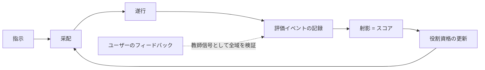

# VISION

ローカル環境で動くマルチエージェントのドック。複数のAIモデルを乗組員として受け入れ、実際の仕事の中で評価し、適所に配置する。

## 背景と問題意識

利用できるAIモデルの選択肢は増え続けている。各社はベンチマークを公開しているが、それが示すのは一般的な性能であって、「自分の使い方の中で、持続的に活用するに足るか」ではない。その結果、タスクに対して過分に高価なモデルを使い続けることが起きる。

開発を経済的にも持続可能にするには、「このタスクには、どのモデルが十分賢く、十分安いか」を自分の実際の仕事に即して判断できる基盤が必要になる。

## このリポジトリは何か

ローカル環境で動くマルチエージェントの**ドック**。コマンドとエージェントスキルを入口として指示を受け取り、複数のAIモデルをエージェントとして受け入れ、実仕事の中で評価し、適所に配置する。

このドックは対等な両輪で構成される。

- **評価**: 実仕事から証拠を集め、モデルの適性をスコアとして導く
- **振り分け**: スコアに基づいて、指示を適切なエージェントに委ねる

両輪の背骨は一つ、**すべての仕事が評価イベントとして記録される**こと。評価は記録から育ち、振り分けは評価から導かれ、振り分けられた仕事がまた記録を生む。

## 中核概念

### 評価イベント（一次データ）

このドックで起きたことは、タグ付きの**評価イベント**として記録される。

- **実行の実測**: 所要時間・実支出・帰結（受け入れ・手戻り・破棄）
- **決定**: 采配（委譲先・任せる範囲・エスカレーション）も遂行中の技術判断も、種別タグ付きの同格な決定イベント
- **フィードバック**: 即時のものも、後日届く長期のアウトカムも同格。タスクの境界に収まらない評価も、遅延イベントとして同じ基盤に載る

### スコア＝射影

スコアは実体ではなく、イベント集合からの**射影**（集約ビュー）である。「タスク種別ごとの成績」も「長期アウトカムを含めた成績」も、同じイベント基盤からの異なる射影にすぎない。評価の第二軸を固定しないことで、短期の実測と長期のアウトカムが同じ概念モデルに同居する。

代表的な射影（評価軸）:

- **意思決定の確かさ**: 帰結を伴う選択が、事後の帰結によって正しかったと検証される度合い
- **作業速度**: 指示から受け入れ可能な成果までの実測時間
- **成果あたり実コスト**: 受け入れられた成果一つに要した実支出。トークン単価は評価軸ではなく、この計算の入力にすぎない。冗長さ・手戻り・リトライは自然にコストへ算入される

### 教師信号（ground truth）

この環境における最終的な正解は**ユーザー自身の判断**である。フィードバックは評価軸の一つではなく、すべての射影を検証する最上位の教師信号として、決定の検証・成果の受け入れ判定・満足度のすべてに使われる。

### 証拠の序列

1. **実タスクの実測** — 一次源泉であり、常に支配的
2. **自前リプレイ** — 受け入れ済みの成果が確定している過去の実タスクの再演。新モデルの初期評価や較正に使う。ベンチマークすら自分の履歴から作る
3. **外部ベンチマーク** — 初期の重みの参考値（prior）としてのみ使う

外部指標は仮説であり、実測は証拠である。証拠は蓄積とともに、常に仮説を上書きする。

### 役割と資格（適所適材）

ドックには**役割**がある（例: 采配役・設計役・大量実装役・検証役）。役割は水平であり、上下関係はない。実務に優れることと采配に優れることは別の適性であり、モデルの得手不得手は質的に異なるからだ。「昇格」という概念は存在しない。

各役割は**適性プロファイル**（関連する射影への要求条件）を定義し、資格は役割ごとに独立に任用・解任される。例えば采配役の資格は、采配種別の決定イベントに対する「意思決定の確かさ」の射影を要求する。**コストも適性の一部**であり、どれほど賢くても役割に見合わないコストのモデルはその役割の資格を満たさない。

新参モデルはどの役割の資格も持たない状態から始まり、リプレイと外部 prior による初期審査を経て、実仕事の証拠を役割ごとに積む。

唯一の垂直関係は、**ユーザーが常にすべての役割の上位にいる**ことだけである。

### 循環

指示は采配され、遂行され、評価イベントとして記録される。記録は射影されてスコアになり、スコアは役割の資格を更新し、次の采配を変える。ユーザーのフィードバックは、この循環全体を検証する教師信号として任意の時点で入る。

## 原則

- **実測主義**: 証拠が仮説に勝る。外部の評判より、自分の仕事での実測を信じる
- **ユーザーが最上位**: ground truth はユーザーの判断であり、どのエージェントの権限もユーザーを超えない
- **コストは適性の一部**: 賢さだけでは資格にならない
- **役割に上下なし**: 適性は質的に異なる。はしごではなく配置
- **持続性の制約**: 評価運用の手間は小さく保つ。ユーザーの手間に依存しすぎる評価体系は続かない

## 成功基準

両輪それぞれに置く。

- **振り分けの成功**: 受け入れ品質を落とさずに、成果あたり実コストが下がり続けること
- **評価の成功**: 自前のスコアが、自分のタスクの帰結を外部ベンチマークより良く予測すること

## 非目標

- **汎用ベンチマーク化しない**: スコアはこの環境の文脈専用であり、モデルの一般的な優劣の主張や公開ベンチマークとしての持ち出しは目指さない
- **マルチユーザー化しない**: ローカル・単一ユーザー前提を維持する。ground truth が一人の判断であることと整合する
- **完全自動運転を目指さない**: 人間の関与ゼロは目標ではない。ユーザーが最上位の権限者であり教師信号の源であることは、自動化が進んでも変わらない不変条件
- **ベンダー固定しない**: 特定ベンダーへの最適化やロックインをしない。モデルは常に交換可能な乗組員であり、新モデルの追加と既存モデルの退場が常態である

## 未解決の問い

VISION の粒度から意図的に外した具体は、設計文書（DESIGN / ADR）で決める。

- 実行基盤: 既存エージェントCLIの束ね方 / 単一のエージェントホスト内での完結 / 自前ハーネス
- タスク種別・射影の具体的な分類法
- 役割の具体的なラインナップと、各役割の要求プロファイル
- 評価イベントの記録形式とストレージ
- 采配（振り分け）の実装方式
- フィードバック収集のUX — 手間を小さく保つ方法
- リプレイの実行方式
- 外部 prior の取り込み方法
- 資格（権限）の執行方法
