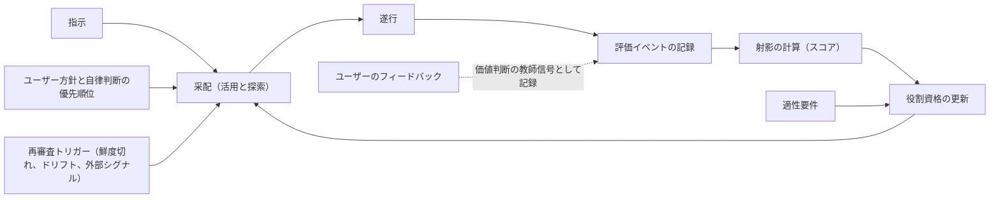

# Agent Dock のビジョン

agent-dock は、ローカルで制御するマルチエージェント環境である。
AI モデルとツール、権限、実行基盤の組み合わせを**実行プロファイル**として登録し、実際の仕事で評価して役割ごとに使い分ける。
この文書では、登録した実行プロファイルを**乗組員**と呼ぶ。

## モデル選択と外部ベンチマーク

利用できる AI モデルの選択肢は増え続けている。
各社のベンチマークが示すのは一般的な性能であり、「ユーザー自身の使い方で持続的に活用できるか」ではない。
外部ベンチマークだけでは、タスクに必要な水準を超える高価なモデルを選び続ける可能性がある。

開発を経済的にも持続可能にするには、「このタスクには、どのモデルを、どの構成で使えば十分な品質を適切なコストで得られるか」を、ユーザー自身の仕事に即して判断できる基盤が必要になる。

## ドックの役割

ドックは、コマンドとエージェントスキルを入口として指示を受け取る。
指示を受けると、登録済みの実行プロファイルから委任先を選び、実際の仕事の記録に基づいてその適性を更新する。

ドックは、次の二つの責務を同じ基盤で扱う。

- **評価**：実際の仕事から証拠を集め、乗組員の適性を表す評価結果を導く
- **振り分け**：評価結果に基づいて、指示を適切な乗組員に委ねる

振り分けにおける一回ごとの委任判断を**采配**と呼ぶ。
ドックでは、仕事の過程と帰結を記録する単位を**評価イベント**と呼ぶ。
ドックが自律判断を止め、理由、選択肢、推奨案を示してユーザーへ判断を求める手続きを**エスカレーション**と呼ぶ。
ドックが起動または仲介するすべての仕事を評価イベントとして記録することで、評価と振り分けを接続する。
記録から評価を更新し、その評価に基づく振り分けが次の記録を生む。

ここでいう**ローカル**は、記録、評価、裁定をユーザーの手元で制御することを指す。
推論の実行場所は問わないため、外部 API のモデルを使う実行プロファイルも、手元で動くモデルを使う実行プロファイルも乗組員になれる。
ドックが所有するのは、評価と振り分けを支える記録と規則、および実行系との接続境界である。
エージェントの実行系と成果物そのものは所有しない。

## 評価と振り分けを支える概念

### 評価イベント（一次データ）

各仕事について、評価に必要な実測、決定、フィードバックを、種別タグ付きの評価イベントとして記録する。

- **実行の実測**：所要時間、実支出、帰結（受け入れ、手戻り、破棄）
- **決定**：委任先、委ねる範囲、エスカレーションといった采配上の判断、および遂行中の技術判断
- **フィードバック**：即時の評価、および後日判明する長期の帰結
  タスクの境界より後に届く評価も、遅延イベントとして同じ基盤に記録する。

イベントには、使用したモデル、プロバイダ、バージョン、ツール、権限、実行基盤を**構成**として記録する。
これらをまとめた単位が実行プロファイルである。
成績はまず実行プロファイルに帰属し、モデル単位の成績は複数の実行プロファイルを横断する参考集計として扱う。
この区別により、プロンプトやツールの改善をモデル自体の能力と取り違えずに済む。
構成を変えた組み合わせは、別の実行プロファイルとして扱う。
その場合は、古い証拠を新しい実行プロファイルへ適用できる範囲を見直す。
複数の乗組員による共同成果も、帰属の根拠がないまま個別の乗組員へ配分しない。

### 射影としてのスコア

評価イベントの集合に対象範囲、評価軸、集約方法を定めて導くビューを**射影**と呼ぶ。
**スコア**は独立した実体ではなく、この射影の値である。
「タスク種別ごとの成績」と「長期の帰結を含めた成績」は、対象範囲や集約方法が異なる別々の射影として扱う。
射影ごとに対象範囲、評価軸、集約方法を変えられるため、短期の実測と長期の帰結を同じ概念モデルで評価できる。

射影は証拠の**鮮度**を考慮し、古い証拠ほど重みを下げる。
鮮度に応じた重みづけによって、スコアから評価対象の現在の状態を推定する。
射影は値だけでなく、確からしさを示す**不確実性**と、主張できる範囲を示す**適用範囲**を伴う。

代表的な評価軸は次のとおりである。

- **意思決定の確かさ**：決定時に期待した帰結と、観測された帰結との整合度
  選ばなかった選択肢の帰結は観測できないため、観測した範囲を超える因果は断定しない。
- **作業速度**：指示を受けてから、受け入れ可能な成果を得るまでの実測時間
- **成果あたり実コスト**：受け入れた成果一件に要した実支出
  トークン単価、出力の冗長さ、手戻り、リトライは独立した評価軸ではなく、実支出を構成する入力として扱う。
  実支出には、API の従量料金、定額契約の配賦額、ローカル計算資源の費用など、実行に伴う金銭的負担を含める。
  金額へ換算できないローカル計算資源の使用量は、実支出とは別に開示する。

### 教師信号と観測事実

成果の受け入れ、選好、目的、リスク許容といった価値判断では、ユーザー自身の判断を最上位の**教師信号**（ground truth）とする。
一方、作業時間や実支出のような**観測事実**は別種の一次データであり、価値判断によって覆さない。
ユーザーのフィードバックは独立した評価軸ではなく、決定の検証、成果の受け入れ判定、満足度の評価に使う教師信号である。

通常の運転ではイベントを書き換えず、ユーザーによる訂正や上位の判断も新しいイベントとして記録する。
現在の判定は、イベント間の優先関係から導く。
ただし、この追記原則よりも、秘密、プライバシー、ユーザーが定めた保持境界を優先する。
ユーザーは機微な内容の削除や秘匿をいつでも命じられる。
削除時は、安全かつ保持方針が許す範囲で、処置があったことを示す非機微な来歴だけを残す。
削除はユーザーの指示に基づいて実行し、ドックの自律運転では追記のみを行う。

すべての評価をユーザー自身が行う運用は、手間が増え続けるため持続しない。
資格を持たない候補は、較正のための観測状態でだけ評価を出力できる。
観測出力そのものは現在の判定や資格判定に使わず、同じ対象へのユーザー判断と比較して得た一致実績だけを資格審査の証拠にする。
観測状態は資格前の較正出力であり、評価を代行する権限ではない。
そこで、ユーザーの過去の判断との一致実績が事前の基準を満たした実行プロファイルに、影響を小さく抑えた試行や過去タスクの再演で得た成果を評価させる。
この仕組みを**評価の代行**と呼び、次の制約を課す。

- **判断の優先**：代行評価はユーザー判断に常に劣後する別種のイベントであり、ユーザー判断が届けばそちらが現在の判定になる
- **常時監査**：代行が評価した一部をユーザーも必ず評価し、一致率を継続して測る
- **領域の限定**：代行を許すのは、ユーザー判断との一致実績がある領域だけとする
- **独立性**：審判役には被評価者と異なる実行プロファイルを使い、プロバイダ、モデル系列、プロンプト、ツール、参照できる証拠の共通性から偏りの共有リスクを評価する
  独立性を判断する情報が不足する構成には代行を許さない。

この制約により、評価作業を委任しても、ユーザーによる監査と最終判断は維持する。

### 証拠と外部事前情報の優先関係

受け入れ済みの実タスクを再演する評価を**リプレイ**と呼ぶ。

1. **実タスクの実測**：一次の証拠とする。
   対象との関連性、条件の比較可能性、標本の十分性を満たす実測は、ほかの源泉よりも重く扱う。
2. **自前リプレイ**：受け入れ済みの成果が確定している実タスクを再演した証拠とする。
   同じ実行プロファイルを過去の状態と比較してドリフトを検知する評価を**定点観測**と呼ぶ。
   リプレイは、新しい実行プロファイルの初期評価と較正に使うほか、定点観測にも使う。
   自前リプレイは、ユーザー自身の履歴を比較用の課題に変える。
3. **外部ベンチマーク**：「外部でこの主張が公開された」という来歴として記録する。
   性能の一次証拠とはせず、**外部事前情報**（prior）として一次の評価イベントと区別したまま射影へ合成する。

リプレイは、新しい実行プロファイルの初期審査と、すでに認めた役割適性の見直しの双方に使う。
後者の審査を**再審査**と呼ぶ。

外部ベンチマーク由来の外部事前情報は仮説として、実測は証拠として扱う。
関連性と比較可能性を満たす実測が十分に蓄積するほど、射影における外部事前情報の重みを下げる。

この序列は、ほかの条件が同じ場合に優先する源泉の順であり、証拠の量や質を無視する規則ではない。
個々の証拠の重みは、序列に加えて、関連性、比較可能性、標本数、鮮度、測定の信頼度から決める。
したがって、関連性の低い実測一件だけを理由に、十分な比較可能性を持つ多数のリプレイ結果を退けることはない。

証拠は時間とともに鮮度を失う。
サービス側の更新により、同じ名前のモデルでも挙動が変わりうるため、古い証拠を現在の状態へそのまま適用できない。
モデル名だけでは同一性を仮定せず、定点観測で変化の兆候を調べ、兆候があれば再審査する。

評判の変化や新バージョンの公開情報といった**外部シグナル**は、スコアの証拠には使わず、再審査を起動するトリガーとしてだけ使う。
外部シグナルをトリガーに限定すれば、自前の証拠が蓄積する前に変化の兆候を得ても、未検証の評判はスコアへ混入しない。
価格改定は証拠ではなく実コスト計算の入力であるため、確認でき次第反映する。

### 役割ごとの資格

ドックは、采配役、設計役、実装役、検証役などの**役割**を定める。
役割は機能の分類であって身分ではないため、役割のあいだに価値の上下関係は置かない。
運転時には委任、検証、承認という順序があるが、これは作業工程であって役割の序列ではない。

実装と采配がそれぞれ異なる能力を必要とするように、役割ごとに求める適性は異なる。
各役割には、関連する射影への要求条件である**適性要件**を定める。
実行プロファイルが特定の役割の適性要件を満たすと認めた状態を、その役割の**資格**と呼ぶ。
資格は役割ごとに独立して付与し、保留し、取り消す。
資格の変化は役割間の移動ではないため、「昇格」や「降格」とは呼ばない。
資格を持つ単位はモデル名ではなく、モデルを含む構成である実行プロファイルである。
モデル単位の成績は複数の実行プロファイルを横断する参考射影にとどまり、それだけでは役割の資格を満たさない。
例えば采配役の資格には、采配に関する決定イベントから導いた「意思決定の確かさ」の射影を使う。
**コストも適性の一部**であるため、役割に見合わないコストの実行プロファイルは、品質が高くてもその役割の資格を満たさない。

新しい実行プロファイルは、どの役割の資格も持たない状態から始まる。
リプレイと外部事前情報による初期審査を経た後、実際の仕事の証拠を役割ごとに蓄積する。

資格は根拠となる証拠の鮮度に依存し、終身ではない。
証拠の鮮度が失われた場合や、定点観測でドリフトを検知した場合は、該当する資格を再審査する。
構成を変えた場合は新しい実行プロファイルとして扱い、資格を持たない状態から審査する。
再審査で適性要件を満たさなければ、資格を失効させる。
証拠が不足している場合や相互に矛盾する場合は、資格を与えず保留する。
保留後の処理は自律判断の優先順位に従い、必要に応じてユーザーへエスカレーションする。

役割間に上下関係はないが、**ユーザーは常にすべての役割より上位の権限を持つ**。

### 評価と采配の循環

ここでの**低リスク**とは、失敗の帰結が小さく、可逆であり、やり直しと成否判定に要するコストが低い仕事を指す。
采配は、現在の証拠に基づいて最も適した乗組員を選ぶ**活用**だけを目的としない。
証拠が少ない、または古い実行プロファイルに低リスクの実際の仕事を意図的に割り当てる**探索**も担う。
探索は低リスクの仕事に限り、定めた予算の範囲で行う。
鮮度切れ、ドリフトの検知、外部シグナルを受けて、リプレイによる再審査も起動する。
探索と再審査により、活用だけでは選ばれない実行プロファイルの評価も更新できる。

指示を采配して遂行すると、その過程と帰結を評価イベントとして記録する。
記録から射影を計算してスコアを得る。
資格は、スコアを証拠として適性要件に照らして更新する。
次の采配は、スコアと資格に加え、ユーザー方針と自律判断の優先順位を適用して決める。
ユーザーのフィードバックは、受け入れや選好といった価値判断の教師信号として、循環のどの時点でも追加できる。

### 自律判断の優先順位

ドックが委任、資格の付与、探索の可否を自律的に判断するときは、次の優先順位に従う。
ここで、許容できるコストで元に戻せない帰結を**不可逆な帰結**と呼ぶ。
ユーザーが定めた境界の外への送信、秘密の開示、復元手段のない破壊、来歴の破壊がこれに当たる。

1. **安全と秘密の保護、不可逆な帰結の回避**：スコアや効率では覆せない絶対制約
2. **ユーザーが定めた規範**：成果の受け入れ基準とリスク上限
3. **証拠の十分性**：適性を裏付ける証拠が足りなければ委任しない
4. **経済性**：ユーザーの手間を含む総コストと速度
5. **探索の価値**：確保された予算の範囲で得られる将来の便益

第 1 層と第 2 層は、制約を定めた主体ではなく、帰結を事後に修正できるかどうかで分ける。
成果の不採用や手順の修正によって是正できる受け入れ基準とリスク上限だけを、第 2 層に分類する。
不可逆な帰結は事後の評価から学んでも修正できないため、第 1 層の絶対制約として扱う。
外部モデルの使用自体は第 1 層への違反ではないが、送信先と送信内容はユーザーが許可した境界内に限る。

複数の層が衝突した場合は、上位の層を優先する。
上位の制約を満たせない場合や不確実性が大きい場合は、自動処理を止めてエスカレーションする。
エスカレーションでは、判断できなかった理由、選択肢、推奨案をユーザーへ提示する。
ユーザーの裁定は評価イベントとして記録するが、その意味は不足していた情報によって異なる。
受け入れ基準やリスク許容が不足していた場合、裁定はユーザーの価値判断を補う教師信号になる。
適性の実証が不足していた場合、裁定は一回限りの明示的な許可であり、資格の証拠にはならない。
この場合に証拠となるのは、許可のもとで遂行した仕事の帰結である。
委任範囲が広がってもエスカレーション率が下がらない場合は、証拠不足、較正不良、タスク構成の変化、リスクの変化を調べ、原因に応じて委任範囲を見直す。

リスクは、帰結の大きさ、可逆性、成否を判定するコストから評価する。
この尺度は探索だけでなくすべての采配に適用し、リスクが高い仕事ほど確かな証拠と厳しい適性要件を求める。

この序列はドックの自律判断を制約するためにある。
ユーザーは序列そのものを改定でき、個別の場面では自ら定めた境界を変更する単発許可を明示的に与えられる。
単発許可によって境界を変更しない限り、ドックは第 1 層の制約を越えられない。
エスカレーションは、この明示的な判断を仰ぐ手続きである。

### 資格のない初期状態

初期状態では、どの実行プロファイルも資格を持たない。
最初の采配と評価はユーザー自身が担う。
ドックは**ユーザーが全役割を兼任する状態**から始まり、証拠が蓄積して資格を得た実行プロファイルへ、役割ごとに委任を広げる。

委任が進んでも、監査と最終判断はユーザーが担う。

## 設計と運転の原則

以下の原則はドックの設計と運転に適用し、プロジェクトの進め方には適用しない。

- **実測を優先する**：外部の評判より、ユーザー自身の仕事で得た実測を優先する
- **証拠の鮮度を管理する**：鮮度を失った証拠に基づく資格を維持しない
- **探索へ予算を割り当てる**：証拠の少ない乗組員へ低リスクの仕事を割り当てる探索は、定めた予算の範囲で行う
- **ユーザーを最上位とする**：価値判断ではユーザーの判断を最上位の教師信号とし、乗組員の権限がユーザーを超えることはない
  評価を代行させる場合も、監査による検証可能性を維持する。
- **コストを適性に含める**：役割に見合わないコストの実行プロファイルには、その役割の資格を与えない
- **役割を序列化しない**：役割ごとに異なる適性を評価し、役割間に価値の上下関係を置かない
- **運用の持続性を求める**：評価運用に要するユーザーの手間を、あらかじめ定めた上限に収める
- **記録を最小限にする**：評価に必要なイベントだけを記録し、成果物やプロンプトの全文は既定で保存しない
  秘密も既定では記録せず、外部へ送信できる範囲をユーザーが統制する。
- **監査可能にする**：射影の根拠となった証拠と、采配を選んだ理由をユーザーが確認し、異議を申し立てられるようにする

運転中に原則が衝突した場合は、「自律判断の優先順位」に従う。
ドック自体の設計をめぐる衝突には、この文書全体を制約としてユーザーが裁定する。

## 成功基準

成否は、事前に定めた基準との比較で測る。
基準には、常に高性能なモデルを選ぶ方法や、外部事前情報だけで采配する方法など、ドックを使わない場合の手順を明記する。

- **振り分けの成功**：比較可能なタスク群と期間で、事前登録した品質指標と失敗率を基準より悪化させず、ユーザーの手間を含む総コストの改善を一度は実証すること
  初回の改善後は、改善した水準を維持できれば継続的な成功と判定する。
- **評価の成功**：自前のスコアによる帰結予測の精度が、事前登録した評価指標で、外部事前情報だけから導いた帰結予測の精度よりも高いこと
  あわせて、事前に定めた失敗基準に該当する采配を減らすこと。
- **持続の成功**：評価と運用に要するユーザーの注意と手間が、事前に定めた上限に収まり続けること

比較の基準、対象とするタスク群、期間、手間の上限は、結果を見る前に定める。
評価には、スコアの形成に使っていない保留データ、または事前登録後に得た将来の帰結を使う。
不利な結果と改善が見られなかった結果も開示する。

ドックは判定材料を計測して開示するが、成否はユーザーが判定する。
ドック自身による成功の認定は行わない。

## 非目標

- **汎用ベンチマーク化しない**：スコアをモデルの一般的な優劣の主張や公開ベンチマークには使わない
  同じ環境内でも単一の普遍スコアや総合順位には集約せず、目的の異なる複数の射影として扱う。
- **マルチユーザー化しない**：ローカルの単一ユーザー環境を前提とする
  この前提により、一人のユーザーの価値判断を最上位の教師信号として一貫して扱える。
- **完全自動運転を目指さない**：ユーザーの関与をなくすことは目標にしない
  自動化が進んでも、ユーザーは最上位の権限者であり、価値判断の教師信号を提供する。
  自動化の範囲、自律性、乗組員の数は、品質とコストを改善するための手段としてだけ評価する。
- **ベンダーを固定しない**：特定ベンダーへの最適化やロックインを避ける
  実行プロファイルを交換可能に保ち、新しいモデルを使うプロファイルの追加と、既存プロファイルの退場を通常の運用として扱う。
