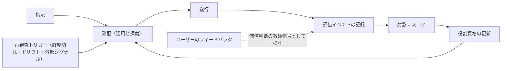

# VISION

ローカル環境で動くマルチエージェントのドック。複数のAIモデルを、ツール・権限・実行基盤といった構成と組み合わせた**実行プロファイル**として乗組員に受け入れ、実際の仕事の中で評価し、適所に配置する。

## 背景と問題意識

利用できるAIモデルの選択肢は増え続けている。各社はベンチマークを公開しているが、それが示すのは一般的な性能であって、「自分の使い方の中で、持続的に活用するに足るか」ではない。その結果、タスクに対して過分に高価なモデルを使い続けることが起きる。

開発を経済的にも持続可能にするには、「このタスクには、どのモデルを、どの構成で使えば十分賢く、十分安いか」を自分の実際の仕事に即して判断できる基盤が必要になる。

## このリポジトリは何か

ローカル環境で動くマルチエージェントの**ドック**。コマンドとエージェントスキルを入口として指示を受け取り、複数のAIモデルをツール・権限・実行基盤といった構成と組み合わせ、その**実行プロファイル**をエージェントとして受け入れ、実仕事の中で評価し、適所に配置する。

このドックは対等な両輪で構成される。

- **評価**: 実仕事から証拠を集め、乗組員（実行プロファイル）の適性をスコアとして導く
- **振り分け**: スコアに基づいて、指示を適切なエージェントに委ねる

両輪の背骨は一つ、**すべての仕事が評価イベントとして記録される**こと。評価は記録から育ち、振り分けは評価から導かれ、振り分けられた仕事がまた記録を生む。

「ローカル」とは制御面の話である。記録・評価・裁定がユーザーの手元にあることを指し、推論がどこで走るかは問わない — 外部 API のモデルを組み込んだ実行プロファイルも、手元で動くモデルを組み込んだ実行プロファイルも、等しく乗組員になれる。このドックが所有するのは評価イベント・射影・資格・采配とその接続境界であり、エージェントの実行系や成果物そのものは所有しない。

## 中核概念

### 評価イベント（一次データ）

このドックで起きたことは、タグ付きの**評価イベント**として記録される。

- **実行の実測**: 所要時間・実支出・帰結（受け入れ・手戻り・破棄）
- **決定**: 采配（委譲先・任せる範囲・エスカレーション）も遂行中の技術判断も、種別タグ付きの同格な決定イベント
- **フィードバック**: 即時のものも、後日届く長期のアウトカムも同格。タスクの境界に収まらない評価も、遅延イベントとして同じ基盤に載る

イベントには、実行時の**構成** — どのモデルが、どのプロバイダ・バージョンで、どのツール・権限・実行基盤のもとで動いたか（あわせて**実行プロファイル**）— が記録される。成績はまず実行プロファイルに帰属し、モデル単位の成績はその上の射影である。プロンプトやツールの改善をモデルの能力と取り違えないためであり、構成が変わったときは、古い証拠がどこまで持ち運べるかを再審査する。複数のエージェントの共同成果を、根拠なく個体に配り分けることもしない。

### スコア＝射影

スコアは実体ではなく、イベント集合からの**射影**（集約ビュー）である。「タスク種別ごとの成績」も「長期アウトカムを含めた成績」も、同じイベント基盤からの異なる射影にすぎない。評価の第二軸を固定しないことで、短期の実測と長期のアウトカムが同じ概念モデルに同居する。

射影は証拠の**鮮度**を考慮する。古い証拠は重みを失い、スコアは常に評価対象の「今」を写そうとする。また射影は値だけを返すものではない。どれくらい確かか（不確実性）と、どの範囲に言えるか（適用範囲）を伴う。

代表的な射影（評価軸）:

- **意思決定の確かさ**: 帰結を伴う選択が、観測された帰結とどれだけ整合していたか。選ばなかった選択肢の帰結は観測できない以上、それを超える因果の断定はしない
- **作業速度**: 指示から受け入れ可能な成果までの実測時間
- **成果あたり実コスト**: 受け入れられた成果一つに要した実支出。トークン単価・冗長さ・手戻り・リトライといった要素は、それ自体が評価軸なのではなく、いずれもこの実支出に算入される入力にすぎない

### 教師信号（ground truth）

この環境における最終的な正解は**ユーザー自身の判断**である。ただしその領分は、受け入れ・選好・目的・リスクの許容といった「良し悪し」の領域である。作業時間や実支出のような**観測事実**は別種の一次データであり、判断で覆すものではない。フィードバックは評価軸の一つではなく、この領分における最上位の教師信号として、決定の検証・成果の受け入れ判定・満足度に使われる。

イベントは書き換えられない。ユーザーの訂正や上位の判断も新しいイベントとして記録され、優先関係によって「現在の判定」が導かれる。ただし、書き換えないのはドックの運転の話である。秘密・プライバシー・ユーザーが定めた保持の境界は不変性に優先し、ユーザーは機微な内容の削除や秘匿をいつでも命じられる。その場合も、可能で安全な範囲で「処置があった」という非機微な来歴だけは残す。削除は常にユーザー起点であり、ドックの自律運転は追記しかしない。

ただし、すべての評価をユーザー自身が行うことは持続性の制約に反する。そこで**評価の代行**を認める: ユーザーの過去の判断との一致率を適性として資格を得た実行プロファイルが、探索やリプレイの成果をユーザーの代わりに評価する。代行には防護柵を設ける。

- 代行評価はユーザー判断に常に劣後する**別種のイベント**であり、ユーザー判断が届けばそちらが現在の判定になる
- **常時監査**: 代行が評価した一部を必ずユーザーも二重評価し、一致率という資格の証拠を絶やさない
- 資格は一致実績のある**領域に限られ**、審判と被評価者の**独立性**（同系の贔屓や癖の共有）に注意する

委任はするが、放棄はしない。

### 証拠の序列

1. **実タスクの実測** — 一次源泉。関連し比較可能で十分な実測は、他のどの源泉よりも重い
2. **自前リプレイ** — 受け入れ済みの成果が確定している過去の実タスクの再演。新モデルを組み込んだ実行プロファイルの初期評価や較正に加え、**定点観測**（同一モデルを過去の自分と比較し、ドリフトを能動的に検知する）に使う。ベンチマークすら自分の履歴から作る
3. **外部ベンチマーク** — 「外部にこういう主張があった」という来歴として記録される。それ自体は性能の一次証拠ではなく、事前の見立て（prior）として、一次の評価イベントと区別されたまま射影に合成される

外部指標は仮説であり、実測は証拠である。関連し比較可能な証拠が十分に蓄積するほど、仮説の影響は後退していく。

この序列は、同じ条件で比べたときにどちらを信じるかの順であって、量や質を無視する意味ではない。証拠の重みは序列に加え、関連性・比較可能性・標本の量・鮮度・測定の信頼度で決まる — 一件のノイズが、大量の比較可能な再演に勝つわけではない。

そして証拠は**鮮度**を持つ。モデルは同じ名前のまま中身が変わりうる（サービス側の変化）ため、古い証拠は現在のそのモデルを説明しない。モデルの同一性は名前では信じない — 観測で継続的に疑い、変化の兆候は再審査に回す。

世間の評判の変化や新バージョンの報といった**外部シグナル**は、証拠としてスコアに入ることは決してないが、**再審査（定点観測）を起動するトリガー**としては使う。世間の方が自前の証拠蓄積より速いことは多く、感度だけを借りて純度は守る。なお価格改定は証拠ではなく実コスト計算の入力なので、即時反映する。

### 役割と資格（適所適材）

ドックには**役割**がある（例: 采配役・設計役・大量実装役・検証役）。役割は水平であり、上下関係はない。実務に優れることと采配に優れることは別の適性であり、モデルの得手不得手は質的に異なるからだ。「昇格」という概念は存在しない。水平とは価値の序列がないという意味である — 運転時には委譲・検証・承認という仕事の流れが存在するが、それは工程であって身分ではない。

各役割は**適性要件**（関連する射影への要求条件）を定義し、資格は役割ごとに独立に任用・解任される。資格を持つのはモデル名ではなく、役割を担う**実行プロファイル**（モデルを含む構成）である — モデル単位の成績は横断的な参考射影であり、それだけで資格を主張することはできない。例えば采配役の資格は、采配種別の決定イベントに対する「意思決定の確かさ」の射影を要求する。**コストも適性の一部**であり、どれほど賢くても役割に見合わないコストの構成はその役割の資格を満たさない。

新参モデルは、どの構成でもどの役割の資格も持たない状態から始まり、リプレイと外部 prior による初期審査を経て、実仕事の証拠を役割ごとに積む。

資格は終身ではない。証拠の鮮度が切れた資格、定点観測でドリフトが検知された資格、構成が変わった資格は再審査に入り、通らなければ失効する。証拠が足りない・矛盾しているときは、資格を与えず保留する。保留の先は裁定の序列に従い、必要ならユーザーへのエスカレーションとなる。

唯一の垂直関係は、**ユーザーが常にすべての役割の上位にいる**ことだけである。

### 循環

指示は采配され、遂行され、評価イベントとして記録される。記録は射影されてスコアになり、スコアは役割の資格を更新し、次の采配を変える。ユーザーのフィードバックは、受入・選好といった価値判断の教師信号として、循環のどの時点にも入る。

采配の責務は「活用」（今の最良の配置）だけではない。証拠が薄い・古い実行プロファイルに低リスクの実仕事を意図的に配る「探索」、そして鮮度切れ・ドリフト検知・外部シグナルを受けて起動する「リプレイ（再審査）」も担う。使われないモデルの評価が止まる袋小路は、ここで断ち切る。

ここでの**低リスク**とは、失敗の帰結が小さく（やり直しが安く、可逆で）、成否の判定が安い仕事を指す。探索はこの範囲でのみ許される。

### 裁定

ドックが自律的に判断するとき — 委譲してよいか、資格を与えてよいか、探索してよいか — 従う優先順位は一つである。

1. **安全・秘密・不可逆な帰結の回避**: ドックの自律判断ではスコアや効率で覆せない絶対制約。不可逆とは、帰結を許容できるコストで元に戻せないこと（ユーザーが定めた境界の外への送信、秘密の開示、復元手段のない破壊、来歴の破壊）。事後の検証で学ぶこの体系で、事後の修正が唯一届かない領域だから、賭けの対象にしない。ユーザーが定めた送信境界の内側で外部のモデルを使うことは、ここに触れない通常の運転である
2. **ユーザーが定めた受入基準とリスク上限**
3. **証拠の十分性**: 確信が持てなければ委譲しない
4. **経済性**: ユーザーの手間を含む総コストと速度
5. **探索の価値**: 確保された予算の内でのみ

衝突したら上位が勝つ。上位を満たせないとき、不確実性が大きいときは、自動では進めず**エスカレーション**する — どこで詰まったか、選択肢と推奨を添えて、判断をユーザーに差し戻す。そこでのユーザーの裁定は必ず記録されるが、その意味は欠けていたものによって異なる。欠けていたのが受入基準やリスク許容といったユーザーの領分なら、裁定はその欠落を埋める教師信号になる。欠けていたのが適性の実証なら、裁定は一回限りの明示の許可であって実証を代替しない — 証拠になるのは、許可のもとで遂行された仕事の帰結である。エスカレーションは委任が広がるにつれ稀になるべきもので、減らないこと自体が証拠不足か較正不良の合図である。

リスクの物差し（帰結の大きさ・可逆性・判定のコスト）は探索専用ではない。すべての采配で考慮され、リスクの高い仕事ほど確かな証拠と高い資格を要求する。

この序列はドックの自律判断のためにある。ユーザーは序列の外におり、序列そのものを改めることも、個別の場面で明示の判断により境界や制約を越えることを許すことも、ユーザーにはできる。エスカレーションは、その明示の判断を仰ぐ手続きである。

### 始動

初期状態では、どの実行プロファイルも資格を持たない。最初の采配も、最初の評価も、ユーザー自身が担う。ドックは**ユーザーが全役割を兼任する状態**から始まり、証拠の蓄積とともに、資格を得た実行プロファイルへ委任が段階的に広がっていく。

これは「ユーザーが最上位」の時間軸での姿でもある。委任がどれだけ進んでも、監査と最終判断はユーザーに残り続ける。

## 原則

- **実測主義**: 証拠が仮説に勝る。外部の評判より、自分の仕事での実測を信じる
- **証拠は腐る**: スコアも資格も鮮度を要求する。終身の資格はない
- **探索は投資**: 証拠の獲得は将来のコスト低減への投資であり、小さく管理された予算で行う
- **ユーザーが最上位**: 価値判断の ground truth はユーザーの判断であり、どのエージェントの権限もユーザーを超えない。評価を代行に委任しても、監査を通じた検証可能性は放棄しない
- **コストは適性の一部**: 賢さだけでは資格にならない
- **役割に上下なし**: 適性は質的に異なる。はしごではなく配置
- **持続性の制約**: 評価運用の手間は小さく保つ。ユーザーの手間に依存しすぎる評価体系は続かない
- **記録は最小限**: 記録するのは評価に必要な最小限のイベントであり、成果物やプロンプトの全文保存は既定ではしない。秘密は既定で記録しない。外部への送信の境界はユーザーが統制する
- **監査できる**: どの射影がどの証拠から導かれ、どの采配がなぜ選ばれたかを、ユーザーはいつでも閲覧し、異議を申し立てられる

運転の中で原則が衝突したときの裁き方は「裁定」の序列が定める。ドックそのものの設計をめぐる衝突は、序列では裁かれない — この文書の全体が制約であり、裁定するのはユーザーである。

## 成功基準

成否は比較で測る。基準となるのは「ドックを使わない場合のやり方」（例: 迷ったら常に高性能なモデルに投げる、外部の初期値だけで采配する）であり、これを明示して置く。

- **振り分けの成功**: 比較できるタスク群と期間で、受け入れの品質と失敗率を基準より落とさず、ユーザーの手間を含めた総コストの改善を一度は実証すること。以後はその水準の維持が継続的な成功であり、最適に達したあとの横ばいは失敗ではない
- **評価の成功**: 自前のスコアが、外部の初期値だけに頼る采配よりも、自分のタスクの帰結をよく予測し、悪い采配を減らしていること
- **持続の成功**: 評価と運用に要するユーザーの注意と手間が、決めた上限の内に収まり続けていること

比較の条件 — 基準、対象のタスク群、期間、手間の上限 — は、結果を見る前に定める。評価は、スコアの形成に使っていない保留または将来の帰結に対して行い、不利な結果や改善の不在もそのまま開示する。

ドックはこれらの判定材料を自己計測して開示する。しかし成否の**判定**はユーザーが下す — ドックは自己認定しない。

## 非目標

- **汎用ベンチマーク化しない**: スコアはこの環境の文脈専用であり、モデルの一般的な優劣の主張や公開ベンチマークとしての持ち出しは目指さない。環境の内でも、単一の普遍スコアや総合順位には集約しない — スコアは常に複数の射影である
- **マルチユーザー化しない**: ローカル・単一ユーザー前提を維持する。価値判断の ground truth が一人の判断であることと整合する
- **完全自動運転を目指さない**: 人間の関与ゼロは目標ではない。ユーザーが最上位の権限者であり、価値判断の教師信号の源であることは、自動化が進んでも変わらない不変条件である。自動化の広さ・自律性・エージェントの数もそれ自体を目的としない — 品質とコストの成果に奉仕する手段に留まる
- **ベンダー固定しない**: 特定ベンダーへの最適化やロックインをしない。乗組員である実行プロファイルは常に交換可能であり、新モデルを組み込んだプロファイルの追加と、退場するモデルを含むプロファイルの失効が常態である
